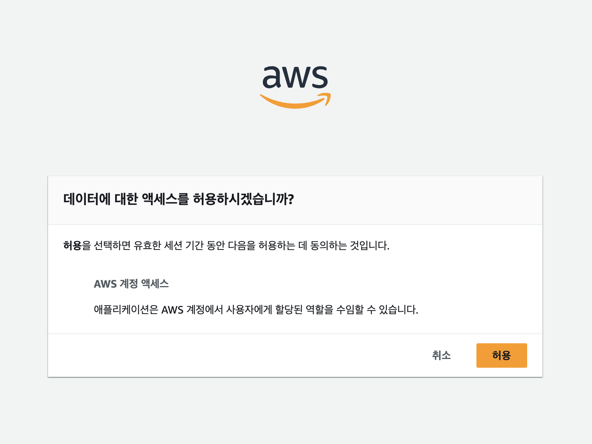

## AWS CodeCommit이란?

> AWS CodeCommit는 AWS 클라우드 서버에서 소스 코드를 안전하게 저장하고 관리할 수 있는 Amazon Web Services의 버전 관리 서비스입니다. 
{: .prompt-tip }

AWS CodeCommit은 소스 코드와 같은 데이터를 비공개로 저장하는 데 사용됩니다.  
쉽게 말해, AWS에서 제공하는 **GitHub와 같은 서비스**라고 생각하면 이해하기 쉽습니다.

CodeCommit에서는 기존 Git 명령어를 그대로 사용할 수 있으며, 특히 AWS의 보안 모델과 통합해 안전한 방식으로 데이터를 관리할 수 있습니다.

## GRC (Git-Remote-CodeCommit) 이란?

`git-remote-codecommit`(GRC)은 Git의 기능을 확장하여 AWS CodeCommit과 간편하게 상호작용할 수 있도록 돕는 도구입니다.  
특히, **IAM 사용자, SSO(Single Sign-On), 임시 자격 증명**과 같은 다양한 인증 방식을 지원하므로, 액세스 키 없이도 AWS CodeCommit을 안전하게 사용할 수 있습니다.

### 주요 특징
1. **HTTPS 기반 연결**
  - GRC는 SSH 대신 HTTPS 방식을 사용하며, 간단한 설정만으로 동작합니다.

2. **IAM 또는 SSO 지원**
  - 별도의 액세스 키 없이 AWS의 인증 시스템을 통해 접근할 수 있습니다.

3. **간편한 Git 연동**
  - 기존의 Git 명령어와 완벽하게 호환되며, 추가 학습 없이 바로 사용할 수 있습니다.

### GRC를 사용하는 이유
- **임시 자격 증명 지원**: AWS CLI에서 생성한 임시 자격 증명으로도 동작하며, 보안성을 높일 수 있습니다.
- **AWS 권장 방식**: AWS에서 공식적으로 지원하고 권장하는 도구입니다.
- **외부 인증 시스템과 통합 가능**: Google, Microsoft 계정 등을 사용하는 회사 환경에서도 쉽게 연동할 수 있습니다.

## 외부 인증 시스템과 권한 할당

AWS CodeCommit에 회사 계정, Google 계정, 또는 기타 외부 인증 시스템을 통해 접근하려면, **IAM 역할(Role)**과 외부 인증 시스템을 연동해야 합니다.  
이렇게 설정하면 사용자는 외부 계정으로 로그인한 뒤, AWS 리소스에 안전하게 접근할 수 있습니다.

### 외부 인증 시스템이란?

외부 인증 시스템은 Google, Microsoft, Okta와 같은 **로그인 제공 서비스**를 의미합니다.   
회사에서 사용하는 SSO(Single Sign-On) 시스템도 포함됩니다.  
예를 들어, 회사 계정(Google Workspace)을 사용해 AWS에 접근하고 싶다면, Google을 외부 인증 시스템으로 등록할 수 있습니다.

## AWS CLI 및 SSO 설정
> Python 3버전 이상, pip 9.0.3 버전 이상, Git 1.7.9 버전 이상  
> IAM User/Role : **AWSCodeCommitFullAccess** 또는 **AWSCodeCommitPowerUser** 권환 필요
{: .prompt-tip }

1. **IAM 역할 생성**
  - AWS Management Console에서 새로운 역할(Role)을 생성합니다.
  - 신뢰할 수 있는 인증 시스템(예: Google, Okta 등)을 선택합니다.
  - 역할에 AWS CodeCommit에 필요한 권한을 부여합니다.

2. **외부 인증 시스템 연동**
  - 사용자가 Google 계정이나 회사 계정으로 로그인하면, AWS는 이를 확인해 권한을 부여합니다.
  - 이후 IAM 역할에 설정된 권한을 기반으로 CodeCommit 리포지토리에 접근합니다.

3. **GRC 구성**
  - AWS CLI를 사용해 GRC를 활성화합니다.
  - IAM 사용자 또는 외부 인증 시스템을 통해 AWS CodeCommit을 연결합니다.


### AWS CLI 및 SSO 명령

- AWS CLI 자격 증명 기본 설정

```bash
git config --global credential.helper '!aws codecommit credential-helper $@'
git config --global credential.UseHttpPath true
```

- AWS CLI 자격 증명 설정 (Access key, Secret Key 입력)

```bash
aws configure 

AWS Access Key ID [None]:
AWS Secret Access Key [None]: 
Default region name:
Default output format:
```

- IAM 역할을 사용하여 자격 증명 설정
  - 외부 인증 시스템(SSO, Google 등)을 통해 로그인하는 경우에도 aws configure sso 명령어를 사용하여 SSO와 연결된 프로필을 설정할 수 있습니다.

```bash
aws configure sso --profile dev

SSO session name(Recommended) :
SSO start URL : [URL 입력]
SSO region : [리전 입력]
```

- SSO 로그인 후 Allow 버튼을 선택

  

- AWS Profile 기본 설정

```bash
export AWS_PROFILE=dev

# 맥인 경우
echo export AWS_PROFILE=dev >> ~/.zshrc
source ~/.zshrc
```

- SSO 로그인 확인

```bash
aws sso login
```


---

## 참고 자료
- [IAM 사용자 가이드 - 외부 인증 제공자를 위한 역할 생성](https://docs.aws.amazon.com/IAM/latest/UserGuide/id_roles_create_for-idp.html)
- [Git-Remote-CodeCommit 공식 문서](https://docs.aws.amazon.com/codecommit/latest/userguide/setting-up-git-remote-codecommit.html)

---

`git-remote-codecommit`을 사용하면 AWS CodeCommit과의 통합이 훨씬 간단하고 안전해집니다. 특히, 회사 환경에서 사용하는 인증 시스템(예: Google Workspace, Okta)과의 연동을 고려한다면, GRC는 가장 효율적이고 권장되는 접근 방식입니다.
