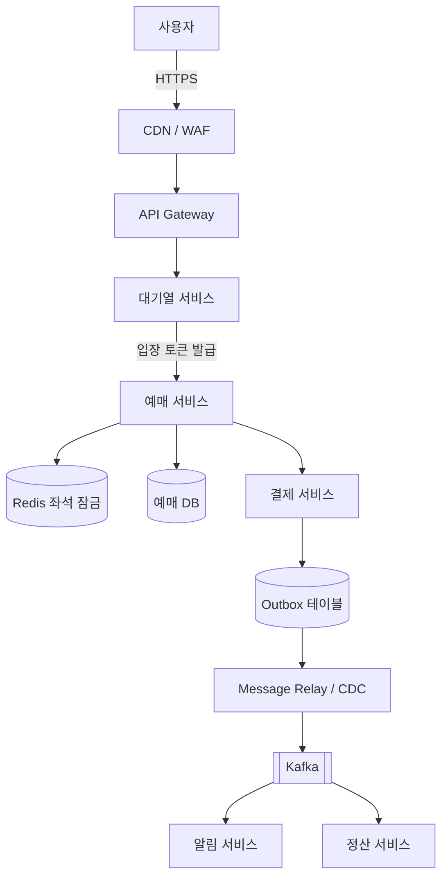
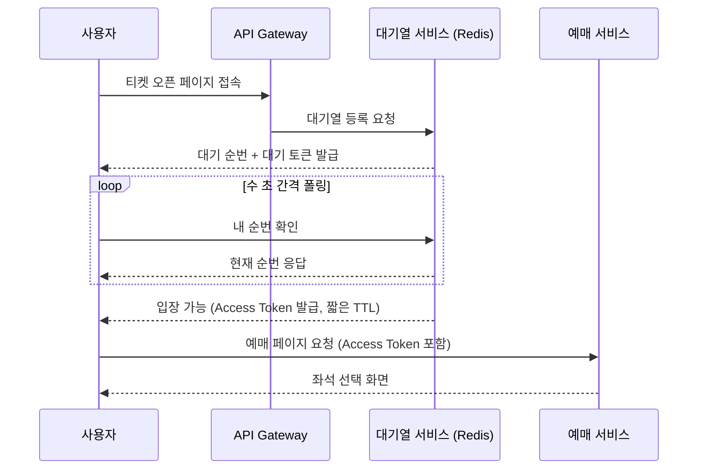
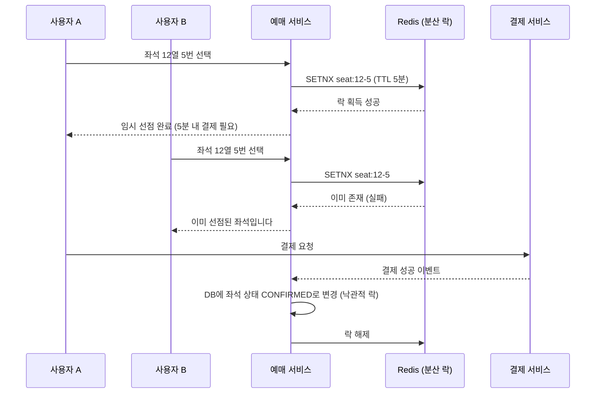

> 미리 말씀드리면, 이 글은 제가 실제로 구현한 프로젝트가 아닙니다. 유명 콘서트 티켓팅 때마다 "서버 터졌다"는 기사를 보면서, 대규모 트래픽이 순간적으로 몰리는 예매 서비스는 실제로 어떻게 설계할까 궁금해서 자료를 찾아보고 제 나름대로 정리해 본 학습 노트입니다. 틀린 부분이나 더 나은 방법이 있다면 언제든 알려주세요.

## 왜 예매 서비스는 어려운가

일반적인 서비스와 다르게 콘서트/공연 티켓 예매는 몇 가지 특이한 제약이 겹칩니다.

- **트래픽이 예측 가능한데도 감당이 안 됨**: 오픈 시각이 정확히 정해져 있고, 그 순간에 평소 대비 수백 배의 트래픽이 몰립니다.
- **재고가 극단적으로 적음**: 인기 좌석은 수천 명이 동시에 같은 좌석 하나를 두고 경쟁합니다.
- **정합성 요구가 높음**: 좌석은 절대 두 명에게 동시에 팔리면 안 되고(이중 예매), 결제와 좌석 확정 상태는 반드시 일치해야 합니다.

이 세 가지를 각각 **트래픽 폭주 대응**, **동시성 제어**, **데이터 정합성** 관점으로 나눠서 정리해봤습니다.

## 전체 아키텍처 개관

핵심은 **사용자 요청이 예매 서비스에 도달하기 전에 대기열 서비스에서 한 번 걸러진다**는 점, 그리고 **예매 서비스와 결제/알림/정산 서비스가 Kafka를 통해 느슨하게 연결**되어 있다는 점입니다. 아래에서 각 구간을 순서대로 살펴보겠습니다.

## 1. 트래픽 폭주 대응 : 가상 대기열

오픈 시각에 수만 명이 동시에 예매 서버를 두드리면, 서버를 아무리 늘려도 DB 커넥션이나 락 경합에서 병목이 생깁니다. 그래서 실제 예매 로직 앞단에 **가상 대기열(Virtual Waiting Room)**을 두고, 정해진 처리량만큼만 순차적으로 입장시키는 방식을 많이 씁니다.

구현 포인트로 찾아본 것들:

- **대기열 큐 자체는 Redis Sorted Set**으로 많이 구현합니다. `score`를 진입 시각(또는 순번)으로 주면 순서 보장이 쉽고, `ZRANK`로 현재 순번을 빠르게 조회할 수 있습니다.
- 입장 토큰은 **짧은 TTL**을 줘서, 순번이 됐는데도 실제로 들어오지 않은 사용자의 자리를 자동으로 회수합니다.
- API Gateway 단에서 **Rate Limiting**(예: Token Bucket)을 함께 걸어서, 대기열을 아예 우회해 예매 서비스로 직접 요청을 던지는 것도 막아줍니다.
- 정적 리소스(이미지, JS/CSS)는 CDN으로 미리 빼서, 오픈 순간 원본 서버가 정적 요청 때문에 흔들리지 않게 합니다.

## 2. 동시성 제어 : 좌석 이중 예매 막기

대기열을 통과했다고 끝이 아닙니다. 통과한 수천 명이 결국 **같은 몇 개의 인기 좌석**을 동시에 클릭하는 순간이 진짜 고비입니다. 좌석 하나를 두 사람에게 파는 걸 막는 방법을 비교해봤습니다.

| 방식 | 설명 | 장점 | 단점 |
| --- | --- | --- | --- |
| DB 비관적 락 (`SELECT ... FOR UPDATE`) | 좌석 row에 직접 락을 건다 | 구현이 단순, 강한 정합성 | 트래픽이 몰리면 DB 커넥션/락 대기가 병목 |
| DB 낙관적 락 (버전 컬럼) | `version` 컬럼으로 갱신 시점에 충돌 감지 | DB 부하가 상대적으로 적음 | 경쟁이 극심하면 재시도 폭주 (Thundering Herd) |
| Redis 분산 락 (`SETNX` + TTL) | 좌석 키 단위로 짧게 선점 | 매우 빠름, DB 앞단에서 대부분의 경합을 걸러냄 | 락과 DB 상태가 어긋나지 않도록 별도 설계 필요 |

실제로는 이 셋을 섞어서 쓰는 경우가 많다고 합니다. **1차로 Redis 분산 락으로 좌석을 짧게 선점**해서 대부분의 경합을 여기서 끝내고, **결제까지 끝난 뒤 DB에는 낙관적 락으로 최종 확정**하는 식입니다.

여기서 중요한 건 **TTL**입니다. 좌석을 선점만 하고 결제를 하지 않는 사용자가 있을 수밖에 없는데, TTL이 없으면 그 좌석은 영영 안 팔리는 좌석이 되어버립니다. TTL이 지나면 자동으로 락이 풀리고 좌석이 다시 매물로 나오도록 해야 합니다.

## 3. 데이터 정합성 : 결제와 재고를 일치시키기

좌석 선점(Redis)과 결제 승인(결제 서비스), 그리고 최종 좌석 확정(DB)은 서로 다른 컴포넌트에서 일어납니다. 이 사이 어느 한 단계에서 실패하면 "결제는 됐는데 좌석은 안 잡힘" 또는 "좌석은 잡혔는데 결제 내역이 없음" 같은 정합성 문제가 생길 수 있습니다.

이 부분은 예전에 정리했던 **아웃박스 패턴** 시리즈와 그대로 이어지는 내용이라 여기서는 개요만 짚고 넘어갑니다.

- 결제 서비스는 결제 승인 처리와 "결제 완료" 이벤트 기록을 **같은 트랜잭션**으로 묶어 Outbox 테이블에 저장합니다.
- Message Relay(또는 CDC)가 Outbox 테이블을 읽어 Kafka로 이벤트를 발행합니다.
- 예매 서비스는 이 이벤트를 구독해서 좌석 상태를 `CONFIRMED`로 바꾸고, 알림/정산 서비스도 각자 필요한 후속 처리를 합니다.

이렇게 하면 "결제 DB 커밋"과 "이벤트 발행"이 원자적으로 묶여서, 결제는 성공했는데 이벤트 발행에 실패해 좌석이 영영 확정 안 되는 상황을 막을 수 있습니다. 반대로 결제가 실패(또는 TTL 만료)하면 좌석 선점을 해제하는 보상 처리가 필요한데, 이 부분은 Saga 패턴으로 확장해서 생각해볼 수 있을 것 같습니다.

## 4. 전체 시스템 구조 (MSA 분해)

지금까지 나온 내용을 서비스 단위로 정리하면 대략 이렇게 나뉠 것 같습니다.

- **API Gateway**: 인증, Rate Limiting, 라우팅
- **대기열 서비스**: Redis 기반 순번 관리, 입장 토큰 발급
- **예매 서비스**: 좌석 조회/선점, 예매 상태 관리
- **결제 서비스**: 결제 승인, 결제 이벤트 발행 (Outbox)
- **알림 서비스**: 예매 완료/취소 알림 발송
- **정산 서비스**: 판매 데이터 집계, 정산 처리

서비스 간 통신은 **사용자 응답이 즉시 필요한 구간(좌석 선점, 결제 요청)은 동기 REST**로, **결과를 나중에 반영해도 되는 구간(알림, 정산)은 Kafka를 통한 비동기 이벤트**로 나누는 게 자연스러워 보입니다.

## 한계 및 남는 궁금증

정리하면서도 확실하지 않은 부분들이 있어서 남겨둡니다.

- 대기열 자체가 무한정 커지면(동시 접속자가 대기열 서비스 용량을 넘으면) 어떻게 방어할지
- 여러 리전/가용영역에 Redis 분산 락을 둘 경우 락의 정합성을 어떻게 보장할지 (Redlock 알고리즘 등)
- 실제 서비스들은 이 구조를 그대로 쓰기보다 트래픽 규모에 맞게 훨씬 단순화하거나 다르게 구성할 수도 있을 것 같습니다.

기회가 되면 이 중 일부(특히 대기열 + 좌석 선점 부분)는 작은 규모로라도 직접 구현해보면서 검증해보고 싶습니다.
