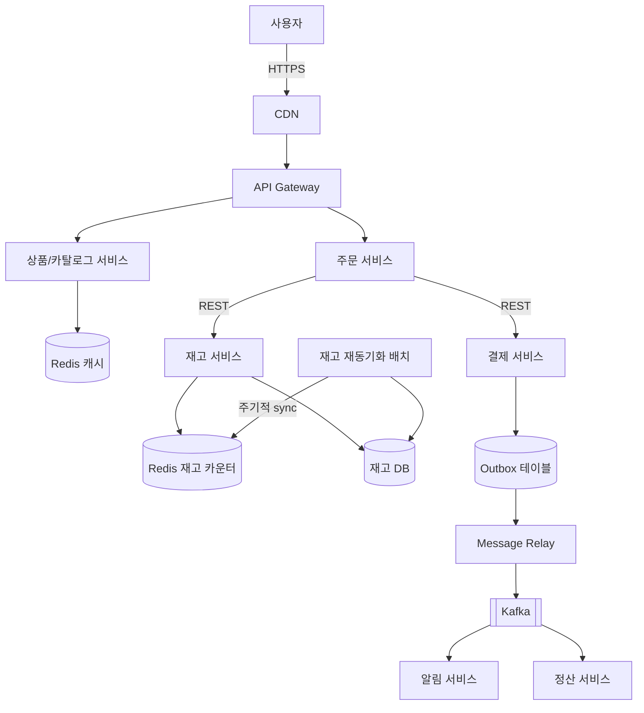
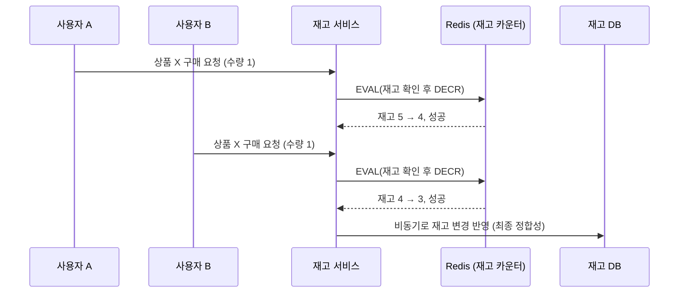
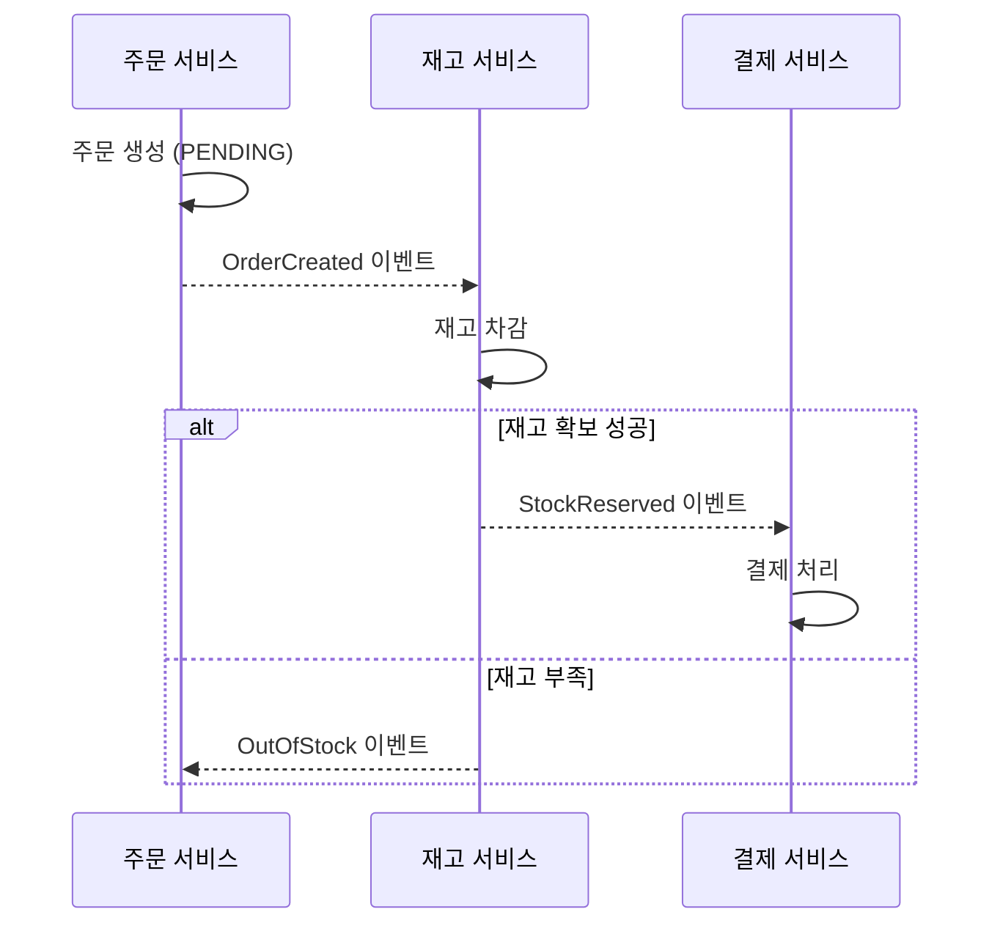
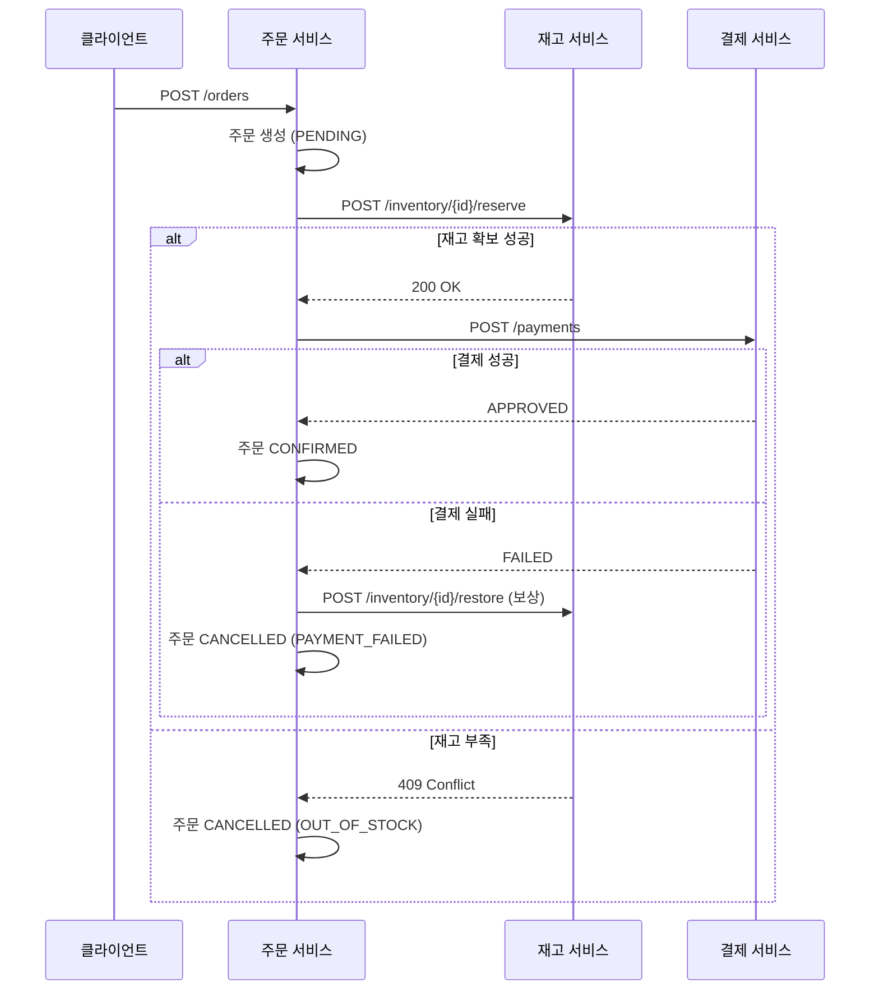

> [지난 콘서트 티켓 예매 아키텍처 글](/posts/concert-ticket-reservation-architecture/)을 정리하면서, 좌석이 아니라 "상품"을 파는 이커머스는 구조가 어떻게 다를지 궁금해져서 자료를 찾아보고 정리한 학습 노트입니다. 다만 이번엔 개념 정리로 끝내지 않고, **재고 동시성 제어**, **데이터 정합성(Saga+Outbox)**, **상품 조회 캐싱** 부분은 실제로 작은 MSA로 구현해서 오버셀링 테스트까지 통과시켰습니다 — 코드는 [github.com/yoonxjoong/ecommerce-msa](https://github.com/yoonxjoong/ecommerce-msa)에 공개해뒀습니다. 반대로 **CDN/Rate Limiting/가상 대기열**은 아직 코드로 옮기지 못했고 여전히 설계 수준입니다 — 아래 각 섹션마다 어디까지가 실제로 검증됐고 어디부터가 설계인지 표시해뒀습니다. 틀린 부분이나 더 나은 방법이 있다면 언제든 알려주세요.

## 왜 이커머스 아키텍처는 어려운가

사용자 입장에서는 "상품을 보고, 장바구니에 담고, 결제한다"는 하나의 흐름이지만, 이 흐름은 실제로는 **상품, 재고, 주문, 결제**라는 서로 다른 도메인을 순서대로 거칩니다. 서비스를 도메인 단위로 나누면 이 도메인들은 각자 자기 DB를 가지게 되고, 그 순간 "하나의 흐름처럼 보이지만 물리적으로 하나의 트랜잭션으로 묶을 수 없다"는 문제가 생깁니다. 결제는 됐는데 재고 차감이 안 됐다거나, 재고는 깎였는데 주문이 안 남는 상황이 생기면 안 되니까요.

콘서트 티켓 예매와 비교하면 이해가 쉽습니다.

- **재고 단위가 다릅니다**: 티켓 예매는 "좌석 하나"라는 단일 식별자를 두고 경쟁하지만, 이커머스는 수많은 상품 각각이 재고 수량을 가지고, 여러 상품이 장바구니 하나에 같이 담깁니다.
- **트래픽이 더 자주, 덜 예측 가능하게 몰립니다**: 티켓 오픈은 특정 시각 단 한 번이지만, 이커머스는 타임세일·라이브커머스·블랙프라이데이처럼 트래픽 폭주가 반복적으로 발생합니다.
- **실패가 옆으로 번지기 쉽습니다**: 주문 → 결제 → 재고 → 알림으로 이어지는 흐름에서 한 서비스가 느려지면, 그 뒤에 걸려 있는 서비스들도 같이 밀리면서 정상적인 주문 처리까지 지연될 수 있습니다.

이 세 가지를 **트래픽 대응**, **재고 동시성 제어**, **데이터 정합성** 관점으로 나눠서 정리해봤습니다.

## 전체 아키텍처 개관



장바구니는 이 프로젝트의 아키텍처 범위에서 아예 뺐습니다 — 주문당 상품 1종만 다룹니다. 점선 없이 실선으로 그린 **CDN/캐시 구간은 아직 설계만 한 부분**이고, **API Gateway·재고 서비스·주문 서비스·결제 서비스·알림 서비스·재고 재동기화 배치는 실제로 구현하고 검증**했습니다. 핵심은 **상품 조회처럼 읽기가 압도적으로 많은 구간은 캐시로 흡수**하고, **주문 생성 이후 알림/정산 같은 후속 처리는 Kafka로 느슨하게 연결**한다는 점입니다. 아래에서 각 구간을 순서대로 살펴보겠습니다.

## 1. 트래픽 대응: 타임세일 오픈 순간 버티기

> **캐싱(Cache-Aside)과 Rate Limiting은 실제로 구현·검증했고, CDN/가상 대기열은 아직 설계 수준입니다.**

콘서트 티켓처럼 특정 시각에 트래픽이 몰리는 건 이커머스도 똑같습니다. 다만 이커머스는 "재고가 극히 적은 좌석 하나"가 아니라 "조회는 폭증하지만 실제 구매 경합은 일부 인기 상품에만 몰리는" 구조라, 대응 방식도 조금 다릅니다.

- **상품 상세 페이지는 캐시로 먼저 막습니다.** 조회 트래픽이 대부분이므로, Redis에 Cache-Aside로 상품 정보를 캐싱하고, 재고 수량처럼 자주 바뀌는 값만 짧은 TTL을 둡니다. DB까지 요청이 내려가는 비율을 최대한 줄이는 게 목적입니다.
- **정적 리소스(이미지, JS/CSS)는 CDN으로 분리**해서, 세일 오픈 순간 원본 서버가 정적 요청 때문에 흔들리지 않게 합니다. *(설계만 함 — CDN은 인프라 영역이라 이 프로젝트 범위에서 빠졌습니다.)*
- **결제 직전 구간에는 Rate Limiting을 겁니다.** 상품 조회는 자유롭게 허용하되, "구매하기" 같은 쓰기 요청은 API Gateway 단에서 Token Bucket 등으로 제한해 재고 서비스·주문 서비스로 넘어가는 요청 양 자체를 조절합니다.
- 특정 인기 상품 하나에 재고 경합이 집중되는 "선착순 특가"류라면, 티켓 예매처럼 **가상 대기열**을 그 상품에 한해 앞단에 두는 것도 방법입니다. 다만 이커머스는 상품이 다양해서 전체 서비스에 대기열을 씌우기보다, 경합이 몰릴 게 뻔한 특정 이벤트 상품에만 국소적으로 적용하는 편이 자연스러워 보입니다. *(설계만 함)*

캐싱 부분은 실제로 [inventory-service](https://github.com/yoonxjoong/ecommerce-msa/tree/main/inventory-service)에 Spring의 선언적 캐싱(`@Cacheable`)으로 구현했습니다. 재고 카운터(`stock:product:*`)와는 별개의 캐시 네임스페이스를 쓰고, TTL은 30초로 뒀습니다.

```java
// inventory-service/.../service/InventoryService.java
@Cacheable(value = "product", key = "#productId", unless = "#result == null")
public Product getProduct(Long productId) {
    log.info("[Cache Miss] DB에서 상품 {} 조회", productId);
    return productRepository.findById(productId).orElse(null);
}
```

```java
// inventory-service/.../config/CacheConfig.java — Redis 캐시 매니저, TTL 30초 + JSON 직렬화
RedisCacheConfiguration config = RedisCacheConfiguration.defaultCacheConfig()
    .entryTtl(Duration.ofSeconds(30))
    .serializeValuesWith(RedisSerializationContext.SerializationPair
        .fromSerializer(new GenericJackson2JsonRedisSerializer()));
```

같은 상품을 세 번 연속 조회해서 확인해봤습니다.

```
1차 호출 -> [Cache Miss] DB에서 상품 1 조회   (로그 찍힘)
2차 호출 -> (로그 안 찍힘, 캐시에서 바로 응답)
3차 호출 -> (로그 안 찍힘, 캐시에서 바로 응답)
```

세 번 호출했는데 DB 접근 로그는 정확히 한 번만 찍혔습니다. 다만 이 캐시에 담기는 `stockQuantity`는 최초 시딩값 기준이라 실시간 재고가 아닙니다 — 실시간 재고는 이 캐시를 타지 않는, 섹션 2의 Redis 카운터(`/inventory/products/{id}/stock`)로 별도 조회해야 합니다. 이 프로젝트엔 상품 정보를 바꾸는 API가 없어서 캐시 무효화(eviction) 로직은 따로 두지 않았는데, 실제 서비스라면 상품 정보 수정 시 `@CacheEvict`로 캐시를 지워주는 로직이 반드시 필요합니다.

Rate Limiting은 [api-gateway](https://github.com/yoonxjoong/ecommerce-msa/tree/main/api-gateway)를 새로 만들어서 구현했습니다. 처음엔 order-service 안에 필터로 넣으려 했는데, 그러면 서비스가 늘어날 때마다 이 로직을 반복해야 해서, 원래 설계대로 게이트웨이(Spring Cloud Gateway)를 세우고 여기서 처리하도록 옮겼습니다.

```yaml
# api-gateway/.../application.yml
- id: order-create-rate-limited
  uri: http://order-service:8080
  predicates:
    - Path=/orders
    - Method=POST      # "구매하기"만 골라서 제한, 상품 조회(GET)는 그대로 통과
  filters:
    - name: RequestRateLimiter
      args:
        redis-rate-limiter.replenishRate: 5
        redis-rate-limiter.burstCapacity: 5
        key-resolver: "#{@ipKeyResolver}"
```

재미있는 점은 Spring Cloud Gateway의 `RedisRateLimiter`도 내부적으로 **Redis + Lua 스크립트로 토큰 버킷을 원자적으로 처리**한다는 겁니다 — 섹션 2에서 재고 차감에 썼던 것과 똑같은 원리가 여기서도 재사용되는 셈입니다. 상태를 게이트웨이 프로세스 메모리가 아니라 Redis에 두기 때문에, 게이트웨이를 여러 대로 늘려도 전체 제한량이 일관되게 유지됩니다.

## 2. 재고 동시성 제어: 오버셀링 막기

> **실제로 구현하고 검증한 부분입니다.** 아래 코드는 [inventory-service](https://github.com/yoonxjoong/ecommerce-msa/tree/main/inventory-service)에 그대로 있는 코드를 살짝 축약한 것입니다.

가장 흔한 사고가 **오버셀링(overselling)**입니다. 재고가 1개 남았는데 두 명이 거의 동시에 "구매하기"를 눌러 둘 다 결제까지 성공해버리는 경우입니다. 티켓 예매의 "좌석 이중 예매"와 본질은 같지만, 이커머스는 재고가 "좌석 식별자"가 아니라 "수량"이라 접근 방식이 조금 더 단순해질 수 있습니다.

| 방식 | 설명 | 장점 | 단점 |
| --- | --- | --- | --- |
| DB 비관적 락 (`SELECT ... FOR UPDATE`) | 재고 row에 직접 락을 건다 | 구현이 단순, 강한 정합성 | 경합이 몰리면 락 대기가 병목 |
| DB 낙관적 락 (버전 컬럼) | `version` 컬럼으로 갱신 시점 충돌 감지 | DB 부하가 적음 | 경합이 심하면 재시도 폭주 |
| Redis 원자적 감소 (`DECR` + Lua 스크립트) | 재고 카운터를 Redis에 두고 원자적으로 확인 후 차감 | 매우 빠름, DB 앞단에서 대부분의 경합을 걸러냄 | Redis 값과 DB 값이 어긋나지 않도록 별도 동기화 필요 |

좌석 예매는 "이 좌석이 비어있는지"를 확인하는 문제라 분산 락(`SETNX`)이 잘 맞았다면, 이커머스 재고는 "숫자를 원자적으로 깎는" 문제라 **Redis `DECR`을 Lua 스크립트로 감싸서 "재고 확인 + 차감"을 한 번의 원자 연산으로 처리**하는 방식이 자주 쓰입니다.



Redis에서 재고가 0이 되면 이후 요청은 즉시 "품절"로 응답하고 DB까지 내려가지 않습니다. 다만 Redis 값은 어디까지나 **빠른 1차 방어선**이고, 최종적으로는 DB 값과 주기적으로 맞춰주는 재동기화(reconciliation)가 필요합니다 — Redis가 장애로 재시작되거나 값이 유실되는 경우까지 대비해야 하기 때문입니다. 이 재동기화는 실제로 별도 배치로 구현했는데, 자세한 내용은 뒤쪽 "전체 시스템 구조" 섹션에서 다룹니다.

이 "확인 후 차감"을 코드로 옮기면 이렇습니다.

```lua
-- inventory-service/src/main/resources/scripts/decrement_stock.lua
-- KEYS[1] = 재고 카운터 키 (예: "stock:product:1234")
-- ARGV[1] = 차감할 수량

local stock = tonumber(redis.call('GET', KEYS[1]))
local qty = tonumber(ARGV[1])

if stock == nil then
    return -1 -- 재고 키 없음
end

if stock < qty then
    return 0 -- 재고 부족
end

redis.call('DECRBY', KEYS[1], qty)
return 1 -- 차감 성공
```

Redis는 싱글 스레드로 명령을 처리하기 때문에, `GET`부터 `DECRBY`까지 이 Lua 스크립트 전체가 **하나의 원자 연산**으로 실행됩니다. 두 요청이 동시에 들어와도 스크립트 실행 자체는 항상 순서대로 처리되므로, "확인은 통과했는데 그 사이 다른 요청이 먼저 차감해버리는" 경쟁 조건이 생기지 않습니다.

```java
// inventory-service/.../service/InventoryService.java
public boolean reserve(Long productId, int quantity) {
    String key = STOCK_KEY_PREFIX + productId;
    Long result = redisTemplate.execute(decreaseStockScript, List.of(key), String.valueOf(quantity));
    return result != null && result == 1L;
}
```

이게 실제로 오버셀링을 막아주는지, 재고 3개인 상품에 **동시 요청 10건**을 던지는 테스트를 만들어서 확인해봤습니다 ([`scripts/oversell-test.sh`](https://github.com/yoonxjoong/ecommerce-msa/blob/main/scripts/oversell-test.sh)).

```
CONFIRMED: 3건 (기대값: 3건)
OUT_OF_STOCK: 7건
최종 Redis 재고: 0
PASS: 오버셀링 없이 정확히 재고 수량만큼만 확정되었습니다.
```

10개의 동시 요청 중 정확히 3건만 성공하고 나머지 7건은 품절로 처리되며, 재고가 음수로 내려가거나 4건 이상 성공하는 일은 없었습니다. Lua 스크립트의 원자성이 실제로 경쟁 조건을 막아준다는 걸 눈으로 확인한 셈입니다.

## 3. 데이터 정합성: 주문 · 재고 · 결제를 일치시키기

> **실제로 구현하고 검증한 부분입니다.** 다만 처음 설계할 때 그렸던 그림과 실제로 구현한 결과물 사이에 차이가 있었는데, 그 차이 자체가 배운 점이라 아래에 그대로 남겨둡니다.

주문 생성, 재고 차감, 결제 승인은 서로 다른 서비스에서 일어나는 별개의 로컬 트랜잭션입니다. 이 중 한 단계가 실패하면 "재고는 깎였는데 결제가 안 됨" 같은 정합성 문제가 생길 수 있는데, 이 보상 개념 자체는 이전에 정리했던 [MSA 분해 이후의 문제들](/posts/msa-service-decomposition-tradeoffs/) 글의 **Saga 패턴**과 이어집니다.

처음엔 아래처럼 **Kafka 이벤트로 각 서비스가 서로 반응하는 choreography 방식**을 그렸습니다.



그런데 실제로 만들어보니 이 방식은 order-service가 "지금 이 주문이 Saga의 어느 단계에 있는지"를 이벤트 흐름만 보고 추적하기 어려웠고, 무엇보다 오버셀링 테스트처럼 **동시 요청 결과를 그 자리에서 바로 검증**하기가 힘들었습니다. 그래서 실제 구현은 **order-service가 재고/결제 서비스를 REST로 직접 호출하는 orchestration 방식**으로 단순화했습니다.



Saga 보상(재고 복구) 여부를 결정하는 판단은 **Kafka 이벤트가 아니라 REST 동기 응답**으로 이루어집니다 — `order-service`가 결제 실패 응답을 받는 순간 곧바로 재고 복구를 호출하고, Kafka가 관여하지 않습니다. 그럼 Kafka/Outbox는 왜 넣었을까요? 아래에서 이어집니다.

여기서 실무적으로 같이 고려한 것들:

- **Outbox 패턴** (구현·검증함): 결제 서비스가 "결제 완료 처리"와 "이벤트 발행 기록"을 같은 트랜잭션으로 Outbox 테이블에 묶어서, 결제는 성공했는데 이벤트 발행에 실패해 후속 서비스가 영영 못 알게 되는 상황을 막습니다.
- **Idempotency Key** (구현함): 네트워크 재시도로 같은 결제 요청이 두 번 들어와도 중복 승인되지 않도록, 요청마다 고유 키를 부여해 결제 서비스가 같은 키는 한 번만 처리하게 합니다.
- **Circuit Breaker / APM 알림** (설계만 함, 미구현): 결제 서비스(특히 외부 PG사 연동)가 느려지거나 응답이 없을 때 [지난 글](/posts/msa-service-decomposition-tradeoffs/)에서 다룬 Circuit Breaker로 장애 전파를 막는 것, 비즈니스 지표 기반 알림을 거는 것은 이번 구현 범위에 넣지 못했습니다.

Outbox 패턴과 Idempotency Key는 실제로 [payment-service](https://github.com/yoonxjoong/ecommerce-msa/tree/main/payment-service)에 그대로 있는 코드입니다.

```sql
-- payment-service의 outbox_event 테이블
CREATE TABLE outbox_event (
    id UUID PRIMARY KEY,
    aggregate_type VARCHAR(50) NOT NULL,
    aggregate_id VARCHAR(50) NOT NULL,
    event_type VARCHAR(50) NOT NULL,
    payload TEXT NOT NULL,
    created_at TIMESTAMP NOT NULL,
    published_at TIMESTAMP                -- Relay가 발행 완료 후 채움
);
```

```java
// payment-service/.../service/PaymentService.java
@Transactional
public PaymentResponse pay(PaymentRequest request) {
    Optional<Payment> existing = paymentRepository.findByIdempotencyKey(request.idempotencyKey());
    if (existing.isPresent()) {
        return toResponse(existing.get()); // 이미 처리된 요청 -> 저장된 결과 그대로 반환
    }

    PaymentStatus status = mockPgApprove(request) ? PaymentStatus.APPROVED : PaymentStatus.FAILED;
    Payment payment = paymentRepository.save(Payment.builder()
        .orderId(request.orderId()).idempotencyKey(request.idempotencyKey())
        .amount(request.amount()).status(status).build());

    // 결제 승인과 이벤트 기록을 같은 트랜잭션으로 묶음 (Outbox)
    String eventType = status == PaymentStatus.APPROVED ? "PaymentCompleted" : "PaymentFailed";
    outboxEventRepository.save(OutboxEvent.builder()
        .aggregateType("PAYMENT").aggregateId(payment.getId().toString())
        .eventType(eventType).payload(toPayload(payment)).build());

    return toResponse(payment);
}
```

```java
// payment-service/.../relay/OutboxRelay.java — Message Relay(폴링 퍼블리셔)
@Scheduled(fixedDelayString = "${payment.outbox-relay.fixed-delay-ms:1000}")
@Transactional
public void publishPendingEvents() {
    List<OutboxEvent> events = outboxEventRepository.findTop50ByPublishedAtIsNullOrderByCreatedAtAsc();
    for (OutboxEvent event : events) {
        kafkaTemplate.send(topic, event.getAggregateId(), event.getPayload());
        event.markPublished();
    }
}
```

`@Transactional`로 결제 승인과 이벤트 기록이 같은 로컬 트랜잭션에 묶이고, 별도 스케줄러(`OutboxRelay`)가 1초마다 미발행 이벤트를 Kafka로 발행합니다. Kafka를 일부러 내린 상태로 주문을 넣어봐도 결제/주문 흐름은 영향을 안 받고, Outbox 테이블에 `published_at`이 빈 채로 쌓여있다가 Kafka가 복구되면 릴레이가 밀린 이벤트를 마저 발행하는 것까지 확인했습니다.

한 가지 짚을 점: 위에서 봤듯 Saga 보상은 REST 동기 응답만으로 이미 끝나기 때문에, Outbox→Kafka 파이프라인은 재고/주문 흐름과는 완전히 별개입니다. 처음엔 이 파이프라인을 구독하는 컨슈머가 하나도 없었는데, [notification-service](https://github.com/yoonxjoong/ecommerce-msa/tree/main/notification-service)를 추가로 만들어서 실제로 이어봤습니다 — `payment-events`를 구독해서 결제 완료/실패에 따라 알림 로그를 남기는 역할만 하는 작은 컨슈머입니다.

```
[알림] 주문 1 결제 완료 - 배송 준비 알림을 발송합니다.
[알림] 주문 2 결제 실패 - 주문 취소 알림을 발송합니다.
```

이걸로 "결제 승인 → Outbox 기록 → Kafka 발행 → 구독자가 반응"까지 전체 파이프라인이 끝까지 연결되는 걸 확인했습니다. 정산 서비스는 아직 안 붙였고, 실제 이메일/푸시 발송도 흉내만 낸 로그입니다.

## 전체 시스템 구조 (MSA 분해)

지금까지 나온 내용을 서비스 단위로 정리하면 대략 이렇게 나뉠 것 같습니다. (구현) 표시는 실제로 [저장소](https://github.com/yoonxjoong/ecommerce-msa)에 코드가 있는 것, 나머지는 설계만 한 것입니다.

- **API Gateway** (구현): 인증은 아직 없고, `POST /orders` Rate Limiting과 각 서비스로의 라우팅만 처리
- **상품/카탈로그 서비스** (구현): 지금은 별도 서비스가 아니라 inventory-service에 포함 — 상품 조회, Redis Cache-Aside로 읽기 최적화
- **재고 서비스** (구현): 재고 카운터 관리(Redis Lua 원자 연산), `product` 테이블(카탈로그+최초 시딩값)
- **주문 서비스** (구현): 주문 생성/상태 관리, Saga 오케스트레이터 (REST 동기 호출). 장바구니는 두지 않아서 주문당 상품 1종만 지원
- **결제 서비스** (구현): mock 결제 승인, 결제 이벤트 발행 (Outbox + Message Relay)
- **알림 서비스** (구현): Kafka `payment-events` 구독, 결제 완료/실패에 따른 알림 로그
- **재고 재동기화 배치** (구현): Redis 재고 카운터를 주기적으로 Postgres에 되돌려 쓰는 배치 — 왜 필요한지는 바로 아래에서 설명합니다
- **정산 서비스**: 판매 데이터 집계, 정산 처리 (설계만 함)

서비스 간 통신은 **사용자 응답이 즉시 필요한 구간(상품 조회, 재고 확인, 결제 요청)은 동기 REST**로, **결과를 나중에 반영해도 되는 구간(알림, 정산)은 Kafka를 통한 비동기 이벤트**로 나누는 게 자연스러워 보입니다 — 다만 실제 구현에서는 Saga 보상 판단까지 동기 REST로 처리했다는 점은 앞서 말씀드린 그대로입니다.

### 재고 재동기화 배치 — 실제로 만들면서 발견한 문제

Redis는 이 프로젝트에서 사실상 유일한 실시간 재고 소스입니다. 그런데 inventory-service는 시작할 때 Postgres의 **최초 시딩값**으로 Redis 키를 채우는데(`SETNX`로 키가 없을 때만), Redis가 재시작 등으로 데이터를 잃으면 이미 판매된 재고가 최초값으로 되살아나는 오버셀링 사고로 이어질 수 있습니다.

이 위험을 줄이려고 두 가지를 추가했습니다.

- Redis에 AOF 영속성을 켜서, 정상적인 컨테이너 재시작으로는 데이터가 아예 안 날아가게 함
- 별도 배치 서비스가 5초마다 Redis의 현재 재고 값을 Postgres에 되돌려 써서, 최악의 경우에도 "최초값"이 아니라 "마지막으로 동기화된 값"으로 복구되게 함

다만 이건 위험을 **줄이는 완화책**이지 완전한 해결책은 아닙니다. 재동기화 주기(5초) 사이의 간극만큼은 여전히 위험 구간으로 남아있습니다.

## 실제로 만들면서 겪은 문제들

설계할 땐 안 보이다가 실제로 Docker Compose로 띄워보고 나서야 알게 된 것들입니다. 이론 정리만 했다면 몰랐을 부분이라 따로 남겨둡니다.

- **재고 시딩 레이스 컨디션**: 처음엔 Redis에 초기 재고를 채우는 로직을 `@PostConstruct`로 짰는데, 이게 `data.sql`로 상품 데이터를 넣는 시점보다 먼저 실행돼버려서 Redis에 재고 키가 하나도 안 만들어지는 버그가 있었습니다. 스프링 컨텍스트가 완전히 다 뜬 뒤 발행되는 `ApplicationReadyEvent`로 바꿔서 해결했습니다.
- **단일 브로커 Kafka에서 컨슈머 그룹이 영원히 안 되던 문제**: Kafka는 컨슈머 그룹을 쓰려면 내부적으로 `__consumer_offsets` 토픽이 필요한데, 기본 설정(`offsets.topic.replication.factor=3`)이 브로커 3대를 요구합니다. 브로커가 1대뿐인 로컬 환경에선 이 토픽 생성이 계속 조용히 실패해서, 프로듀서(발행)는 멀쩡한데 컨슈머(구독)는 전부 무한 대기하는 상태가 됐습니다. `offsets.topic.replication.factor=1`로 낮춰서 해결했는데, 오프셋 조회로는 메시지가 있다는 게 확인되는데 컨슈머로는 안 읽히는 증상이라 처음엔 원인을 좁히기 까다로웠습니다.
- **메모리 제약**: 총 1.9GB 메모리인 서버에 Postgres + Redis + Kafka + Spring Boot 서비스 여러 개를 한 번에 띄우니 swap을 800MB 넘게 쓸 정도로 빠듯했습니다. JVM 힙(`-Xmx200m`)과 컨테이너 메모리 상한을 명시적으로 걸어두지 않았다면 OOM으로 뭔가 죽었을 가능성이 높습니다.

## 한계 및 남는 궁금증

정리하면서도 확실하지 않은 부분, 그리고 이번에 구현 범위에서 뺀 부분들입니다.

- **트래픽 대응 중 CDN/가상 대기열은 미구현** — 캐싱과 Rate Limiting은 구현·검증했지만, 나머지는 여전히 설계만 있는 상태입니다.
- **장바구니를 아키텍처 범위에서 아예 뺐습니다.** 주문당 상품 1종만 지원해서, 여러 상품이 한 주문에 섞였을 때(일부는 재고 확보, 일부는 품절) 부분 실패를 어떻게 처리할지 같은 어려운 문제 자체를 피해갔습니다. 장바구니에 담아둔 시점과 결제 시점 사이 재고가 바뀌는 문제도 마찬가지로 다루지 않았습니다.
- Circuit Breaker, 정산 서비스는 아직 구현하지 않았습니다.
- 실제 서비스들은 이 구조를 그대로 쓰기보다 트래픽 규모와 상품 특성(단일 SKU vs 옵션이 많은 상품)에 맞게 훨씬 단순화하거나 다르게 구성할 수도 있을 것 같습니다.

다음엔 가상 대기열을 실제로 구현해보거나, 장바구니(여러 상품 주문)를 아키텍처에 다시 넣고 부분 실패 문제를 정면으로 풀어보고 싶습니다.

## 참고 자료

- [Pattern: Saga](https://microservices.io/patterns/data/saga.html) — microservices.io
- [Pattern: Transactional outbox](https://microservices.io/patterns/data/transactional-outbox.html) — microservices.io
- [bliki: CircuitBreaker](https://martinfowler.com/bliki/CircuitBreaker.html) — Martin Fowler
- [Idempotent requests](https://docs.stripe.com/api/idempotent_requests) — Stripe API Reference
- [Flash Sale System Design: Architecture, Scale, and Oversell](https://singhajit.com/flash-sale-system-design/) — Ajit Singh
- [How to Implement Atomic Read-Modify-Write with Redis Lua](https://oneuptime.com/blog/post/2026-01-21-redis-lua-read-modify-write/view) — OneUptime
