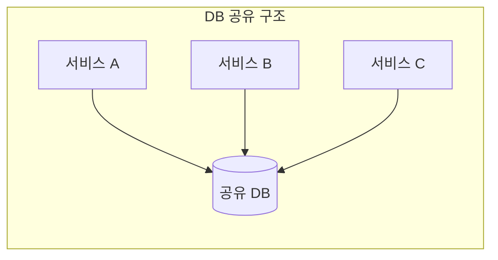
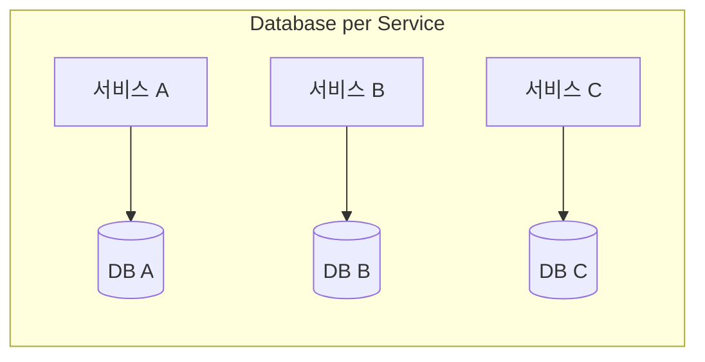
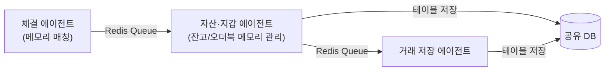
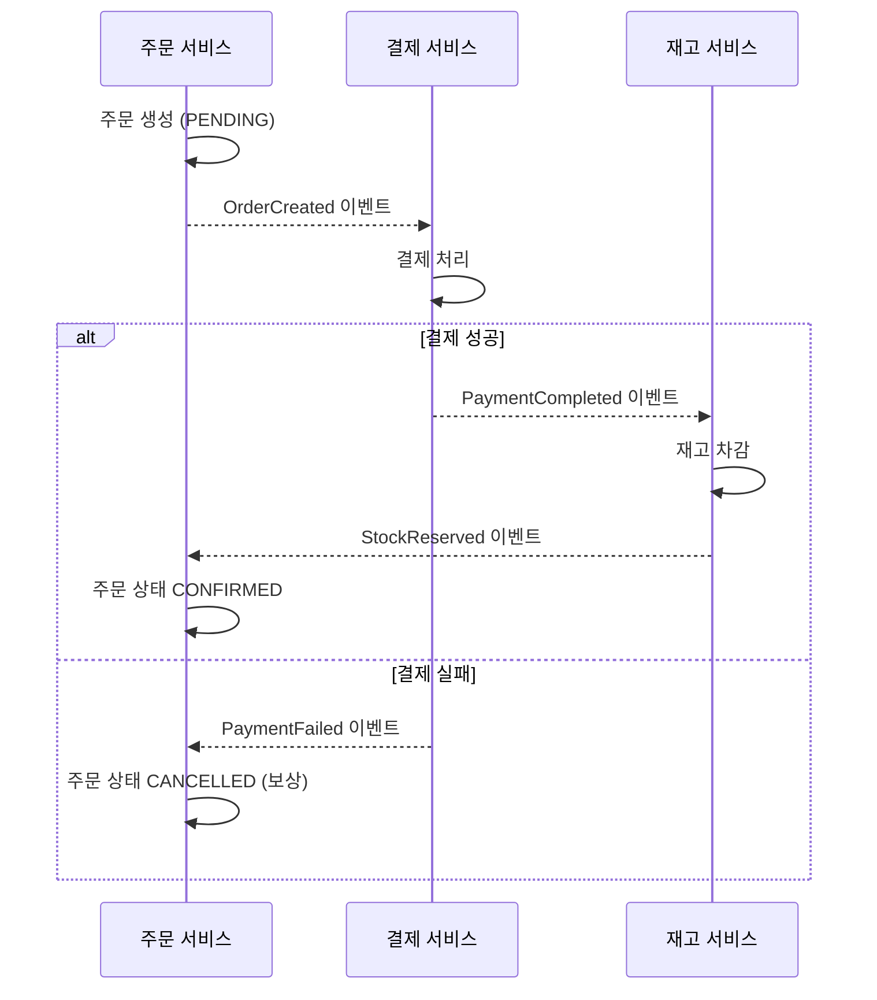
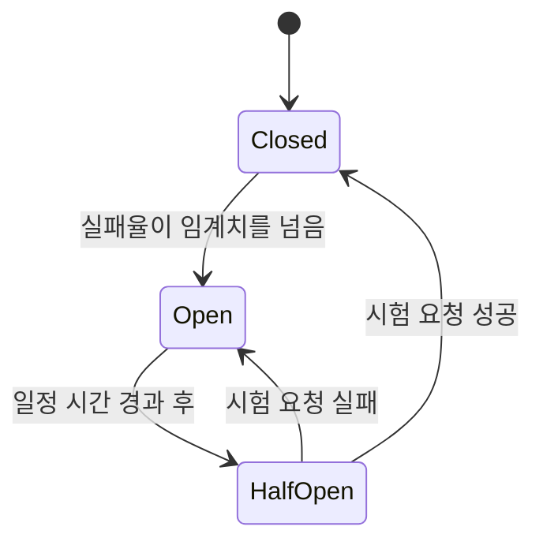

지난 [마이크로서비스 아키텍처 글](/posts/MSA-1/)에서는 모놀리식과 마이크로서비스를 비교하면서, "독립적으로 배포 가능한 작은 서비스로 나눈다"는 개념과 장단점을 정리했습니다. 그런데 실제로 서비스를 나누는 것 자체는 시작에 불과하고, 나눈 뒤에 진짜 문제들이 시작됩니다.

이번 글에서는 서비스를 쪼갠 뒤 반드시 부딪히는 네 가지 주제 — **Database per Service, 분산 트랜잭션(Saga 패턴), Service Discovery, 장애 격리(Circuit Breaker)** — 를 정리해봤습니다.

## 1. Database per Service: 나누라고는 하는데, 왜?

마이크로서비스의 원칙 중 하나가 "서비스마다 자기 데이터베이스를 가져야 한다(Database per Service)"입니다. 처음 이 얘기를 들으면 의아할 수 있습니다. 같은 도메인을 다루는 서비스들이 DB를 하나 공유하면 조인도 쉽고 트랜잭션도 간단한데, 왜 굳이 나누라는 걸까요.

공유 DB 구조가 편한 건 사실입니다. 트랜잭션 정합성을 DB가 알아서 보장해주고, 서비스 하나가 다른 서비스 데이터를 조인해서 바로 조회할 수도 있습니다. 실제로 예전에 참여했던 가상화폐 거래소 프로젝트에서 이걸 그대로 겪었습니다.

기존 거래엔진은 C#으로 작성된 단일 서버 에이전트였는데, 거래량이 늘어나면 시스템이 멈추고 에러가 발생하는 문제가 있어서 도메인 단위로 쪼개기로 했습니다. 어떤 기준으로 나눌지 고민한 끝에 **체결 / 자산 / 지갑** 세 모듈로 나누고, 서버도 각각 별도로 띄웠습니다 — 무엇보다 처리 속도를 최우선으로 둔 결정이었습니다.

파이프라인은 이렇게 흘러갑니다. 체결 에이전트가 메모리에서 최대한 빠르게 매칭을 처리하고, 다음 에이전트가 그 결과를 받아 지갑·자산 잔고와 오더북 상태를 메모리에서 관리하면서 테이블에 반영하고, 마지막 에이전트가 확정된 거래 내역을 저장하는 구조였습니다. 에이전트 간 데이터는 Redis 큐로 비동기 전달했고, 서버 간 헬스체크는 REST API로 처리했습니다. 그런데 — **DB만큼은 세 에이전트가 하나를 공유**했습니다.

당시엔 이게 합리적인 선택이었습니다. 에이전트를 막 분리하기 시작한 단계에서 DB까지 쪼개면 트랜잭션을 다시 설계해야 하는데, 그럴 여유가 없었습니다. 공유 DB 덕분에 "체결은 됐는데 잔고 반영이 안 됐다" 같은 정합성 문제는 걱정할 필요가 없었죠.

다만 그 대가도 분명했습니다.

- **스키마 변경이 무서워진다**: 한 에이전트가 쓰는 테이블 구조를 바꾸면, 그 테이블을 같이 보는 다른 에이전트가 영향을 받을 수 있어서 항상 셋을 다 확인해야 했습니다.
- **결합도가 코드가 아니라 DB에 숨어있다**: 겉보기엔 프로세스가 분리돼 있어 독립적으로 보이지만, 실제로는 DB 스키마를 통해 강하게 묶여 있었습니다. "서비스가 나뉘어 있다 = 독립적이다"가 아니라는 걸 몸으로 배운 경험이었습니다.
- **DB 자체를 독립적으로 확장할 수 없다**: 에이전트 중 하나만 트래픽이 몰려도 DB는 셋이 공유하는 하나뿐이라 전체가 영향을 받습니다.

즉 이 구조는 "서비스는 분리했지만 DB는 공유"한, MSA보다는 SOA(Service-Oriented Architecture)에 가까운 절충안이었습니다. 이 경험 덕분에 Database per Service 원칙이 왜 존재하는지, 그리고 그걸 지키지 않으면 정확히 어떤 대가를 치르는지를 이론이 아니라 트레이드오프로 이해하게 됐습니다.

## 2. 그럼 DB를 나누면? — 분산 트랜잭션과 Saga 패턴

DB를 서비스별로 쪼개는 순간, 앞서 공유 DB가 공짜로 해결해주던 문제가 그대로 돌아옵니다. "주문 생성 + 결제 처리 + 재고 차감"처럼 여러 서비스에 걸친 작업을 하나의 트랜잭션으로 묶을 수 없게 되는 것이죠. 이때 등장하는 게 **Saga 패턴**입니다.

Saga는 하나의 큰 트랜잭션을, 각 서비스가 처리하는 **로컬 트랜잭션의 연속**으로 쪼개고, 중간에 실패하면 이전 단계를 취소하는 **보상 트랜잭션(Compensating Transaction)**을 실행하는 방식입니다. 구현 방식은 크게 두 가지입니다.

**Choreography (안무형)**: 중앙 지휘자 없이, 각 서비스가 이벤트를 발행하고 구독하면서 다음 단계를 스스로 트리거합니다.

서비스 간 결합도가 낮고 구현이 단순하지만, 참여 서비스가 늘어날수록 "지금 전체 흐름이 어디까지 왔는지" 한눈에 파악하기 어려워집니다.

**Orchestration (오케스트레이션형)**: 중앙에 Saga Orchestrator를 두고, 이 오케스트레이터가 각 서비스에 순서대로 명령을 내리고 실패 시 보상 명령도 직접 지시합니다. 흐름이 한 곳에 명시적으로 드러나 추적은 쉽지만, 오케스트레이터가 새로운 종류의 중앙 의존점이 됩니다.

앞서 얘기한 공유 DB 구조로 돌아가보면, 그 프로젝트가 DB를 공유했던 이유 중 하나가 사실 이 Saga 패턴 같은 보상 로직을 별도로 설계할 여력이 없었기 때문이기도 했습니다. "DB를 나누지 않으면 편하지만 결합도가 생기고, 나누면 독립적이지만 이런 보상 트랜잭션 설계 비용이 붙는다"는 트레이드오프를 양쪽 다 겪어본 셈입니다.

## 3. Service Discovery: 서버 주소를 어떻게 알아낼까

서비스를 여러 대의 서버에 분산 배포하면 바로 다음 문제가 생깁니다. **서비스 A가 서비스 B를 호출하려면, B가 지금 어느 서버(IP:Port)에 떠 있는지 알아야 합니다.** 서버 대수가 몇 대뿐이고 거의 안 바뀐다면 설정 파일에 IP를 박아놓고 써도 되지만, 서버가 스케일 아웃/인 되거나 장애로 재시작되면 이 방식은 바로 깨집니다.

| 방식 | 설명 | 예시 |
| --- | --- | --- |
| 클라이언트 사이드 디스커버리 | 클라이언트가 레지스트리에 직접 물어본 뒤, 받은 주소로 직접 요청 | Netflix Eureka + Ribbon |
| 서버 사이드 디스커버리 | 클라이언트는 로드밸런서/게이트웨이에만 요청하고, 실제 라우팅은 그쪽이 레지스트리를 참조해 처리 | Kubernetes Service, AWS ALB |

핵심 메커니즘은 동일합니다. 각 서비스 인스턴스가 뜨면 **레지스트리(Eureka, Consul 등)에 자신을 등록**하고, 주기적으로 **헬스체크(하트비트)**를 보내 살아있음을 알립니다. 레지스트리는 응답이 끊긴 인스턴스를 목록에서 제거하고, 다른 서비스는 항상 레지스트리를 통해 "현재 살아있는" 인스턴스 목록을 받아 요청을 보냅니다.

앞서 얘기한 프로젝트에서는 에이전트별로 서버 주소를 알고 있는 구조였는데, 서버가 소수(에이전트당 1~2대)였고 자주 바뀌지 않았기 때문에 문제가 크게 드러나지 않았습니다. 하지만 서버 대수가 늘어나거나 오토스케일링이 필요한 규모였다면, 수동으로 주소를 관리하는 방식은 금방 한계에 부딪혔을 것 같습니다. 이 부분이 "규모가 커지면 다음에 필요해지는 것"으로 가장 명확하게 그려지는 지점이었습니다.

## 4. Circuit Breaker: 장애가 옆으로 안 번지게

서비스가 여러 개로 나뉘면 서비스 간 호출도 늘어나는데, 그중 하나가 느려지거나 죽으면 어떻게 될까요? 안전장치가 없으면, 그 서비스를 호출하는 다른 서비스들도 응답을 기다리다 스레드/커넥션이 고갈되면서 **장애가 옆으로 전파**됩니다. 이걸 막는 게 Circuit Breaker 패턴입니다.

- **Closed (닫힘)**: 평상시 상태. 요청을 정상적으로 통과시키면서 실패율을 계속 집계합니다.
- **Open (열림)**: 실패율이 임계치를 넘으면 회로가 열리며, 이후 요청은 실제 호출 없이 즉시 실패(또는 대체 응답)를 반환합니다. 장애가 난 서비스에 요청을 계속 몰아넣지 않게 막아주는 역할입니다.
- **Half-Open (반열림)**: 일정 시간이 지나면 시험 삼아 요청을 몇 개만 흘려보내고, 성공하면 Closed로 복구, 실패하면 다시 Open으로 돌아갑니다.

Spring 진영에서는 Resilience4j로 이 패턴을 붙이는 게 일반적이고, Bulkhead(리소스 격리)나 Rate Limiter 같은 패턴과 함께 묶어서 쓰는 경우가 많습니다. 여기는 아직 직접 다뤄본 적이 없어서, 다음 학습/실습 대상으로 남겨둡니다.

## 마무리

정리하고 나니, 서비스를 나누는 것 자체보다 나눈 뒤에 생기는 문제들 — 정합성을 어떻게 다시 확보할지(Saga), 서로를 어떻게 찾을지(Service Discovery), 한쪽 장애가 번지지 않게 어떻게 막을지(Circuit Breaker) — 이게 진짜 MSA의 난이도라는 걸 다시 느꼈습니다.

특히 Database per Service는 예전에 겪었던 "서비스는 나눴지만 DB는 공유했던" 경험과 겹쳐지면서, 원칙을 문장으로만 아는 것과 왜 그 원칙이 필요한지 대가를 몸으로 아는 것의 차이를 느낄 수 있었습니다. Service Discovery와 Circuit Breaker는 아직 실무에서 직접 부딪혀본 적이 없는 영역이라, 다음에는 작은 규모로라도 직접 구성해보면서 정리해보고 싶습니다.
