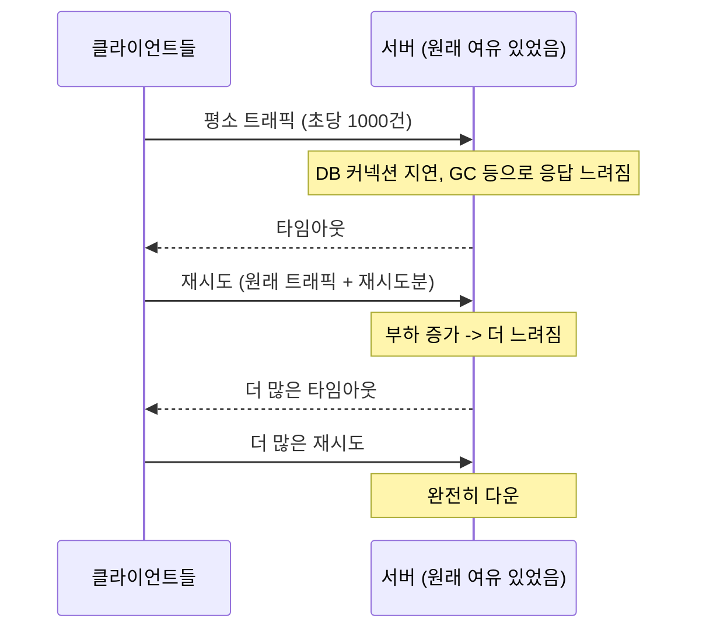
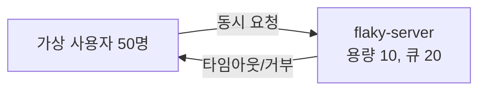

> [ecommerce-msa](https://github.com/yoonxjoong/ecommerce-msa)에 Circuit Breaker를 붙이면서, "재시도는 언제, 어떻게 해야 안전한가"라는 질문이 자연스럽게 따라왔습니다. 개념만 정리하고 끝내기보다, **Retry Storm을 실제로 재현해서 naive 재시도와 Exponential Backoff+Jitter를 숫자로 비교**해봤습니다 — [retry-storm-lab](https://github.com/yoonxjoong/retry-storm-lab)이라는 별도 저장소입니다 (`ecommerce-msa`와는 관심사가 달라서, 그리고 부하 테스트 특성상 메모리를 많이 쓸 수 있어서 분리했습니다). 다만 이 재시도를 `ecommerce-msa`의 실제 서비스 호출(`order-service → payment-service`)에 붙이는 것까지는 아직 안 했습니다 — 아래 코드는 여전히 "이렇게 붙일 수 있다"는 설계 스케치입니다.

## 이런 상황을 상상해보세요

평소 초당 1000건을 무리 없이 받던 서버가 있습니다. 어느 순간부터 응답이 느려지기 시작합니다 — DB 커넥션이 잠깐 밀렸거나, GC가 길게 돌았거나, 이유는 다양합니다.

느려진 응답은 곧 **타임아웃**으로 이어집니다. 타임아웃을 받은 클라이언트들은 (당연하게도) **재시도**를 합니다. 여기서부터가 진짜 문제입니다.

- 서버는 이미 평소보다 느린 상태인데, 여기에 **재시도 트래픽까지 얹혀서** 부하가 더 늘어납니다
- 부하가 늘었으니 응답은 더 느려지고, 더 많은 요청이 타임아웃납니다
- 타임아웃난 요청들이 또 재시도하고, 부하는 또 늘어납니다

**서버를 살리려고 한 재시도가, 서버를 죽이는 방향으로 스스로를 강화하는 피드백 루프**가 만들어집니다. 이게 **Retry Storm**입니다.



실제로 겪어본 적 없더라도 낯설지 않은 이야기일 겁니다 — "재시도했더니 더 심해졌다"는 장애 후기가 유독 많은 이유이기도 하고요. 이 글은 **왜 이런 일이 생기고, 어떻게 재시도를 "안전하게" 설계할 수 있는지**를 정리한 것입니다.

## 재시도, 아무 때나 해도 될까

재시도가 의미 있으려면 먼저 실패의 종류부터 구분해야 합니다.

| 실패 종류 | 예시 | 재시도 효과 |
| --- | --- | --- |
| **일시적(transient) 실패** | 순간적인 네트워크 끊김, DB 커넥션 풀 고갈, GC 일시정지 | 재시도하면 성공할 가능성 있음 |
| **영구적(permanent) 실패** | 잘못된 요청(400), 인증 실패(401), 존재하지 않는 리소스(404) | 재시도해도 100% 또 실패함 |

두 번째 경우에 재시도를 걸면 서버에 불필요한 부하만 더할 뿐 아무것도 해결되지 않습니다. 그래서 실무에서는 보통 **HTTP 상태 코드 기준으로 재시도 대상을 가른다**는 원칙을 씁니다 — 5xx(서버 에러), 타임아웃, 연결 실패는 재시도 후보, 4xx는 재시도 제외.

## 재시도가 안전하려면 — 멱등성

두 번째로 중요한 조건은 **멱등성(Idempotency)**입니다. 재시도는 결국 "같은 요청을 또 보내는 것"인데, 그 요청이 실행될 때마다 다른 결과를 낳는다면(예: "재고 1개 차감") 재시도는 원본 요청과는 다른 부작용(이중 차감)을 만들어버립니다.

이 부분은 사실 [ecommerce-msa](https://github.com/yoonxjoong/ecommerce-msa)에서 이미 실제로 마주쳤던 문제입니다. `payment-service`의 `PaymentService.pay()`가 `idempotencyKey`로 같은 요청의 중복 실행을 막고 있는데, 이게 정확히 "재시도를 걸어도 안전하게 만들어주는" 장치입니다.

```java
// payment-service/.../service/PaymentService.java (이미 구현·검증된 코드)
Optional<Payment> existing = paymentRepository.findByIdempotencyKey(request.idempotencyKey());
if (existing.isPresent()) {
    return toResponse(existing.get()); // 이미 처리된 요청 -> 저장된 결과 그대로 반환
}
```

반대로 `inventory-service`의 재고 차감(`DECRBY`)은 **멱등하지 않습니다** — 같은 요청을 두 번 보내면 진짜로 두 번 차감됩니다. 그러니까 "여기에 재시도를 걸어도 될까?"라는 질문의 답은 **"먼저 멱등하게 만들지 않으면 안 된다"**입니다. 재시도는 이미 멱등한 연산 위에나 안전하게 얹을 수 있는 거지, 아무 호출에나 붙일 수 있는 만능 장치가 아닙니다.

## Exponential Backoff — 간격을 벌리기

가장 기본적인 완화책은 **재시도할 때마다 대기 시간을 지수적으로 늘리는 것**입니다.

```
1차 재시도: 1초 대기
2차 재시도: 2초 대기
3차 재시도: 4초 대기
4차 재시도: 8초 대기
```

이러면 실패가 계속될수록 서버에 가하는 압박이 줄어듭니다. 근데 이것만으로는 부족합니다 — **같은 시각에 실패한 클라이언트 1000개가 전부 "1초 후 재시도"를 하고 있다면, 1초 뒤에 또 한꺼번에 몰려듭니다.** 간격을 벌리는 것과, 그 간격이 서로 겹치지 않게 하는 건 다른 문제입니다.

## Jitter — 몰리는 시점을 흩뜨리기

여기서 **Jitter(무작위성)**가 들어옵니다. AWS Architecture Blog의 ["Exponential Backoff and Jitter"](https://aws.amazon.com/blogs/architecture/exponential-backoff-and-jitter/)가 이 주제의 정석 같은 글인데, 세 가지 전략을 비교합니다.

| 전략 | 방식 | 특징 |
| --- | --- | --- |
| **No Jitter** | 고정된 지수 백오프 그대로 | 클라이언트들이 계속 같은 타이밍에 몰림 (Thundering Herd) |
| **Full Jitter** | `random(0, backoff)` | 대기 시간을 0부터 백오프값 사이에서 완전 무작위로 |
| **Equal Jitter** | `backoff/2 + random(0, backoff/2)` | 최소 대기 시간은 보장하면서 일부만 무작위화 |
| **Decorrelated Jitter** | 이전 대기 시간을 기준으로 다음 값을 무작위로 늘림 | 재시도끼리도 서로 상관관계를 낮춤 |

핵심 통찰은 이겁니다 — **"무작위성을 더해서 시스템 성능을 개선한다"는 게 직관적이진 않지만, 클라이언트들의 재시도 타이밍을 서로 어긋나게(decorrelate) 만드는 게 목적**입니다. 다 같이 정해진 타이밍에 몰리는 것 자체가 문제였으니까요.

## 말로만 하지 않고 실제로 재현해봤습니다

이 주장(naive 재시도는 부하를 늘리고, Backoff+Jitter는 줄인다)이 진짜인지 [retry-storm-lab](https://github.com/yoonxjoong/retry-storm-lab)이라는 작은 프로젝트로 직접 확인해봤습니다. 구조는 단순합니다.

- **flaky-server**: 진짜 "용량"이 있는 서버. Tomcat 스레드 풀을 10개로 제한하고, 요청 하나당 200ms가 고정으로 걸리게 해뒀습니다. 이론상 최대 처리량은 초당 50건 정도입니다.
- **retry-client**: 가상 사용자 50명이 동시에 이 서버를 두드립니다(사용자당 5건, 총 논리적 요청 250건). 재시도 전략만 `none` / `naive`(거의 즉시 재시도) / `backoff-jitter`(Resilience4j `IntervalFunction.ofExponentialRandomBackoff`)로 바꿔가며 같은 부하를 걸었습니다.



같은 부하, 같은 최대 시도 횟수(5회)로 세 전략을 그대로 돌린 결과입니다.

| 전략 | 서버로 나간 총 요청(재시도 포함) | 성공률 | 소요 시간 |
| --- | --- | --- | --- |
| `none` (재시도 없음) | 250건 | 18.8% (47/250) | 5.1초 |
| `naive` (즉시 재시도) | 625건 | 75.6% (189/250) | 13.0초 |
| `backoff-jitter` | 356건 | **100.0%** (250/250) | 7.6초 |

`naive`가 `none`보다 성공률은 높였지만, 그 대가로 **서버에 2.5배 많은 요청을 쏟아부었고 시간도 제일 오래 걸렸습니다** — 서버가 계속 포화 상태 근처에 머물러 있었다는 신호입니다. `backoff-jitter`는 `naive`보다 적은 요청으로 100% 성공했고, 더 빨리 끝났습니다. 재시도 간격이 벌어지고 흩어지는 동안 서버가 밀린 요청을 처리할 틈이 생긴 것으로 보입니다.

설계 단계에서 주장했던 걸 숫자로 확인한 셈입니다.

## Retry와 Circuit Breaker는 같이 다닌다

이 글을 쓰게 된 계기가 Circuit Breaker였는데, 사실 이 둘은 따로 노는 개념이 아닙니다.

- **Circuit Breaker가 OPEN 상태**라는 건 "지금 이 서비스는 계속 실패하고 있다"는 걸 이미 알고 있다는 뜻입니다
- 그 상태에서 재시도를 시도하는 건 애초에 무의미합니다 — 재시도 자체를 걸기 전에 **"지금 재시도해볼 가치가 있는 상태인가"부터 Circuit Breaker에게 물어보는 게** 순서상 맞습니다

Resilience4j에서는 보통 이렇게 감쌉니다 (개념 스케치입니다):

```java
@Retry(name = "paymentService")
@CircuitBreaker(name = "paymentService", fallbackMethod = "fallback")
public PaymentResult pay(...) { ... }
```

여기서 재밌는(그리고 헷갈리기 쉬운) 부분이 있습니다 — **Resilience4j의 어노테이션 적용 순서는 코드에 쓴 순서와 무관하게 고정**돼 있습니다. 기본 순서는

```
Retry ( CircuitBreaker ( RateLimiter ( TimeLimiter ( Bulkhead ( 실제 호출 ) ) ) ) )
```

즉 **`Retry`가 가장 바깥, `CircuitBreaker`가 그 안쪽**입니다 — 처음엔 저도 반대로 알고 있었는데, 찾아보니 이게 맞았습니다. 이 순서가 의미하는 바는: 재시도를 한 번 시도할 때마다 매번 Circuit Breaker의 현재 상태부터 확인한다는 것입니다. Circuit이 이미 OPEN이라면, `Retry`가 재시도를 반복하긴 하지만 그 각각의 시도는 실제 네트워크 호출까지 가지 않고 Circuit Breaker 단계에서 즉시 실패로 끝납니다 (`CallNotPermittedException`) — 그래도 정해진 재시도 횟수만큼은 이 "즉시 실패"를 반복하게 되니, 완전히 공짜는 아니지만 최소한 실제 네트워크 왕복(과 그로 인한 부하)은 막아주는 셈입니다.

한 가지 더 — 이 기본 순서는 사실 [resilience4j GitHub 이슈](https://github.com/resilience4j/resilience4j/issues/2383)에서 "Circuit Breaker의 실패 카운트가 부풀려질 수 있다"는 부작용으로 지적된 적도 있는 지점이라, **운영에서는 기본값에 기대지 말고 `resilience4j.retry.retry-aspect-order`, `resilience4j.circuitbreaker.circuit-breaker-aspect-order` 같은 프로퍼티로 순서를 명시적으로 고정해두는 게 안전**해 보입니다.

## 그래서 이걸 어디에 붙이면 좋을까

[ecommerce-msa](https://github.com/yoonxjoong/ecommerce-msa) 기준으로 정리해보면:

- **`order-service → payment-service` 호출**: 좋은 후보입니다. 이미 Idempotency Key로 멱등성이 보장돼 있고, Circuit Breaker도 이미 붙어있어서 `@Retry` 어노테이션 하나만 추가하면 됩니다 (실제로 감싸는 순서는 Resilience4j가 알아서 `Retry(CircuitBreaker(...))`로 잡아줍니다).
- **`order-service → inventory-service`의 재고 차감(`reserve`)**: 아직은 안 됩니다. `DECRBY`는 멱등하지 않아서, 지금 상태로 재시도를 걸면 "타임아웃났는데 사실은 서버에서 차감은 성공했던" 상황에서 이중 차감이 일어날 수 있습니다. 재시도를 걸려면 먼저 이 호출에도 멱등키(예: 요청 ID 기반)를 도입해야 합니다.

## 한계 및 남는 궁금증

- `retry-storm-lab`으로 Retry Storm 재현과 Backoff+Jitter의 효과는 실제로 검증했지만, 이걸 `ecommerce-msa`의 실제 서비스 호출(`order-service → payment-service`)에 붙이는 건 아직 안 했습니다. `inventory-service`의 재고 차감에 멱등키를 먼저 도입하는 것도 마찬가지로 남아있습니다.
- `backoff-jitter`가 100% 성공한 건 이번 부하 조건(가상 사용자 50명, 최대 시도 5회)에서의 결과입니다. 부하가 더 크거나 서버 용량이 더 작았다면 5번의 재시도로도 부족했을 수 있어서, "얼마나 재시도하면 충분한지"는 여전히 트래픽 패턴에 달린 문제입니다.
- AWS 블로그의 Jitter 전략 세 가지(Full/Equal/Decorrelated)를 각각 정확히 구현해서 비교한 건 아니고, Resilience4j가 기본 제공하는 `IntervalFunction.ofExponentialRandomBackoff`(자체 랜덤화 공식) 하나만 써봤습니다. 이게 세 전략 중 어디에 가장 가까운지, 서로 실제로 얼마나 차이 나는지는 다음에 직접 비교해보고 싶습니다.
- 재시도 총 횟수, 최대 대기 시간 상한 같은 값도 다 감으로 잡은 부분이라, 이것도 결국 [Circuit Breaker 글](/posts/ecommerce-architecture/)에서 짚었던 "실측 없이 정한 기본값" 문제와 똑같이 남아있습니다.

기회가 되면 `inventory-service`의 재고 차감 호출에 멱등키를 먼저 붙이고, 그 위에 Retry + Circuit Breaker를 `ecommerce-msa`에 실제로 얹어서 Retry Storm이 억제되는 걸 직접 확인해보고 싶습니다.

## 참고 자료

- [Exponential Backoff and Jitter](https://aws.amazon.com/blogs/architecture/exponential-backoff-and-jitter/) — AWS Architecture Blog, Marc Brooker
- [Retry Storms: Amplification & Mitigation](https://www.emergentmind.com/topics/retry-storms)
- [Guide to Resilience4j With Spring Boot](https://www.baeldung.com/spring-boot-resilience4j) — Baeldung
- [Retry with Spring Boot and Resilience4j](https://reflectoring.io/retry-with-springboot-resilience4j/) — reflectoring.io
- [Default Aspect Order places Retry outside CircuitBreaker, causing inflated failure counts](https://github.com/resilience4j/resilience4j/issues/2383) — resilience4j GitHub Issues
