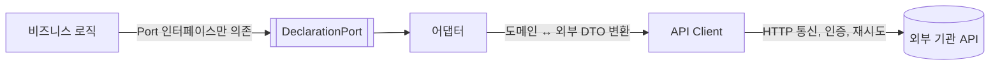

업무 중에 외부 기관 API와 연동하는 기능을 개발할 일이 있었습니다. 처음엔 "그냥 API 호출하는 메서드 하나 만들면 되는 거 아닌가?" 싶었는데, 막상 짜다 보니 한 클래스에 다 몰아넣는 것과 계층을 나누는 것 사이에서 고민하게 됐고, 결국 **비즈니스 로직 / 어댑터 / API Client**로 나눠서 개발했습니다. 왜 이렇게 나눴는지 정리해봅니다.

## 처음에 다 합쳤을 때 생기는 문제

가장 빠른 방법은 서비스 클래스 하나에 다 넣는 것입니다.

```java
@Service
public class DeclarationService {

    private final RestTemplate restTemplate;

    public DeclarationResult submitDeclaration(Declaration declaration) {
        // 1. 비즈니스 규칙 검증
        if (declaration.getItems().isEmpty()) {
            throw new IllegalArgumentException("신고 항목이 비어있습니다.");
        }

        // 2. 외부 API 요청 포맷으로 변환
        ExternalRequestDto request = new ExternalRequestDto();
        request.setDeclarantCode(declaration.getCompanyCode());
        request.setItems(declaration.getItems().stream()
            .map(i -> new ExternalItemDto(i.getName(), i.getQuantity()))
            .toList());

        // 3. 실제 HTTP 호출 + 인증 헤더 세팅
        HttpHeaders headers = new HttpHeaders();
        headers.set("Authorization", "Bearer " + issueAccessToken());
        HttpEntity<ExternalRequestDto> entity = new HttpEntity<>(request, headers);

        ResponseEntity<ExternalResponseDto> response = restTemplate.postForEntity(
            "https://external-agency.example.com/api/declarations", entity, ExternalResponseDto.class);

        // 4. 응답을 다시 우리 도메인 모델로 변환
        ExternalResponseDto body = response.getBody();
        if (body == null || !"OK".equals(body.getStatus())) {
            throw new DeclarationFailedException(body != null ? body.getErrorMessage() : "응답 없음");
        }

        return new DeclarationResult(body.getDeclarationNo(), body.getProcessedAt());
    }
}
```

한 메서드 안에 **비즈니스 규칙 검증**, **도메인 ↔ 외부 API 모델 변환**, **HTTP 통신/인증 디테일**이 전부 섞여 있습니다. 코드 자체는 동작하지만, 실제로 겪은 문제는 이랬습니다.

- 외부 API 응답 필드 하나가 바뀌어도 `DeclarationService`를 수정해야 해서, 비즈니스 로직과 무관한 변경인데도 서비스 클래스 전체를 다시 들여다봐야 했습니다.
- 신고 항목 검증 같은 순수 비즈니스 규칙을 테스트하려면 `RestTemplate`까지 같이 물려 있어서, HTTP 호출을 mock 처리하지 않으면 단위 테스트가 안 됐습니다.
- 메서드가 길어질수록 "이게 우리 도메인 규칙인지, 아니면 그냥 이 API가 요구하는 특이한 스펙인지" 구분이 점점 어려워졌습니다.

## 계층을 나누기

그래서 역할을 세 가지로 나눴습니다.



- **비즈니스 로직**: 신고 항목 검증 같은 도메인 규칙만 다룹니다. 외부 API가 REST인지, 어떤 인증 방식을 쓰는지 전혀 몰라도 됩니다. `DeclarationPort`라는 인터페이스에만 의존합니다.
- **어댑터**: `DeclarationPort`의 구현체. 도메인 모델(`Declaration`)을 외부 API가 요구하는 형태로 바꾸고, 응답을 다시 도메인 모델(`DeclarationResult`)로 바꿉니다.
- **API Client**: 실제 HTTP 요청, 인증 토큰 발급, 타임아웃/재시도 같은 통신 디테일만 담당합니다. 도메인 모델은 전혀 모릅니다.

### 비즈니스 로직 — Port 인터페이스에만 의존

```java
public interface DeclarationPort {
    DeclarationResult submit(Declaration declaration);
}

@Service
@RequiredArgsConstructor
public class DeclarationService {

    private final DeclarationPort declarationPort;

    public DeclarationResult submitDeclaration(Declaration declaration) {
        if (declaration.getItems().isEmpty()) {
            throw new IllegalArgumentException("신고 항목이 비어있습니다.");
        }
        return declarationPort.submit(declaration);
    }
}
```

`DeclarationService`는 이제 외부 API의 존재 자체를 모릅니다. 테스트할 때는 `DeclarationPort`를 mock으로 대체하면 되니, 비즈니스 규칙 검증만 순수하게 단위 테스트할 수 있습니다.

### 어댑터 — 도메인 모델과 외부 API 모델 사이 변환

```java
@Component
@RequiredArgsConstructor
public class ExternalDeclarationAdapter implements DeclarationPort {

    private final ExternalDeclarationClient client;

    @Override
    public DeclarationResult submit(Declaration declaration) {
        ExternalRequestDto request = toExternalRequest(declaration);
        ExternalResponseDto response = client.postDeclaration(request);

        if (!"OK".equals(response.getStatus())) {
            throw new DeclarationFailedException(response.getErrorMessage());
        }
        return new DeclarationResult(response.getDeclarationNo(), response.getProcessedAt());
    }

    private ExternalRequestDto toExternalRequest(Declaration declaration) {
        ExternalRequestDto request = new ExternalRequestDto();
        request.setDeclarantCode(declaration.getCompanyCode());
        request.setItems(declaration.getItems().stream()
            .map(i -> new ExternalItemDto(i.getName(), i.getQuantity()))
            .toList());
        return request;
    }
}
```

### API Client — 통신 디테일만 담당

```java
@Component
@RequiredArgsConstructor
public class ExternalDeclarationClient {

    private final RestTemplate restTemplate;
    private final TokenProvider tokenProvider;

    public ExternalResponseDto postDeclaration(ExternalRequestDto request) {
        HttpHeaders headers = new HttpHeaders();
        headers.set("Authorization", "Bearer " + tokenProvider.getAccessToken());
        HttpEntity<ExternalRequestDto> entity = new HttpEntity<>(request, headers);

        ResponseEntity<ExternalResponseDto> response = restTemplate.postForEntity(
            "https://external-agency.example.com/api/declarations", entity, ExternalResponseDto.class);

        return response.getBody();
    }
}
```

## 이렇게 나눠서 얻은 것

- **비즈니스 로직 단위 테스트**: `DeclarationPort`를 mock으로 대체하면 네트워크 없이도 검증 로직만 빠르게 테스트할 수 있었습니다.
- **변경 격리**: 외부 API 응답 필드가 바뀌면 어댑터만 고치면 되고, 신고 항목 검증 로직에는 영향이 없습니다. 반대로 검증 규칙이 바뀌어도 통신 코드는 그대로입니다.
- **책임이 분명해짐**: 코드 리뷰할 때 "이건 우리 도메인 규칙인지, 외부 API 스펙 때문인지"를 계층만 보고 바로 구분할 수 있게 됐습니다.

## 그래도 남는 고민

계층을 나누는 만큼 인터페이스, DTO, 구현체까지 파일 수는 확실히 늘어납니다. 정말 한 번 쓰고 버릴 스크립트 수준이라면 이 정도 구조는 과할 수 있습니다. 하지만 실제 서비스 코드에 들어가고, 언젠가 이 외부 시스템의 스펙이 바뀌거나 테스트가 필요해질 가능성이 있다면, 처음부터 계층을 나눠두는 쪽이 결국 더 적은 시간을 쓰게 만든다고 느꼈습니다.
