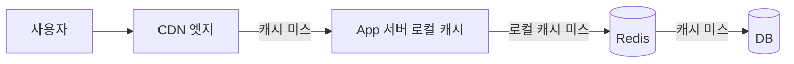
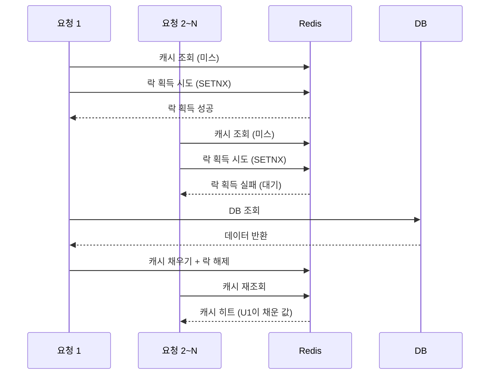
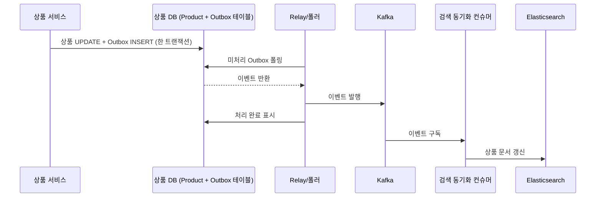
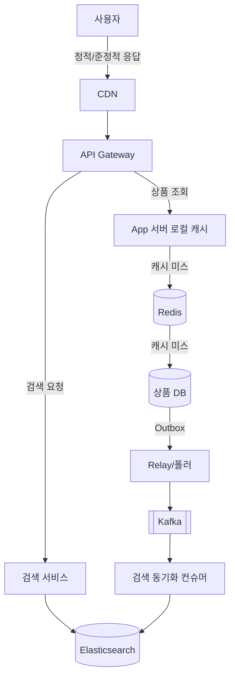

## 왜 읽기 성능이 문제가 되는가

상품 조회처럼 읽기가 압도적으로 많은 API를 생각해보면, 결국 매 요청마다 DB에 접근하게 됩니다. 이게 왜 느려지는지 조금 쪼개보면:

- **디스크 접근**: 데이터가 버퍼 풀(메모리)에 없으면 디스크까지 내려가야 하는데, 메모리 접근보다 몇 자릿수 느립니다.
- **커넥션 풀 고갈**: DB 커넥션 수는 유한한데, 조회 요청이 몰리면 커넥션을 기다리는 큐가 쌓입니다. 이건 쿼리 자체보다 동시성 문제에 가깝습니다.
- **인덱스가 있어도 비용은 있음**: 인덱스를 탄다 해도 결국 B-Tree 탐색 + 디스크 I/O가 붙습니다.

그래서 흔히 쓰는 방법이 Redis 같은 캐시를 앞단에 두는 것입니다. Redis는 **인메모리**라 디스크 I/O 자체가 없고, **단일 스레드**라 락 경합 없이 명령어가 순차 처리되어 오히려 예측 가능한 빠른 응답을 만듭니다.

문제는 여기서 끝나지 않습니다. 타임세일처럼 **같은 상품 하나를 수만 명이 동시에 조회**하는 상황이면, 아무리 Redis가 빨라도 그 요청이 전부 같은 노드의 같은 스레드로 몰리고, 매 요청마다 네트워크 왕복도 발생합니다. 이걸 **핫키(Hot Key) 문제**라고 부르는데, 이걸 풀려면 캐시를 한 겹이 아니라 여러 겹으로 쌓아야 합니다.

## 1. 다계층 캐싱 : 로컬 캐시 → Redis → CDN

- **로컬 캐시(In-process Cache)**: 애플리케이션 서버 메모리 안에 데이터를 직접 들고 있는 방식입니다 (예: Caffeine). 네트워크 왕복 자체가 없어서 Redis보다도 빠릅니다. 대신 서버 인스턴스마다 캐시가 따로 놀기 때문에, 인스턴스 간 데이터가 잠깐 어긋날 수 있어 TTL을 짧게 가져가는 게 일반적입니다.
- **Redis (분산 캐시)**: 여러 서버 인스턴스가 공유하는 캐시입니다. 핫키가 한 노드에 몰리는 걸 완화하려면 Read Replica를 두거나, 키를 `product:1:0` ~ `product:1:9`처럼 샤딩해서 요청을 분산시키기도 합니다.
- **CDN**: 사용자와 물리적으로 가까운 엣지 로케이션에 캐시를 둡니다. Redis는 보통 오리진 서버와 같은 리전에 있어서 "DB까지 안 간다"는 이득은 있어도 사용자와의 물리적 거리는 그대로인데, CDN은 그 거리 자체를 줄입니다. 대신 재고 수량처럼 실시간으로 바뀌는 값은 캐싱하면 안 되고, 정적 자산이나 자주 안 바뀌는 응답에만 적합합니다.

여기서 "로컬 캐시"라는 단어가 맥락에 따라 다르게 쓰일 수 있다는 점도 짚고 넘어갈 만합니다. 예를 들어 결제 콜백을 처리하는 브릿지 페이지에서 결제 정보를 잠깐 담아두는 로컬 캐시는, 한 요청 흐름 안에서 상태를 들고 있는 용도라 아래 표의 왼쪽에 가깝고, 지금 얘기하는 핫키 분산용 로컬 캐시는 오른쪽에 가깝습니다.

| | 요청/세션 범위 로컬 캐시 | 핫키 분산용 로컬 캐시 |
| --- | --- | --- |
| 목적 | 한 요청 흐름(리다이렉트 등) 사이에서 상태를 잠깐 들고 있기 | 여러 사용자의 반복 조회를 서버 메모리에서 흡수해서 Redis 부하 자체를 줄이기 |
| 공유 범위 | 보통 그 요청/세션 하나 | 그 서버 인스턴스로 오는 모든 요청이 공유 |

## 2. 캐시는 언제, 어떻게 지워야 하나 : 무효화 전략과 Cache Stampede

캐시는 결국 원본(DB)과 다른 복사본이기 때문에, 원본이 바뀌면 캐시도 어떻게든 맞춰줘야 합니다. 쓰기가 발생했을 때 캐시를 처리하는 방식은 크게 세 가지로 나뉩니다.

| 전략 | 방식 | 특징 |
| --- | --- | --- |
| Cache-Aside | DB만 갱신하고, 캐시는 지워버림(evict) | 다음 읽기 때 캐시 미스 → DB에서 다시 채움. 구현이 단순해서 가장 흔히 씀 |
| Write-Through | 캐시와 DB를 동시에 갱신 | 캐시가 항상 최신이지만, 쓰기가 두 곳을 다 거쳐서 느림 |
| Write-Behind | 캐시만 먼저 갱신하고, DB엔 비동기로 나중에 반영 | 쓰기는 빠르지만, DB 반영 전에 장애가 나면 데이터 유실 위험 |

CloudFront에서 `create-invalidation`을 호출해 캐시를 강제로 지우는 것이나, Spring의 `@CacheEvict`로 Redis 키를 지우는 것이 전형적인 Cache-Aside의 쓰기 경로입니다.

### Cache Stampede

TTL이든 evict든, 캐시가 "비어있는 순간"은 반드시 생깁니다. 문제는 그 순간이 하필 인기 상품에 트래픽이 몰리는 타이밍과 겹치면, 수만 개 요청이 동시에 캐시 미스가 나서 그대로 DB로 몰려갑니다. 이 현상을 **Cache Stampede**(또는 Thundering Herd, Dog-piling)라고 부릅니다.

막는 방법은 크게 세 가지입니다.

1. **분산 락(Mutex)**: 캐시가 비어있으면 가장 먼저 도착한 요청 하나만 락을 잡고 DB 조회 + 캐시 채우기를 하고, 나머지는 대기합니다. DB에는 딱 1건만 갑니다.
2. **논리적 만료(Logical Expiration)**: 캐시를 물리적으로 지우지 않고, 값 안에 "언제까지 유효함"이라는 필드를 같이 저장해둡니다. 그 시각이 지나면 일단 오래된 값을 그대로 응답(빠른 응답 유지)하면서, 백그라운드에서 딱 1명만 갱신을 트리거합니다. HTTP 쪽에는 `Cache-Control: stale-while-revalidate`라는 이름으로 같은 개념이 표준화되어 있습니다.
3. **TTL에 지터(Jitter) 추가**: TTL을 정확히 고정하지 않고 `30초 ± 랜덤 5초`처럼 흔들면, 같은 시각에 캐싱된 여러 키가 한꺼번에 만료되는 걸 막을 수 있습니다. [Retry Storm 글](/posts/retry-storm-exponential-backoff-jitter/)에서 재시도 타이밍에 지터를 섞었던 것과 원리가 같습니다 — "동시에 몰리는 걸 막기 위해 일부러 흩뿌린다"는 아이디어가 재시도에도, 캐시 만료에도 똑같이 적용됩니다.

## 3. 검색은 왜 DB만으로 안 되는가 : 역인덱스

상품명으로 검색하는 기능을 가장 쉽게 만들면 `WHERE name LIKE '%키워드%'` 같은 SQL이 됩니다. 여기엔 두 가지 문제가 있습니다.

**속도 문제**: `LIKE 'keyword%'`처럼 뒤에만 와일드카드가 붙으면 B-Tree 인덱스를 탈 수 있습니다(정렬되어 있으니 "이걸로 시작하는 것"은 빠르게 찾을 수 있음). 하지만 `LIKE '%keyword%'`처럼 **앞에 와일드카드**가 붙으면 어디서 시작할지 알 수 없어 인덱스를 못 타고 테이블 전체를 훑습니다(Full Scan). 테이블이 커질수록 느려집니다.

**품질 문제**: 설령 인덱스를 탈 수 있어도, `LIKE`는 정확히 그 문자열이 포함됐는지만 봅니다. "삼성 냉장고"를 검색했는데 상품명이 "냉장고 삼성전자"면 못 찾고, 오타 하나에도 매칭이 깨집니다. 관련도 순으로 정렬하는 것도 불가능합니다.

이걸 풀기 위해 검색엔진은 **역인덱스(Inverted Index)**를 씁니다. 책 뒤에 있는 "찾아보기"와 같은 개념인데, 책을 처음부터 훑는 대신 "이 단어는 몇 페이지에 나온다"는 표를 미리 만들어두고 그 표를 바로 찾아가는 방식입니다. Elasticsearch는 텍스트를 저장할 때 **분석기(Analyzer)**로 문장을 단어 단위로 쪼개고(한글이면 형태소 분석기인 Nori 같은 걸 씀), "이 단어는 어떤 문서들에 몇 번씩 나온다"는 표(역인덱스)를 만들어둡니다. 검색할 때는 이 표를 찾아서 단어 빈도 등을 바탕으로 관련도 점수까지 매겨 순위를 매겨줍니다.

## 4. DB와 검색엔진을 동기화하기 : Dual Write vs Outbox vs CDC

상품 정보는 이제 DB에도 있고 Elasticsearch에도 있는 상태가 됩니다. 상품 정보가 수정될 때 이 둘을 계속 맞춰주는 방법은 크게 세 가지입니다.

| 방식 | 설명 | 문제/장점 |
| --- | --- | --- |
| Dual Write | 애플리케이션 코드에서 DB를 저장하고 바로 이어서 ES에도 저장 | 제일 간단하지만, DB는 성공하고 ES 저장이 실패하면 바로 불일치가 생김. 원자성이 없음 |
| Outbox + Relay/폴링 | 상품 테이블과 **같은 트랜잭션**으로 Outbox 테이블에 이벤트를 남기고, 별도 Relay 프로세스가 그 테이블을 폴링해서 메시지 브로커로 발행 | 원자성 보장. 추가 테이블과 폴링 프로세스가 필요 |
| CDC (Debezium 등) | 애플리케이션 코드 변경 없이, DB의 binlog/WAL을 직접 읽어서 변경분을 감지 | Outbox 테이블 자체가 필요 없음. 대신 CDC 커넥터 같은 별도 인프라가 필요 |

Outbox 패턴의 핵심은 "상품 정보 UPDATE"와 "이벤트 INSERT"를 한 트랜잭션으로 묶는다는 점입니다. 그래야 분산 트랜잭션 없이도 둘 다 성공하거나 둘 다 실패하는 게 보장됩니다. [이전에 정리했던 Outbox 패턴 글](/posts/OutBox-pattern/)에서 이 메커니즘을 다뤘는데, 그때는 결제/알림 같은 서비스 간 이벤트 전파에 썼다면, 이번엔 같은 메커니즘을 **검색엔진 동기화**에 적용해보는 것입니다.

## 5. 전체 구조로 묶어보기

지금까지 얘기한 걸 하나로 합치면 이런 그림이 됩니다.

조회 경로와 검색 경로가 갈라져 있고, 상품 정보가 바뀔 때만 Outbox를 거쳐 검색 인덱스가 뒤늦게(하지만 안정적으로) 따라간다는 게 핵심입니다.

## 한계 및 남는 궁금증

- 이번 글은 개념 정리에 그쳤고, 이전 이커머스 글처럼 실제로 구현하고 검증한 건 아닙니다. 특히 분산 락 구현(Redis `SETNX` vs Redlock 논쟁), Elasticsearch 클러스터의 샤드/레플리카 구성, Nori 형태소 분석기의 실제 동작은 다뤄보지 못했습니다.
- Cache Stampede 방지 세 가지 방법(분산 락, 논리적 만료, TTL 지터)을 비교만 했지, 실제 부하 상황에서 얼마나 차이가 나는지는 [Retry Storm 글](/posts/retry-storm-exponential-backoff-jitter/)처럼 직접 재현해서 숫자로 보고 싶습니다.
- CDC(Debezium) 방식은 개념만 정리했는데, Outbox+폴링과 실제로 운영 복잡도가 얼마나 차이 나는지는 직접 붙여봐야 감이 올 것 같습니다.

기회가 되면 `ecommerce-msa`의 상품 조회 경로에 로컬 캐시 계층을 얹어보고, Cache Stampede를 재현해서 대응 전후를 비교해보고 싶습니다.

## 참고 자료

- [Pattern: Transactional outbox](https://microservices.io/patterns/data/transactional-outbox.html) — microservices.io
- [Scaling Memcache at Facebook](https://www.usenix.org/conference/nsdi13/technical-sessions/presentation/nishtala) — USENIX NSDI '13
- [Cache stampede](https://en.wikipedia.org/wiki/Cache_stampede) — Wikipedia
- [RFC 5861: HTTP Cache-Control Extensions for Stale Content](https://datatracker.ietf.org/doc/html/rfc5861) — IETF
- [How full-text search works](https://www.elastic.co/docs/solutions/search/full-text/how-full-text-works) — Elastic Docs
