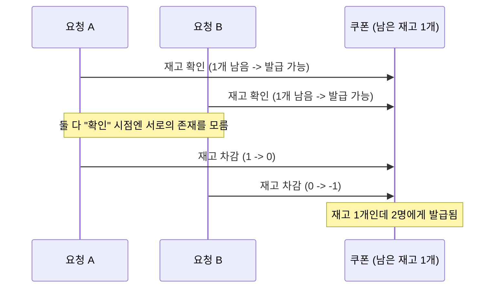
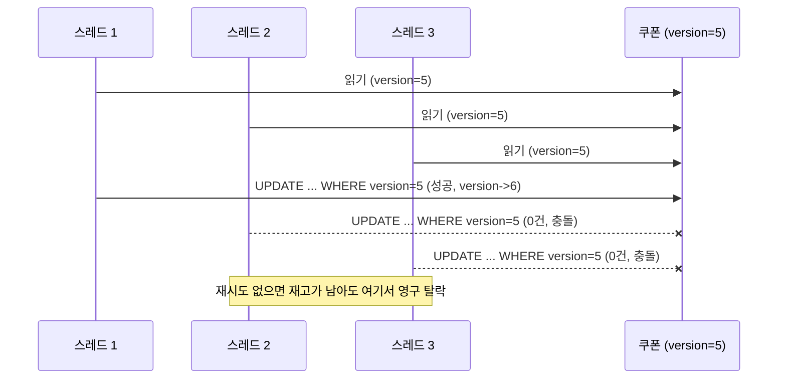

> "동시성 제어"를 개념으로만 알고 있는 것과, 직접 재현해서 숫자로 보는 것 사이엔 꽤 차이가 있었습니다. 재고 100개짜리 쿠폰에 1000명이 동시에 몰리는 상황을 만들어서, 비관락·낙관락·Redis 분산락을 각각 구현하고 실제로 얼마나 걸리는지, 왜 그런 차이가 나는지 확인해봤습니다 — [coupon-lock-lab](https://github.com/yoonxjoong/coupon-lock-lab)이라는 별도 저장소입니다.

## 문제 상황 — 왜 오버부킹이 나는가

"남은 재고를 확인하고, 있으면 차감한다"는 로직을 그대로 코드로 옮기면 이렇게 됩니다.

```java
if (coupon.getIssuedQuantity() < coupon.getTotalQuantity()) {
    coupon.setIssuedQuantity(coupon.getIssuedQuantity() + 1);
}
```

문제없어 보이지만, 동시에 두 요청이 들어오면 얘기가 달라집니다.



"확인"과 "차감" 사이에 다른 요청이 끼어들 틈이 있는 한, 아무리 코드를 꼼꼼히 짜도 이 문제는 안 없어집니다. 이걸 막는 대표적인 세 가지 방법을 직접 구현해봤습니다.

## 세 가지 해결 방법

### 비관락 (Pessimistic Lock)

"충돌이 날 거다"라고 미리 가정하고, 아예 다른 트랜잭션이 못 들어오게 막아버리는 방식입니다.

```java
@Lock(LockModeType.PESSIMISTIC_WRITE)
@Query("select c from Coupon c where c.id = :id")
Optional<Coupon> findByIdForUpdate(@Param("id") Long id);
```

`SELECT ... FOR UPDATE`가 나가고, 이 row를 읽은 트랜잭션이 커밋할 때까지 다른 트랜잭션은 같은 row를 읽으려는 순간 그냥 멈춰서 기다립니다. 코드 입장에서는 "기다렸다가 성공"과 "바로 성공"이 구분 없이 똑같이 한 번의 호출로 보입니다.

### 낙관락 (Optimistic Lock)

반대로 "충돌은 드물 것"이라 가정하고 아무도 막지 않다가, 커밋 시점에 버전이 바뀌어 있으면 그제야 실패시키는 방식입니다.

```java
@Version
private long version;
```

이 애노테이션 하나만 붙이면, Hibernate가 UPDATE 문에 자동으로 버전 조건을 끼워 넣습니다.

```sql
UPDATE coupon
SET issued_quantity = ?, version = 3   -- 새 버전(현재값 + 1)
WHERE id = ? AND version = 2           -- 읽었을 때의 버전
```

다른 트랜잭션이 먼저 커밋해서 버전이 이미 3이 되어 있다면, 이 UPDATE는 매치되는 row가 없어서 **0건 업데이트**로 끝납니다. Hibernate는 이걸 보고 `ObjectOptimisticLockingFailureException`을 던지는데, 여기서 중요한 게 하나 있습니다 — **누가 대신 재시도해주지 않습니다.** 프레임워크의 역할은 "충돌을 감지해서 예외로 알려주는 것"까지고, 그 다음에 재시도할지 말지는 순전히 애플리케이션 코드의 몫입니다.

```java
public IssueResult issue(Long couponId) {
    for (int attempt = 1; attempt <= MAX_RETRY; attempt++) {
        try {
            return issuer.issueOnce(couponId);
        } catch (OptimisticLockingFailureException e) {
            // 버전 충돌 - 다음 attempt에서 최신 버전을 다시 읽어 재시도
        }
    }
    return IssueResult.fail("MAX_RETRY_EXCEEDED");
}
```

비관락/Redis 락은 "락 메커니즘 자체가 기다려주기" 때문에 재시도 루프가 필요 없는데, 낙관락만 유일하게 이 루프를 직접 짜넣어야 하는 이유가 여기 있습니다.

### Redis 분산락 (Redisson)

DB row는 아예 잠그지 않고, Redis에만 락을 겁니다.

```java
RLock lock = redissonClient.getLock("lock:coupon:" + couponId);
try {
    if (!lock.tryLock(5, 3, TimeUnit.SECONDS)) {
        return IssueResult.fail("LOCK_TIMEOUT");
    }
    return issuer.issueInLock(couponId);
} finally {
    if (lock.isHeldByCurrentThread()) lock.unlock();
}
```

동작 방식은 비관락과 비슷하게 "직렬화"지만, 그 줄을 세우는 주체가 DB가 아니라 Redis입니다. 애플리케이션 인스턴스가 여러 대로 늘어나서 DB 커넥션 풀이 서로 분리돼도, 락 자체는 Redis 하나를 공유하기 때문에 정합성이 깨지지 않습니다.

## 실측 비교

재고 100개짜리 쿠폰을 만들고, 스레드풀 50개로 1000건의 발급 요청을 동시에 쏴봤습니다.

| 전략 | 성공 | 최종 발급 수량 | 재시도 | 소요시간 |
| --- | --- | --- | --- | --- |
| 비관락 | 100 | 100 | - | **615ms** |
| Redis 분산락 | 100 | 100 | - | 1,221ms |
| 낙관락 | 100 | 100 | **1,467회** | 4,354ms |

셋 다 오버부킹 없이 정확히 100개만 발급했지만(정합성은 세 방식 모두 지킴), 소요시간은 최대 7배까지 벌어졌습니다.

**낙관락이 압도적으로 느린 이유는 재시도 횟수에 그대로 드러납니다.** 성공은 100건인데 재시도가 1,467회 발생했다는 건, 총 DB 시도 횟수가 1,000(최초 시도) + 1,467(재시도) ≈ 2,467번이라는 뜻입니다. 성공 100건을 위해 그 15배에 가까운 시도가 낭비된 셈입니다. 게다가 재시도 루프에 백오프가 전혀 없어서(충돌하면 바로 다음 attempt로 돌진), 재고가 얼마 안 남은 구간에서 스레드들이 서로 계속 부딪히는 **재시도 폭풍**이 그대로 재현됐습니다.

**비관락이 Redis 분산락보다 빠른 이유**는 둘 다 "직렬화한다"는 점은 같지만, 비관락은 DB 커넥션 하나로 끝나는 반면 Redis 분산락은 매 요청마다 "Redis 락 획득 → DB 작업 → Redis 락 해제"까지 왕복이 하나 더 붙기 때문입니다. 그 추가 네트워크 홉만큼 정직하게 느려집니다.

## 재시도를 없애면 실제로 무슨 일이 생기나

낙관락의 재시도 루프가 정말 필수인지 궁금해서, 일부러 재시도를 빼고 충돌하면 바로 포기하도록 바꿔봤습니다.

```java
public IssueResult issue(Long couponId) {
    try {
        return issuer.issueOnce(couponId);
    } catch (OptimisticLockingFailureException e) {
        return IssueResult.fail("VERSION_CONFLICT");  // 재시도 없이 바로 포기
    }
}
```

같은 조건(재고 100개, 요청 1000건)으로 돌려보니 **성공이 58건**으로 떨어졌습니다. 재고가 42개나 남아있는데도 발급이 안 된 겁니다.

메커니즘은 이렇습니다 — 여러 스레드가 거의 같은 순간에 같은 `version`을 읽어버리는 "묶음"이 생깁니다. 이 묶음 중 딱 1명만 먼저 커밋해서 버전을 올리고, 나머지는 전부 충돌납니다. 재시도가 있으면 이 나머지가 최신 버전으로 다시 읽어서 재도전하면 되는데, 지금은 재시도가 없으니 **재고가 남아있어도 그 자리에서 영구 탈락**합니다. 이게 매 버전마다 반복되면서 재고의 상당 부분이 그냥 허공으로 날아간 겁니다.



수강신청이나 콘서트 티켓팅처럼 "선착순"을 낙관락으로 구현하면서 재시도를 빼먹으면, **좌석/재고는 분명히 남아있는데 시스템이 알아서 매진처럼 처리해버리는 버그**가 생길 수 있다는 걸 숫자로 확인한 셈입니다.

## 그래서 뭘 언제 써야 하나

이번 벤치마크만 보면 "비관락이 제일 빠르니까 그냥 비관락 쓰면 되는 거 아냐?"라는 생각이 들 수 있는데, 그건 이 테스트가 **낙관락한테 최악의 조건**(재고 100개에 1000명이 수십 ms 안에 몰려서 사실상 거의 모든 시도가 충돌)이었기 때문입니다. 실무에서는 이런 극단적 경합이 오히려 드뭅니다.

- **경합이 드문 대부분의 기능** (프로필 수정, 게시글 수정, 주문 상태 변경 등) → 낙관락. 충돌이 없으면 락 오버헤드가 0에 가깝고, 어쩌다 나는 충돌만 재시도 비용을 냅니다. 비관락은 충돌 여부와 상관없이 매번 DB 커넥션을 붙잡고 대기하기 때문에, 정작 충돌이 거의 안 나는 상황에서도 손해를 봅니다.
- **경합이 확실히 몰리는 좁은 이벤트** (지금 만든 쿠폰 선착순, 콘서트 티켓팅처럼 "터지는 순간"이 정해진 기능) → 비관락. 이번 벤치마크가 정확히 이 케이스라 비관락이 이겼습니다.
- **애플리케이션이 여러 인스턴스/여러 DB로 나뉘어 있어서 단일 DB row-lock만으론 못 막는 경우** → Redis 분산락. DB 트랜잭션과 무관하게 서비스 경계를 넘나드는 mutual exclusion이 필요할 때가 이 경우입니다.

비관락의 숨은 비용도 짚어둘 만합니다 — 락을 기다리는 동안 DB 커넥션을 계속 붙잡고 있어서, 이 기능 하나 때문에 커넥션 풀을 계속 늘릴 수는 없습니다(이번 테스트도 풀을 60개로 늘려놓고 돌린 결과입니다). 대기가 길어지면 이 기능과 무관한 다른 API들까지 커넥션을 못 받아 타임아웃나는 여파가 생길 수 있습니다.

## 한계 및 남는 궁금증

- **Redis 원자적 카운터 방식은 비교에서 뺐습니다.** 사실 [ecommerce-msa](https://github.com/yoonxjoong/ecommerce-msa)의 `inventory-service`는 이미 Lua 스크립트로 `DECRBY`를 원자적으로 실행하는 방식을 쓰고 있는데, 이건 "락을 잡고 → DB 작업 → 락을 푸는" Redisson 방식과 달리 **왕복 자체가 하나(원자적 연산 한 번)**로 끝납니다. Redisson 뮤텍스 락보다 이쪽이 더 빠를 가능성이 높은데, 이번엔 비교 대상에 넣지 못했습니다.
- **낙관락 재시도 루프에 백오프를 아예 안 넣었습니다.** 실무에서는 재시도 사이에 짧은 랜덤 대기를 넣는 게 일반적인데, 이번엔 순수한 "재시도 폭풍" 현상을 보여주려고 일부러 없앤 상태로 측정했습니다. 백오프를 넣으면 4,354ms가 어떻게 바뀌는지는 다음 실험 대상입니다.
- **Redis도 단일 인스턴스로만 테스트했습니다.** Redisson의 진짜 강점(여러 애플리케이션 인스턴스가 동시에 붙어도 막아주는 것)은 애플리케이션을 여러 대로 띄워봐야 제대로 검증되는데, 이번엔 단일 인스턴스라 "분산" 환경의 이점은 코드 구조로만 확인했고 실측은 못 했습니다.

## 참고 자료

- [coupon-lock-lab](https://github.com/yoonxjoong/coupon-lock-lab) — 이번 실습에 쓴 저장소
- [Pessimistic Locking in JPA](https://www.baeldung.com/jpa-pessimistic-locking) — Baeldung
- [Optimistic Locking in JPA](https://www.baeldung.com/jpa-optimistic-locking) — Baeldung
- [Redisson Wiki — Distributed Locks and Synchronizers](https://github.com/redisson/redisson/wiki/8.-distributed-locks-and-synchronizers)
