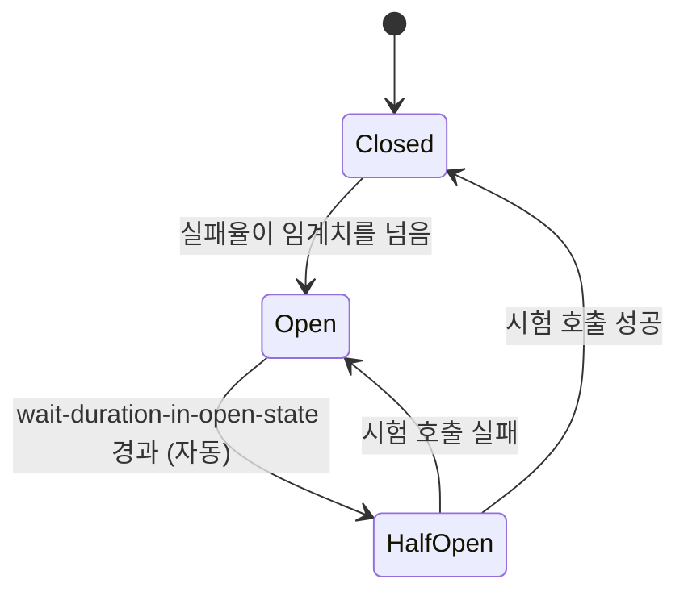

> [ecommerce-msa](https://github.com/yoonxjoong/ecommerce-msa)의 `order-service → payment-service` 호출에 Circuit Breaker를 실제로 붙이면서, Retry와 같이 쓸 때 생각보다 훨씬 헷갈리는 함정이 있다는 걸 알게 됐습니다. 이 글은 그 경험을 정리한 것이고, 이 함정을 재현하는 실험은 [circuit-breaker-lab](https://github.com/yoonxjoong/circuit-breaker-lab)이라는 별도 저장소로 만들어뒀습니다.

## 왜 필요한가

서비스가 여러 개로 나뉘면 서비스 간 호출도 늘어납니다. 그중 하나가 느려지거나 죽으면 어떻게 될까요? 안전장치가 없으면, 그 서비스를 호출하는 다른 서비스들도 응답을 기다리다 스레드/커넥션이 고갈되면서 **장애가 옆으로 전파**됩니다. `order-service`가 `payment-service`의 응답을 무한정 기다리다가, 정작 `payment-service`와 아무 상관없는 다른 요청들까지 처리를 못 하게 되는 식입니다. Circuit Breaker는 이런 상황에서 "지금 이 서비스는 계속 실패하고 있다"는 걸 감지하고, 더 이상 헛되이 기다리지 않도록 **차단기를 내려버리는** 패턴입니다.

## 세 가지 상태



- **Closed (닫힘)**: 평상시 상태. 요청을 정상적으로 통과시키면서 실패율을 계속 집계합니다.
- **Open (열림)**: 실패율이 임계치를 넘으면 회로가 열립니다. 이후 요청은 **실제 호출 자체를 시도하지 않고** 즉시 `CallNotPermittedException`을 던지거나 대체 응답(fallback)을 반환합니다.
- **Half-Open (반열림)**: 일정 시간이 지나면 시험 삼아 요청을 몇 개만 흘려보냅니다. 성공하면 Closed로 복구, 실패하면 다시 Open으로 돌아가서 대기부터 반복합니다.

중요한 포인트 하나 — 이 상태는 **인스턴스 이름으로 전역 공유**됩니다. 특정 요청 하나의 상태가 아니라, 같은 이름(예: `paymentService`)을 쓰는 모든 호출이 같은 회로 상태를 공유합니다. 그래서 A 요청의 실패가 누적돼서 회로가 열리면, 전혀 상관없는 B 요청의 첫 호출도 즉시 막힐 수 있습니다.

## 실전 설정 — ecommerce-msa 기준

`order-service`에서 실제로 쓰고 있는 설정입니다.

```yaml
resilience4j:
  circuitbreaker:
    instances:
      paymentService:
        sliding-window-type: COUNT_BASED
        sliding-window-size: 5        # 최근 5번의 호출을 기준으로 판단
        minimum-number-of-calls: 5    # 최소 5번은 쌓여야 판단 시작
        failure-rate-threshold: 50    # 그중 50% 이상 실패하면 OPEN
        wait-duration-in-open-state: 10s   # OPEN 상태 유지 시간
        permitted-number-of-calls-in-half-open-state: 2  # HALF_OPEN에서 시험 호출 횟수
        automatic-transition-from-open-to-half-open-enabled: true
```

애노테이션 하나로 적용됩니다.

```java
@CircuitBreaker(name = "paymentService", fallbackMethod = "payFallback")
public PaymentResult pay(Long orderId, Long amount, String idempotencyKey, boolean simulateFailure) {
    return restClient.post()
        .uri("/payments")
        .contentType(MediaType.APPLICATION_JSON)
        .header("Idempotency-Key", idempotencyKey)
        .body(new PaymentRequestDto(orderId, amount, simulateFailure))
        .retrieve()
        .body(PaymentResult.class);
}

private PaymentResult payFallback(Long orderId, Long amount, String idempotencyKey, boolean simulateFailure, Throwable t) {
    log.warn("payment-service 호출 실패(Circuit Breaker fallback), orderId={}, cause={}", orderId, t.toString());
    return PaymentResult.circuitOpen(orderId);
}
```

`pay()`가 실패하면(진짜 실패든, Circuit이 OPEN이라 막힌 거든) `payFallback`이 대신 호출돼서 정상적인 `PaymentResult`를 돌려줍니다. `OrderService`는 이 결과를 보고 Saga 보상(재고 복구, 주문 취소)을 진행합니다 — Circuit Breaker의 fallback이 **기존 Saga 보상 경로를 그대로 재사용**하는 구조입니다. 여기에 타임아웃도 같이 걸어뒀습니다 — Circuit Breaker는 "예외가 쌓이는 걸 보고" 판단하는데, HTTP 클라이언트에 타임아웃이 없으면 응답 없이 멈춰있는 상황이 예외로 잡히지도 않고 그냥 무한정 기다리게 됩니다. `RestClient`에 connect timeout 2초, read timeout 3초를 걸어서, 응답이 안 오는 상황도 결국 예외로 터져 실패율 계산에 들어가게 했습니다.

## Retry와 같이 쓸 때 생기는 함정

여기까지는 단독으로 쓸 때 이야기고, 여기에 `@Retry`를 얹으려다가 진짜 함정을 만났습니다.

Resilience4j의 애노테이션 합성 순서는 코드에 쓴 순서와 무관하게 기본값이 고정돼 있습니다.

```
Retry ( CircuitBreaker ( RateLimiter ( TimeLimiter ( Bulkhead ( 실제 호출 ) ) ) ) )
```

`Retry`가 제일 바깥, `CircuitBreaker`가 그 안쪽입니다. 그래서 "그냥 `@Retry`만 추가하면 Resilience4j가 알아서 순서를 잡아준다"고 생각하고 이렇게 했습니다.

```java
// 처음 시도 - 겉보기엔 문제없어 보이지만 재시도가 동작하지 않는다
@Retry(name = "paymentService")
@CircuitBreaker(name = "paymentService", fallbackMethod = "payFallback")
public PaymentResult pay(...) { ... }
```

결과는 **재시도가 조용히 아무 효과가 없었습니다.** 이유는 `payFallback`이 실패를 예외로 다시 던지지 않고, 정상적인 `PaymentResult` 값으로 바꿔버리기 때문입니다. `Retry(CircuitBreaker(...))` 구조에서, 안쪽 `CircuitBreaker`가 이미 실패를 값으로 삼켜버리면 바깥의 `Retry` 입장에서는 **"예외 없이 값이 반환됐네, 성공했구나"**로 보입니다. 재시도할 이유 자체가 만들어지지 않는 겁니다. 애노테이션은 분명히 붙어있는데, 실제로는 죽은 코드였던 셈입니다.

고치는 방법은 **fallback을 제일 바깥쪽(`@Retry`)으로 옮기는 것**입니다.

```java
@Retry(name = "paymentService", fallbackMethod = "payFallback")
@CircuitBreaker(name = "paymentService")   // fallback 없음
public PaymentResult pay(...) { ... }
```

이러면 `CircuitBreaker`는 실패를 그대로 예외로 흘려보내고(진짜 실패든, OPEN이라 막힌 `CallNotPermittedException`이든), `Retry`가 그 예외를 보고 설정된 횟수만큼 재시도하다가, 그래도 다 실패하면 그때 가서야 `Retry`의 fallback이 마지막으로 한 번 호출돼서 정상 값으로 마무리합니다. **fallback은 항상 합성 구조의 제일 바깥쪽에 있어야, 그 안쪽 레이어들이 각자의 역할(재시도, 회로 차단)을 실제로 수행할 기회를 가질 수 있습니다.**

이 상호작용은 사실 [resilience4j GitHub 이슈](https://github.com/resilience4j/resilience4j/issues/2383)에서도 "Retry가 바깥에 있으면 CircuitBreaker의 실패 카운트가 부풀려질 수 있다"는 반대 방향의 부작용으로 지적된 적 있는 지점입니다. Retry가 CircuitBreaker보다 바깥이라는 건, 재시도 한 번 한 번이 전부 별개의 "호출"로 CircuitBreaker의 슬라이딩 윈도우에 기록된다는 뜻이기도 합니다 — 요청 하나가 실패해서 3번 재시도하면, 그 요청 하나가 슬라이딩 윈도우(크기 5)의 3칸을 혼자 채워버릴 수 있습니다. 이 설정값들은 원래 Retry 없이 잡아둔 값이라, Retry를 얹으면서 의도했던 것보다 훨씬 예민하게(쉽게 OPEN되게) 바뀔 수 있다는 뜻입니다. 운영에서는 `resilience4j.retry.retry-aspect-order`, `resilience4j.circuitbreaker.circuit-breaker-aspect-order` 프로퍼티로 순서를 명시적으로 고정해두거나, 슬라이딩 윈도우 크기를 재시도 횟수를 감안해서 넉넉하게 잡는 게 안전해 보입니다.

## 재현 실험

말로만 정리하기보다 이 함정을 재현 가능한 형태로 직접 확인해보려고 [circuit-breaker-lab](https://github.com/yoonxjoong/circuit-breaker-lab)이라는 작은 프로젝트를 만들었습니다. `retry-storm-lab`의 `flaky-server`(용량 제한 있는 테스트 서버)를 재사용하고, 세 가지 전략을 비교하도록 설계했습니다.

- `retry-only`: CircuitBreaker 없이 Retry만
- `cb-wrong`: 위에서 겪은 것과 같은 구조 — CircuitBreaker 레이어 안에서 실패를 값으로 삼켜버림
- `cb-correct`: 예외가 CircuitBreaker를 그대로 통과해서 Retry까지 전파됨

`cb-wrong`에서는 `MAX_ATTEMPTS`를 아무리 크게 잡아도 진짜 네트워크 호출 수가 거의 늘지 않아야 합니다(재시도가 사실상 0건). `cb-correct`에서는 재시도가 실제로 일어나다가 Circuit이 OPEN되는 순간부터 네트워크 호출 없이 빠르게 실패로 전환되는 걸 숫자로 볼 수 있게 설계했습니다.

## 한계 및 남는 궁금증

- `order-service`의 `application.yml`에는 `resilience4j.circuitbreaker.instances.paymentService` 설정만 있고, `resilience4j.retry.instances.paymentService`는 별도로 설정하지 않아서 Resilience4j 기본값(최대 시도 3회, 고정 간격 500ms)을 그대로 쓰고 있습니다. 백오프/지터 없이 고정 간격이라, retry-storm 글에서 다뤘던 "naive 재시도" 패턴에 더 가깝습니다 — 다음에 명시적으로 설정을 추가하고 싶습니다.
- Resilience4j의 CircuitBreaker 상태는 JVM 메모리 안에 있어서, `order-service`를 여러 인스턴스로 늘리면 인스턴스마다 회로 상태가 따로 놉니다. Rate Limiting 때처럼 Redis로 상태를 공유하기가 CircuitBreaker 구조상 더 어려워서, 아직 해결책을 찾아보지 않았습니다.
- Circuit Open을 "결제 실패"로 간주해서 재고를 복구하는데, 만약 PG 쪽에서는 실제로 승인이 됐는데 응답만 못 받은 상황이라면 이 로직만으로는 완전하지 않습니다. Idempotency Key(이미 구현됨)가 이중 승인은 막아주지만, "재고가 복구됐는데 실제로는 결제된" 정합성 문제 자체를 없애주지는 않습니다.

## 참고 자료

- [CircuitBreaker — Martin Fowler](https://martinfowler.com/bliki/CircuitBreaker.html)
- [Resilience4j CircuitBreaker 공식 문서](https://resilience4j.readme.io/docs/circuitbreaker)
- [Default Aspect Order places Retry outside CircuitBreaker, causing inflated failure counts](https://github.com/resilience4j/resilience4j/issues/2383) — resilience4j GitHub Issues
- [circuit-breaker-lab](https://github.com/yoonxjoong/circuit-breaker-lab) — 이 글의 함정을 재현하는 실습 저장소
- [ecommerce-msa](https://github.com/yoonxjoong/ecommerce-msa) — 실제로 붙인 코드
