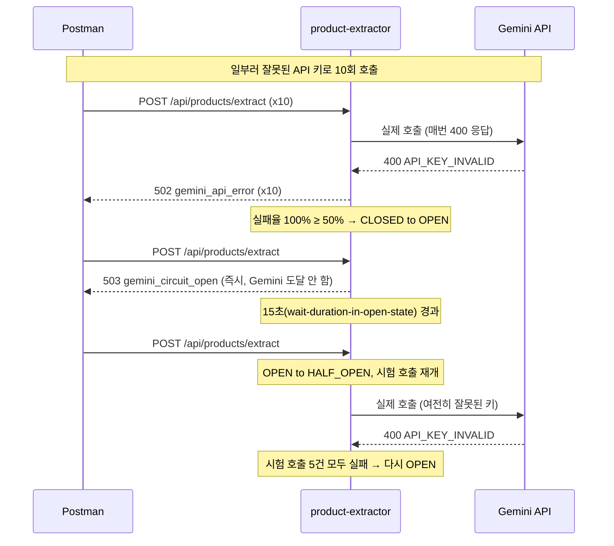

> 회사 업무에서 "이미지를 올리면 상품 정보를 JSON으로 뽑아준다"는 기능이 필요한데, 이걸 처리해줄 Gemini Vision API 응답이 꽤 오래 걸립니다. 실제 코드베이스에 바로 붙이기 전에, WebFlux로 이 지연을 감당할 수 있을지 먼저 별도 프로젝트로 테스트해봤습니다. 코드는 [product-extractor](https://github.com/yoonxjoong/product-extractor)에 있습니다.

## 왜 블로킹 서버로는 안 되는가

Spring MVC(스레드-퍼-리퀘스트 모델)로 이 기능을 만들면, 요청 하나가 스레드 하나를 물고 Gemini 응답이 올 때까지 그 스레드가 멈춰 있습니다. 톰캣 기본 스레드풀은 200개 안팎이라, Gemini가 조금만 느려져도 대기 중인 스레드가 빠르게 쌓이고, 풀이 고갈되면 **이미지 추출과 아무 상관 없는 다른 API 요청들까지** 처리할 스레드가 없어서 같이 멈춥니다. 외부 API 하나가 느려졌을 뿐인데 서비스 전체가 마비되는 패턴입니다.

여기서 흔한 오해가 하나 있습니다. "WebFlux를 쓰면 논블로킹이니까 알아서 해결된다"는 생각입니다. 틀렸습니다. WebFlux는 CPU 코어 수만큼의 소수 이벤트루프 스레드로 요청을 처리하는데, 이 체인 안에 blocking 코드가 한 줄이라도 있으면 그 순간 이벤트루프 스레드 자체가 멈춥니다. MVC라면 스레드 200개 중 하나가 멈추는 거지만, WebFlux에서 이벤트루프 하나가 멈추면 그 스레드가 담당하던 다른 모든 요청이 한꺼번에 멈춥니다. **잘못 쓰면 오히려 MVC보다 더 위험합니다.** 그래서 핵심은 "WebFlux를 쓴다"가 아니라 "체인 전체에 블로킹 지점이 하나도 없다"입니다.

## Mono는 값이 아니라 "값을 만드는 절차"다

WebClient를 처음 써보면서 가장 헷갈렸던 지점이 `Mono<T>`였습니다. `Mono<String>`을 보면 "String이 이미 든 상자"처럼 보이는데, 실제로는 **"구독(subscribe)하면 나중에 String 하나(또는 에러)를 만들어주겠다는 약속의 레시피"**입니다. `CompletableFuture`는 만드는 순간 바로 실행이 시작되지만(eager), `Mono`는 만들어도 아무 일도 안 일어나고 누군가 구독해야 그제서야 실행됩니다(lazy).

```java
public Mono<String> extractProductJson(byte[] imageBytes, String mimeType) {
    return geminiWebClient.post()
        .uri(...)
        .bodyToMono(GeminiGenerateContentResponse.class)
        .flatMap(this::extractText)
        ...
}
```

이 메서드가 리턴하는 순간 Gemini에 요청이 나가는 게 아닙니다. "요청을 보내고, 응답을 파싱하고, 텍스트를 뽑아내는" 레시피만 조립해서 리턴하는 겁니다. 실제 실행은 이 `Mono`를 WebFlux 프레임워크가 컨트롤러 반환값으로 받아 구독할 때 비로소 시작됩니다.

연산자 선택 규칙은 단순합니다 — **변환 함수가 평범한 값을 리턴하면 `map`, `Mono`/`Flux`를 리턴하면 `flatMap`.**

```java
return DataBufferUtils.join(filePart.content())
        .map(this::toBytesAndRelease)                                          // byte[] (그냥 값) → map
        .flatMap(imageBytes -> geminiClient.extractProductJson(imageBytes, mimeType))  // Mono<String> → flatMap
        .flatMap(this::parseJson)                                              // Mono<ProductExtractionResult> → flatMap
        .flatMap(this::save);                                                  // Mono<Product> → flatMap
```

`extractProductJson`이 리턴하는 게 `Mono<String>`인데 여기서 `map`을 썼다면 `Mono<Mono<String>>`(모노 안에 모노가 든 상자)이 되어버립니다. `flatMap`이 이 겹쳐진 구조를 한 겹으로 펴줍니다.

## 실제 구현 — 체인 전체에 블로킹 지점 없애기

**1. Gemini 호출은 WebClient로, CircuitBreaker는 바깥쪽에**

```java
return geminiWebClient.post()
        .uri(uriBuilder -> uriBuilder
                .path("/v1beta/models/{model}:generateContent")
                .queryParam("key", properties.apiKey())
                .build(properties.model()))
        .bodyValue(request)
        .retrieve()
        .onStatus(HttpStatusCode::isError, this::mapErrorResponse)
        .bodyToMono(GeminiGenerateContentResponse.class)
        .flatMap(this::extractText)
        .transformDeferred(TimeLimiterOperator.of(timeLimiter))
        .transformDeferred(CircuitBreakerOperator.of(circuitBreaker));
```

`transformDeferred` 순서가 중요합니다. TimeLimiter를 먼저 감싸고 그 바깥을 CircuitBreaker가 감싸는 구조라, 호출 시점엔 CircuitBreaker가 먼저 "지금 호출을 허용할지"를 판단합니다(OPEN이면 TimeLimiter/WebClient까지 갈 필요도 없이 즉시 `CallNotPermittedException`). 허용된 호출은 TimeLimiter가 시간을 재고, 여기서 발생한 `TimeoutException`도 다시 CircuitBreaker를 통과하면서 실패로 집계됩니다. 그래서 "그냥 느리기만 한" 장애도 결국 실패율에 반영되어 OPEN 전환으로 이어집니다. 순서를 반대로 하면 이 집계가 깨집니다.

**2. DB 저장은 boundedElastic으로 격리, 그것도 Gemini 호출이 끝난 뒤에만**

```java
private Mono<Product> save(ProductExtractionResult result) {
    Product product = Product.builder()
            .name(result.name())
            ...
            .build();

    return Mono.fromCallable(() -> productRepository.save(product))
            .subscribeOn(Schedulers.boundedElastic());
}
```

JDBC는 태생이 blocking입니다. 이걸 이벤트루프(`Schedulers.parallel()`)에서 그대로 실행하면 그 스레드가 막힙니다. `boundedElastic`은 blocking 작업 전용으로 분리된, 상한이 있는 스레드풀이라 이벤트루프와 완전히 격리해서 실행할 수 있습니다. 그리고 이 저장 로직은 **Gemini 호출이 끝난 뒤에만** 실행됩니다 — Spring Data JPA의 `@Transactional`은 `save()` 호출 안에서만 짧게 걸리기 때문에, 트랜잭션/DB 커넥션이 "Gemini 응답을 기다리는 긴 시간" 동안은 전혀 잡혀 있지 않습니다. 원래 걱정했던 "트랜잭션이 외부 API 대기 시간을 물고 있는" 문제가 구조적으로 생기지 않습니다.

**3. 멀티파트 업로드도 끝까지 논블로킹**

```java
@PostMapping(value = "/extract", consumes = MediaType.MULTIPART_FORM_DATA_VALUE)
public Mono<ResponseEntity<Product>> extract(@RequestPart("image") Mono<FilePart> imagePart) {
```

`FilePart`를 바로 안 받고 `Mono<FilePart>`로 받습니다. WebFlux는 멀티파트 바디도 스트리밍으로 파싱하는데, `Mono`로 받아야 파싱 완료를 "기다리는" 게 아니라 완료 시점에 "이어지는" 형태가 되어 컨트롤러 진입부터 끝까지 블로킹 지점이 없습니다.

## Netty 이벤트루프는 스레드 1개 + 큐 2개

이 모든 논블로킹 동작이 실제로 어떻게 돌아가는지 궁금해서 Netty 내부를 조금 더 파봤습니다. Netty는 Reactor 패턴으로 동작하는데, `EventLoop` 하나는 스레드 하나에 영구히 묶여있고, 커넥션(Channel) 하나는 생성되는 순간 그 여러 `EventLoop` 중 하나에 평생 고정됩니다 — 그래서 한 커넥션 안에서 벌어지는 이벤트는 항상 같은 스레드가 처리하고, 락이 필요 없습니다.

이 스레드는 무한 루프를 돌면서 매 사이클마다:

1. Selector(epoll/kqueue)로 지금 읽거나 쓸 준비된 소켓이 있는지 논블로킹으로 확인하고, 있으면 파이프라인 실행
2. **`taskQueue`(MPSC 락프리 큐)**를 비웁니다 — 다른 스레드가 "이 이벤트루프에서 이거 실행해줘"라고 넣어둔 임의의 `Runnable`들
3. **`scheduledTaskQueue`(우선순위 큐)**를 확인합니다 — "N초 뒤에 실행" 예약된 작업들

`scheduledTaskQueue`는 실제로 이 프로젝트 코드에도 등장합니다 — `ReadTimeoutHandler`가 내부적으로 `ctx.executor().schedule(..., timeoutSeconds, SECONDS)`로 이 큐에 "N초 뒤 타임아웃 체크"를 예약해두고, 그 시간이 지나도 응답이 안 오면 여기서 꺼내져서 `ReadTimeoutException`을 던집니다.

```java
HttpClient httpClient = HttpClient.create()
        .option(ChannelOption.CONNECT_TIMEOUT_MILLIS, 5_000)
        .doOnConnected(conn -> conn.addHandlerLast(
                new ReadTimeoutHandler(properties.timeoutSeconds(), TimeUnit.SECONDS)));
```

이 `ReadTimeoutHandler`(전송 계층 타임아웃, "연결은 됐는데 응답 바이트가 안 옴")와 `GeminiClient`의 `TimeLimiter`(리액티브 체인 레벨 타임아웃)는 역할이 다릅니다. 이게 없으면 커넥션 자체는 살아있는 채로 무한 대기할 수 있습니다.

## 넘겨짚었다가 정정한 것 — 서버와 클라이언트 스레드풀이 분리돼 있을 거라는 착각

처음엔 "서버가 요청 받는 이벤트루프와 WebClient가 Gemini 호출하는 이벤트루프는 당연히 분리돼 있겠지"라고 별생각 없이 넘겨짚었습니다. 근데 확인해보니 **틀렸습니다.** Reactor Netty 소스를 직접 까봤습니다.

```java
// reactor-netty-http .../HttpClientConfig.java
@Override
protected LoopResources defaultLoopResources() {
    return HttpResources.get();
}

// reactor-netty-http .../HttpServerConfig.java
@Override
protected LoopResources defaultLoopResources() {
    return HttpResources.get();
}
```

둘 다 `HttpResources.get()`을 리턴하는데, 이건 JVM 전체에서 하나뿐인 전역 싱글톤입니다.

```java
// HttpResources.java
static final AtomicReference<HttpResources> httpResources;
public static HttpResources get() {
    return getOrCreate(httpResources, null, null, ON_HTTP_NEW, "http");
}
```

Spring Boot 쪽도 마찬가지입니다. 내장 서버(`NettyReactiveWebServerFactory`)는 `HttpServer.create()`를 그대로 쓰고, Spring Boot가 자동설정하는 `ReactorResourceFactory` 빈도 기본값이 `useGlobalResources = true`라서 결국 같은 `HttpResources.get()`으로 수렴합니다. 이 프로젝트의 `WebClientConfig`는 그 `ReactorResourceFactory`조차 거치지 않고 `HttpClient.create()`를 직접 호출하지만, 어느 경로로 가든 종착지는 같습니다.

즉 **서버가 요청을 받는 스레드와 Gemini를 호출하는 스레드는 실제로 같은 풀**입니다(스레드 이름 접두사는 `reactor-http-nio-*`). 걱정할 필요는 없습니다 — 양쪽 다 순수 논블로킹 콜백이라 스레드를 "점유"하는 게 아니라 이벤트 발생 시 잠깐 실행되고 반납하는 방식이기 때문에, Reactor Netty가 기본을 아예 "공유"로 잡아둔 겁니다. 문제가 생기는 유일한 경우는 이 콜백 안에 blocking 코드가 섞여 들어갈 때인데, 그건 이미 `boundedElastic`으로 격리해뒀습니다.

## CircuitBreaker를 실제로 열어보고 닫아본 기록

설정은 이렇게 잡았습니다.

```yaml
resilience4j:
  circuitbreaker:
    instances:
      gemini:
        sliding-window-size: 20
        minimum-number-of-calls: 10
        failure-rate-threshold: 50
        wait-duration-in-open-state: 15s
        permitted-number-of-calls-in-half-open-state: 5
```

말로만 설계하고 끝내지 않고, `spring-boot-starter-actuator`를 추가해서 `/actuator/circuitbreakers`로 실제 상태 전이를 눈으로 확인했습니다.



`minimum-number-of-calls: 10` 덕분에 처음 9번까지는 계속 실제로 Gemini까지 왕복하며 502를 받다가, 10번째에 실패율이 100%로 확정되는 순간 OPEN으로 전환됐습니다. 그 뒤로는 응답이 눈에 띄게 빨라졌습니다 — 네트워크 시도 자체를 안 하고 즉시 503을 돌려주기 때문입니다.

여기서 한 가지 놓치기 쉬운 디테일도 확인했습니다. `automatic-transition-from-open-to-half-open-enabled`를 따로 안 켜서 기본값이 `false`인데, 이 경우 15초가 지나도 백그라운드 타이머가 알아서 HALF_OPEN으로 바꿔주지 않습니다. **15초가 지난 뒤 다음 요청이 실제로 들어와야** 그 요청을 계기로 HALF_OPEN 전환이 일어납니다. 실제로 `/actuator/circuitbreakers`를 확인해보니, 요청 없이 시간만 흘려보내면 상태가 `OPEN`에 그대로 머물러 있었습니다.

```json
{
  "circuitBreakers": {
    "gemini": {
      "failureRate": "100.0%",
      "bufferedCalls": 5,
      "failedCalls": 5,
      "state": "OPEN"
    }
  }
}
```

HALF_OPEN에서 시험 호출 5건이 다 채워지고 다 실패하는 것도 실제로 확인했고, 유효한 키로 바꾼 뒤 정상 호출이 쌓이며 CLOSED가 유지되는 것까지 확인했습니다. 다만 CircuitBreaker 상태는 JVM 메모리에 있는 값이라 **앱을 재시작하면 완전히 새 서킷(CLOSED, 빈 슬라이딩 윈도우)으로 초기화**됩니다 — 재시작 후 CLOSED가 나오는 건 "복구에 성공해서"가 아니라 "새로 만들어져서"라는 걸 헷갈리지 않는 게 중요했습니다.

## Bulkhead도 같이 붙이기

CircuitBreaker만으로는 빈 구멍이 하나 있습니다. Gemini가 완전히 죽은 게 아니라 **그냥 느리기만 한 경우**(타임아웃 문턱을 아슬아슬하게 못 넘는 정도)엔 실패로 카운트되지 않아서 CircuitBreaker가 반응하기 전까지 계속 실제 호출이 나갑니다. 동시 요청이 몰리면 그만큼 Gemini 호출이 동시에 쌓이는데, 이건 실패율과 무관한 문제라 CircuitBreaker가 막아주지 않습니다. 그래서 Bulkhead로 **동시 호출 수 자체에 상한**을 걸었습니다.

```yaml
resilience4j:
  bulkhead:
    instances:
      gemini:
        max-concurrent-calls: 10   # 동시에 10건까지만 허용
        max-wait-duration: 0       # 대기 없이 바로 거절
```

```java
.flatMap(this::extractText)
.transformDeferred(BulkheadOperator.of(bulkhead))
.transformDeferred(TimeLimiterOperator.of(timeLimiter))
.transformDeferred(CircuitBreakerOperator.of(circuitBreaker));
```

순서는 resilience4j 기본 합성 순서(`Retry(CircuitBreaker(RateLimiter(TimeLimiter(Bulkhead(호출)))))`)를 그대로 따랐습니다. CircuitBreaker가 제일 바깥에서 먼저 "호출 자체를 허용할지" 판단하고, 통과한 요청만 TimeLimiter가 시간을 재고, 마지막으로 Bulkhead가 동시 호출 슬롯을 확인합니다. 슬롯이 꽉 차 있으면 `BulkheadFullException`이 던져지고, `GlobalExceptionHandler`가 이걸 429로 매핑합니다.

이건 `SemaphoreBulkhead`라서(`max-wait-duration: 0`으로 대기 없이 즉시 거절하는 카운터 방식) 스레드 풀 자체를 분리하는 건 아니고 동시 호출 수만 제한합니다. 진짜 스레드 격리를 하려면 `ThreadPoolBulkhead`가 필요한데, 지금은 Gemini 호출 자체가 WebClient로 논블로킹이라 스레드를 물고 있는 게 아니어서 세마포어 방식으로 충분하다고 판단했습니다.

## 한계 및 남는 궁금증

- CircuitBreaker/TimeLimiter의 합성 순서와 Retry를 같이 쓸 때 생기는 함정은 이미 [Circuit Breaker: 장애가 옆으로 안 번지게 막는 법](/posts/circuit-breaker-resilience4j/)에서 다뤘던 내용이라 이 글에서는 반복하지 않았습니다. 이 프로젝트에는 아직 `@Retry`를 얹지 않았는데, 붙이게 되면 그 글에서 겪은 fallback 위치 함정을 그대로 다시 점검해야 합니다.
- 실제 CLOSED 복구(HALF_OPEN → CLOSED)를 재현할 때 앱을 재시작하는 방식으로는 진짜 복구를 검증한 게 아니라는 걸 뒤늦게 깨달았습니다. 앱을 계속 띄워둔 채로 실패 원인만 없애는 방식(예: 토글 가능한 mock 서버)으로 다시 검증해보고 싶습니다.
- `gemini.api-key`/`gemini.base-url`이 `@ConfigurationProperties` record라 런타임에 값을 바꿀 방법이 없습니다. `@RefreshScope` + `/actuator/refresh`를 붙이면 재시작 없이 복구 테스트가 가능할 것 같은데, 지금 규모에는 과할 수 있어서 보류했습니다.
- 이건 어디까지나 회사 코드베이스에 붙이기 전 단계의 테스트 프로젝트입니다. 실제 도입 시에는 회사 쪽 요구사항(응답 스키마, 에러 처리 정책, 이미지 저장 방식 등)에 맞춰 이 구조를 다시 다듬어야 합니다.

## 참고 자료

- [product-extractor](https://github.com/yoonxjoong/product-extractor) — 이 글에서 다룬 코드 전체
- [Reactor Netty Reference Guide](https://projectreactor.io/docs/netty/release/reference/index.html)
- [Resilience4j CircuitBreaker 공식 문서](https://resilience4j.readme.io/docs/circuitbreaker)
- [Circuit Breaker: 장애가 옆으로 안 번지게 막는 법](/posts/circuit-breaker-resilience4j/) — Retry와 조합할 때의 함정을 다룬 이전 글
