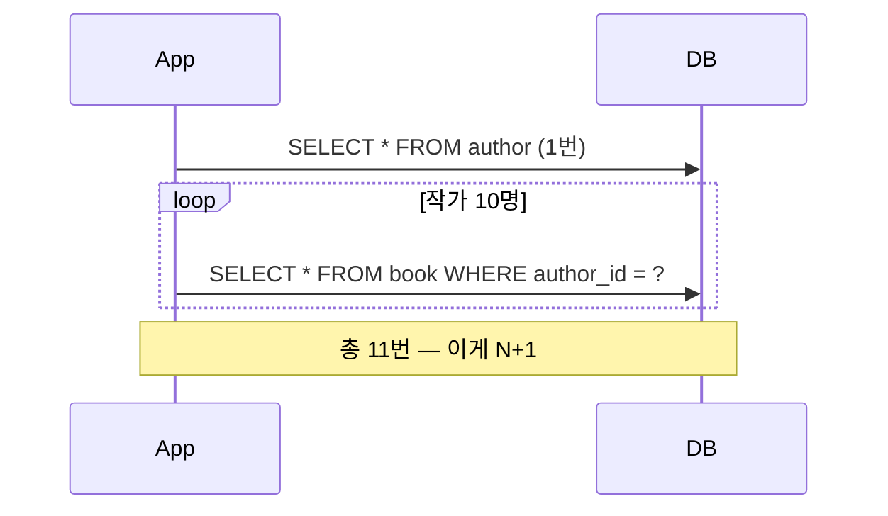
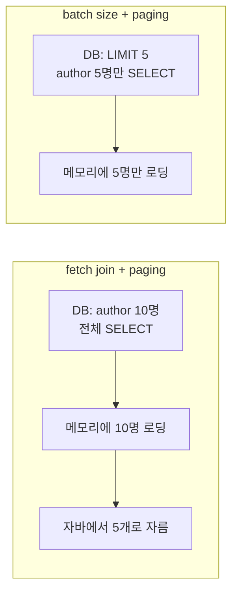

> N+1은 "쿼리 개수가 많아진다" 정도로만 알고 있었는데, 해결책마다 트레이드오프가 달라서 막상 실무에서 뭘 골라야 할지 헷갈렸습니다. Author 1명이 Book 여러 권을 쓰는 아주 단순한 1:N 관계로 N+1을 직접 재현하고, 흔히 쓰는 네 가지 해결책(fetch join, EntityGraph, DTO projection, batch size)을 같은 조건에서 비교해봤습니다 — [jpa-n-plus-one-lab](https://github.com/yoonxjoong/jpa-n-plus-one-lab)이라는 별도 저장소입니다.

## 문제 상황 — N+1이 왜 생기는가

작가(Author) 10명이 각각 책(Book) 5권씩 쓴 상황을 만들고, 기본 설정 그대로 `findAll()`을 호출한 뒤 각 작가의 책 목록을 순회했습니다.

```java
@OneToMany(mappedBy = "author", cascade = CascadeType.ALL)
private List<Book> books = new ArrayList<>();
```

```java
List<Author> authors = authorRepository.findAll();   // 쿼리 1번
authors.forEach(author -> author.getBooks().size());  // 작가 수만큼 추가 쿼리
```

`books`가 기본값인 `LAZY`라, `findAll()` 시점엔 Author만 조회되고 Book은 아직 안 건드립니다. 문제는 그 다음입니다 — `getBooks()`를 호출하는 순간, Hibernate는 "이 Author의 책 목록"을 그때그때 하나씩 조회합니다. 작가 10명이면 최초 조회 1번 + 작가별 조회 10번 = **11번**. 작가가 1000명이면 그대로 1001번이 됩니다.



## 네 가지 해결 전략

### fetch join

JPQL에서 `join fetch`로 연관 엔티티를 같은 쿼리에 묶어서 가져옵니다.

```java
@Query("select distinct a from Author a join fetch a.books")
List<Author> findAllFetchJoin();
```

SQL 레벨에서 `JOIN`으로 한 번에 끝나기 때문에 쿼리는 딱 1번입니다. `distinct`는 Author가 book 개수만큼 중복으로 뻥튀기되는 걸 애플리케이션 레벨에서 걸러내기 위한 것입니다.

### EntityGraph

JPQL을 손대지 않고, 애노테이션으로 "이 쿼리 실행할 때 이 연관관계는 같이 채워줘"라고 선언하는 방식입니다.

```java
@EntityGraph(attributePaths = "books")
@Query("select a from Author a")
List<Author> findAllWithEntityGraph();
```

내부적으로는 fetch join과 똑같이 SQL JOIN으로 풀립니다. 차이는 JPQL 문자열에 `join fetch`를 직접 안 써도 된다는 점 — 기존 쿼리 메서드에 애노테이션만 얹어서 적용하기 편합니다.

### DTO projection

애초에 엔티티를 통째로 안 가져오고, 필요한 필드만 뽑아서 DTO로 바로 매핑합니다.

```java
@Query("""
    select new com.example.jpalab.dto.AuthorBookCountDto(a.id, a.name, count(b))
    from Author a left join a.books b
    group by a.id, a.name
    """)
List<AuthorBookCountDto> findAuthorBookCounts();
```

쿼리 1번으로 끝나는 건 fetch join과 같지만, Author/Book 엔티티 자체를 영속성 컨텍스트에 안 올리기 때문에 **화면에 필요한 값(작가 이름, 책 권수)만 있으면 되는 조회 전용 API**에 특히 유리합니다. 대신 엔티티를 그대로 못 쓰니 수정이 필요한 흐름에는 안 맞습니다.

### batch size (`default_batch_fetch_size`)

앞의 세 방법은 전부 쿼리(엔티티 코드나 JPQL)를 손대야 하는데, 이건 프로퍼티 하나로 끝납니다.

```yaml
spring:
  jpa:
    properties:
      hibernate:
        default_batch_fetch_size: 5
```

lazy loading 자체는 그대로 두되, `books`에 접근할 때 "author_id = ?" 하나씩이 아니라 **`author_id IN (?, ?, ?, ?, ?)`로 묶어서** 가져옵니다. 작가 10명에 batch size 5면, book 조회가 10번이 아니라 2번(5개씩 2묶음)으로 줄어듭니다.

## 쿼리 수 비교

같은 데이터(작가 10명 × 책 5권)로 각 전략의 쿼리 수를 테스트에 그대로 assertion으로 박아뒀습니다. 실제 서버에 부하를 걸어 잰 실측 벤치마크는 아니고, **"이 조건에서 쿼리가 몇 번 나가야 정상인가"를 코드로 못 박아 검증한 값**입니다.

| 전략 | 쿼리 수 | 비고 |
| --- | --- | --- |
| 기본 lazy loading | 11 | findAll 1 + 작가 10명분 개별 조회 10 |
| fetch join | 1 | JOIN으로 한 번에 |
| EntityGraph | 1 | 내부적으로 fetch join과 동일 |
| DTO projection | 1 | 엔티티 로딩 자체가 없음 |
| batch size = 5 | 3 | findAll 1 + IN절 배치 조회 2 (⌈10/5⌉) |

batch size는 fetch join/EntityGraph만큼 1번으로 줄지는 않지만, **엔티티 코드나 쿼리를 전혀 안 건드리고** 11번을 3번까지 줄인다는 게 포인트입니다. 프로퍼티 하나로 프로젝트 전체의 N+1 심각도를 낮추는 안전망으로 자주 쓰이는 이유가 여기 있습니다.

## 함정 1 — 컬렉션이 두 개 이상이면 fetch join이 터진다

작가가 책(`books`)뿐 아니라 수상 내역(`awards`)도 갖고 있어서, 화면 하나에 두 컬렉션이 동시에 필요하다고 해봅시다. "그럼 둘 다 fetch join하면 되지 않나" 싶어서 그대로 해봤습니다.

```java
@Query("select distinct a from Author a join fetch a.books join fetch a.awards")
List<Author> findAllFetchJoinBooksAndAwards();
```

이건 실행하는 순간 `MultipleBagFetchException`이 터집니다. 컬렉션(`List`) 두 개를 동시에 fetch join하면 SQL이 `author ⋈ book ⋈ award`로 카티션 곱(cartesian product)이 나는데, Hibernate가 이 결과를 두 개의 개별 컬렉션으로 다시 쪼개는 걸 못 합니다.

이럴 때 batch size는 그대로 통합니다 — 각 컬렉션이 자기 batch로 따로 조회되기 때문에 카티션 곱 자체가 안 생깁니다.

```java
List<Author> authors = authorRepository.findAll();
authors.forEach(author -> {
    author.getBooks().size();
    author.getAwards().size();
});
```

작가 10명, batch size 5 기준으로 findAll 1 + books 배치 2 + awards 배치 2 = **5번**. fetch join이 못 하는 자리를 batch size가 메워주는 대표적인 케이스입니다.

## 함정 2 — 컬렉션 fetch join + 페이징은 겉만 정상으로 보인다

Author 목록을 페이지 크기 5로 페이징하면서 동시에 `books`를 fetch join하면 어떻게 될까요.

```java
@Query(value = "select distinct a from Author a left join fetch a.books",
       countQuery = "select count(a) from Author a")
Page<Author> findAllFetchJoinPaged(Pageable pageable);
```

리턴되는 `page.getContent()`의 크기는 정확히 5입니다. 겉보기엔 페이징이 잘 되는 것처럼 보입니다. 그런데 실제로 메모리에 로딩된 엔티티 개수(`entityLoadCount`)를 찍어보면 **10** — 요청한 페이지 크기와 무관하게 author 테이블 전체를 DB에서 끌어온 뒤, 자바 메모리 안에서 5개로 잘라낸 겁니다.

컬렉션을 fetch join하면 SQL이 JOIN으로 풀리기 때문에 DB의 `LIMIT/OFFSET`을 쓸 수 없고(row 수 자체가 book 개수만큼 늘어나 있어서), Hibernate가 애플리케이션 레벨 페이징으로 우회하기 때문입니다. 작가가 10명일 땐 티가 안 나지만, 10만 명이면 페이지 하나 보려고 10만 명을 전부 메모리에 올리는 셈이라 그대로 장애로 이어질 수 있습니다.

같은 조건을 batch size로 바꾸면 요청한 페이지 크기(5)만큼만 메모리에 올라갑니다 — `findAll(Pageable)`은 정상적으로 `LIMIT/OFFSET`을 쓰고, books는 그 5명분만 이후에 배치로 채워지기 때문입니다.



## 그래서 뭘 언제 써야 하나

- **컬렉션이 하나뿐이고, 페이징이 없는 화면** → fetch join이나 EntityGraph. 쿼리 1번으로 끝나고 코드도 직관적입니다. 둘 중에서는 기존 쿼리 메서드를 최대한 재사용하고 싶으면 EntityGraph, JPQL을 이미 커스텀하고 있으면 fetch join 쪽이 자연스럽습니다.
- **화면에 필요한 값이 엔티티 일부뿐인 조회 전용 API** → DTO projection. 엔티티를 아예 안 올리니 가장 가볍고, N+1 걱정 자체가 없어집니다.
- **컬렉션이 둘 이상이거나, 페이징이 걸린 목록 화면** → `default_batch_fetch_size`. fetch join은 이 두 상황에서 각각 예외(`MultipleBagFetchException`)와 숨은 전체 로딩이라는 형태로 깨지는데, batch size는 둘 다 무사히 통과합니다.
- **프로젝트 전체에 대한 안전망** → `default_batch_fetch_size`를 전역 기본값으로 깔아두는 것도 방법입니다. 개별 쿼리를 fetch join으로 최적화 못 한 곳이 있어도, 최소한 11번이 나갈 게 3번 수준으로는 줄어듭니다.

## 한계 및 남는 궁금증

- **이번 수치는 부하 벤치마크가 아니라 테스트 assertion 기준입니다.** 작가 10명 × 책 5권이라는 작은 데이터로 "쿼리가 이 횟수만큼 나가는 게 맞다"를 코드로 검증한 것이고, 실제 운영 규모(수만~수십만 건)에서 batch size별로 응답 시간이 어떻게 바뀌는지는 재보지 않았습니다.
- **batch size 최적값을 탐색해보진 못했습니다.** 5로 고정해서 테스트했는데, 100/500/1000처럼 값을 키우면 쿼리 수는 더 줄어드는 대신 `IN` 절 하나가 무거워집니다. 이 트레이드오프가 어디서 역전되는지는 다음 실험 대상입니다.
- **N+1 자동 탐지(예: Hypersistence Utils의 `SQLStatementCountValidator`, p6spy 쿼리 로그 기반 알림)는 다루지 않았습니다.** 지금은 테스트 코드에 직접 assertion을 박아서 확인했는데, 실무에서는 이런 걸 놓치지 않게 CI에 자동으로 걸어두는 방법도 궁금합니다.

## 참고 자료

- [jpa-n-plus-one-lab](https://github.com/yoonxjoong/jpa-n-plus-one-lab) — 이번 실습에 쓴 저장소
- [Hibernate User Guide — Fetching](https://docs.jboss.org/hibernate/orm/6.5/userguide/html_single/Hibernate_User_Guide.html#fetching)
- [Avoiding the N+1 Select Problem in JPA and Hibernate](https://vladmihalcea.com/n-plus-1-query-problem/) — Vlad Mihalcea
- [Spring Data JPA — @EntityGraph](https://docs.spring.io/spring-data/jpa/reference/jpa/entity-graph.html)
