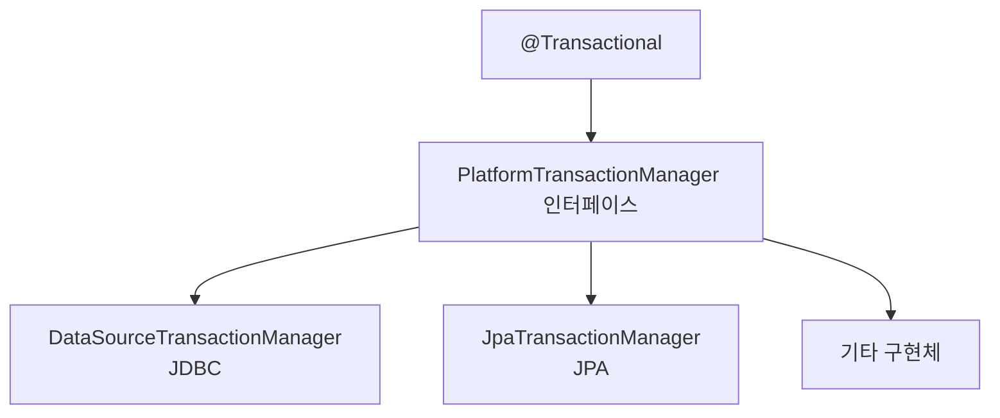
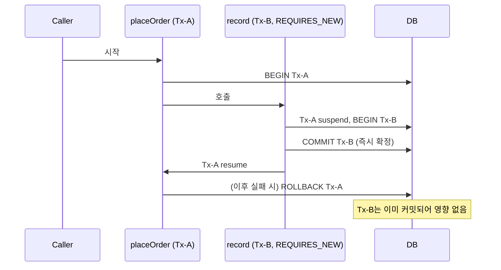
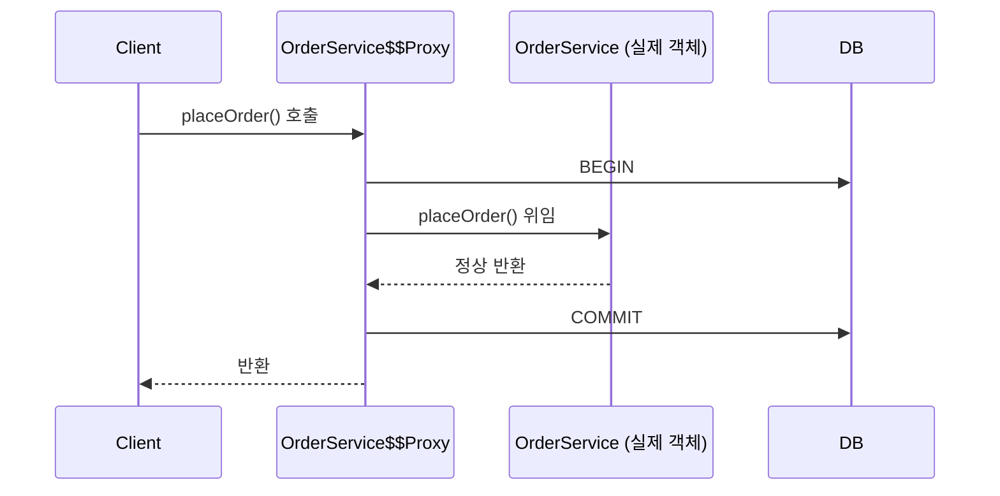

`@Transactional`을 습관적으로 붙여왔지만, 막상 전파(Propagation)나 격리 수준(Isolation)에 대해 정확히 공부해본 적이 없어서, 개념부터 순서대로 정리해봤습니다.

## 트랜잭션이 왜 필요한가 — ACID 복습

트랜잭션은 여러 작업을 하나의 단위로 묶어서, 전부 성공하거나 전부 실패하게 만드는 장치입니다.

- **Atomicity(원자성)**: 중간에 하나라도 실패하면 전체 롤백
- **Consistency(일관성)**: 트랜잭션 전후로 DB는 항상 유효한 상태
- **Isolation(격리성)**: 동시에 실행되는 트랜잭션끼리 서로 간섭하지 않음
- **Durability(지속성)**: 커밋되면 영구 저장

스프링이 하는 일은 결국 이 ACID를, 개발자가 `Connection.setAutoCommit(false)` / `commit()` / `rollback()`을 직접 호출하지 않고도 선언적으로 쓸 수 있게 해주는 것입니다.

## 스프링 트랜잭션 추상화 계층

`@Transactional`을 붙이면 실제로는 이런 계층을 거쳐서 동작합니다.



개발자는 `@Transactional`만 붙이면 되고, 어떤 `TransactionManager`가 실제 커밋/롤백을 처리하는지는 스프링 부트가 자동 구성으로 골라줍니다. 이 계층을 알아두면 "왜 JPA와 JDBC를 한 트랜잭션에 섞어 쓰기 어려운지", "왜 여러 DB를 하나의 트랜잭션으로 묶으려면 별도 설정(JTA 등)이 필요한지"를 이해하는 기반이 됩니다.

## 전파(Propagation) — 트랜잭션이 트랜잭션을 만났을 때

핵심 질문은 하나입니다. **"트랜잭션이 있는 메서드 A가, 트랜잭션이 있는 메서드 B를 호출하면 B는 A의 트랜잭션에 묻어갈까, 새로 만들까?"**

| 옵션 | 동작 |
| --- | --- |
| **REQUIRED** (기본값) | 기존 트랜잭션 있으면 참여, 없으면 새로 시작 |
| **REQUIRES_NEW** | 항상 새 트랜잭션 시작, 기존 트랜잭션은 잠시 보류(suspend) |
| **NESTED** | 기존 트랜잭션 안에 savepoint를 만들어 중첩 |
| SUPPORTS | 있으면 참여, 없으면 트랜잭션 없이 실행 |
| NOT_SUPPORTED | 트랜잭션 없이 실행, 있으면 보류 |
| MANDATORY | 반드시 기존 트랜잭션 필요, 없으면 예외 |
| NEVER | 트랜잭션이 있으면 예외 |

실무에서 실제로 쓰는 건 사실상 위쪽 세 개뿐이고, 그중에서도 REQUIRED가 대부분입니다. REQUIRES_NEW와 NESTED를 구분하는 게 개념적으로 헷갈리기 쉬운 지점이라 따로 짚어봅니다.

### REQUIRED — 그냥 묻어가기

```java
@Transactional // REQUIRED
public void placeOrder(Order order) {
    orderRepository.save(order);
    inventoryService.decreaseStock(order); // 같은 트랜잭션에 참여
}
```

`decreaseStock`이 던지는 예외는 `placeOrder`의 트랜잭션 전체를 롤백시킵니다. 하나의 물리 트랜잭션을 공유하기 때문입니다.

### REQUIRES_NEW — 완전히 독립적인 트랜잭션

"주문이 실패해도 로그만큼은 남겨야 한다"처럼, 바깥 트랜잭션의 성패와 무관하게 반드시 커밋되어야 하는 작업에 씁니다.

```java
@Transactional // REQUIRED
public void placeOrder(Order order) {
    orderRepository.save(order);
    auditLogService.record(order); // REQUIRES_NEW — 독립적으로 커밋
    inventoryService.decreaseStock(order); // 여기서 실패해도 로그는 남아있음
}
```



물리적으로 별도 커넥션 + 별도 트랜잭션이기 때문에, 바깥이 나중에 롤백되어도 REQUIRES_NEW로 실행된 부분은 이미 커밋된 채로 남습니다.

### NESTED — 부모 안의 체크포인트

REQUIRES_NEW와 다르게, 물리적으로 새 트랜잭션을 만들지 않고 **부모 트랜잭션 안에 savepoint**만 둡니다. 자식이 실패하면 그 savepoint까지만 롤백하고 부모는 계속 진행할 수 있지만, **부모가 최종적으로 롤백되면 NESTED로 처리된 부분도 함께 사라집니다.** REQUIRES_NEW는 부모와 완전히 독립적이라 부모가 롤백돼도 영향이 없다는 점과 대비됩니다. (JDBC savepoint를 지원해야 동작하며, JPA 환경에서는 제약이 있어 실무에서는 REQUIRED/REQUIRES_NEW에 비해 잘 쓰이지 않습니다.)

## 격리 수준(Isolation) — 동시에 같은 데이터를 건드리면

동시에 실행되는 트랜잭션들이 서로 얼마나 격리되는지를 정합니다. 세 가지 이상현상(anomaly)을 이해하면 표 전체가 정리됩니다.

- **Dirty Read**: A가 아직 커밋하지 않은 데이터를 B가 읽음 → A가 롤백하면 B는 존재한 적 없는 값을 읽은 셈
- **Non-repeatable Read**: A가 같은 row를 두 번 읽는 사이 B가 그 row를 수정하고 커밋 → A가 같은 쿼리로 두 번 다른 값을 얻음
- **Phantom Read**: A가 같은 조건으로 두 번 조회하는 사이 B가 새 row를 추가하고 커밋 → 두 번째 조회에 없던 row가 나타남

| 격리 수준 | Dirty Read | Non-repeatable Read | Phantom Read |
| --- | --- | --- | --- |
| READ_UNCOMMITTED | 발생 | 발생 | 발생 |
| READ_COMMITTED | 방지 | 발생 | 발생 |
| REPEATABLE_READ | 방지 | 방지 | 발생 (DB 구현에 따라 다름) |
| SERIALIZABLE | 방지 | 방지 | 방지 |

```java
@Transactional(isolation = Isolation.READ_COMMITTED)
public void transfer(...) { ... }
```

- 기본값은 `Isolation.DEFAULT`로, 실제 DB 설정을 따릅니다. MySQL InnoDB는 기본이 `REPEATABLE_READ`, PostgreSQL/Oracle은 `READ_COMMITTED`입니다. "스프링 기본값"이 아니라 "쓰고 있는 DB의 기본값"이 적용된다는 걸 놓치기 쉽습니다.
- 격리 수준을 올릴수록 안전하지만 락을 더 오래/넓게 잡아 동시성(처리량)이 떨어집니다. **정합성 vs 성능**의 트레이드오프이고, 대부분의 서비스는 DB 기본값(READ_COMMITTED 또는 REPEATABLE_READ)을 그대로 쓰고, 정말 민감한 구간에만 개별적으로 올립니다.

## `@Transactional`의 롤백 규칙 — 가장 흔한 함정

스프링은 기본적으로 **RuntimeException(unchecked)과 Error에서만 롤백**하고, **checked exception(Exception을 직접 상속한 예외)에서는 롤백하지 않습니다.**

```java
@Transactional
public void process() throws IOException {
    repository.save(entity);
    throw new IOException("실패"); // 기본값으로는 롤백되지 않음!
}
```

의도적으로 checked exception도 롤백시키려면 `rollbackFor`를 명시해야 합니다.

```java
@Transactional(rollbackFor = Exception.class)
public void process() throws IOException {
    repository.save(entity);
    throw new IOException("실패"); // 이제 롤백됨
}
```

그 외 자주 쓰는 속성들:

```java
@Transactional(
    readOnly = true,   // 조회 전용 — 변경 감지(dirty checking) 생략 등 최적화
    timeout = 5,        // 초 단위 타임아웃
    noRollbackFor = SpecificException.class
)
```

## 프록시 기반 동작 원리 — self-invocation 함정

`@Transactional`은 **AOP 프록시**로 동작합니다.



스프링은 `@Transactional`이 붙은 빈을 감싸는 프록시 객체를 만들고, **외부에서 이 빈을 호출할 때만** 프록시를 거칩니다. 이 구조를 알면 자연스럽게 아래 두 가지 함정이 왜 생기는지 이해가 됩니다.

**1. 같은 클래스 내부 호출은 프록시를 거치지 않는다.**

```java
@Service
public class OrderService {

    public void placeOrder(Order order) {
        // this.save(order) — 프록시를 거치지 않고 직접 호출됨
        save(order); // @Transactional이 무시됨!
    }

    @Transactional
    public void save(Order order) {
        orderRepository.save(order);
    }
}
```

`placeOrder`가 `save`를 `this.save()` 형태로 직접 호출하면, 그건 프록시가 가로챌 수 없는 내부 호출이라 `save`의 `@Transactional`이 그냥 무시됩니다. 해결하려면 `save`를 별도 빈으로 분리하거나 `AopContext.currentProxy()`로 프록시 자신을 통해 호출해야 합니다.

**2. private 메서드에는 `@Transactional`을 붙여도 의미가 없다.** 프록시(기본 CGLIB)는 대상 클래스를 상속해서 메서드를 오버라이드하는 방식으로 동작하는데, private 메서드는 오버라이드할 수 없기 때문입니다.

## 정리

| 개념 | 한 줄 요약 |
| --- | --- |
| Propagation | 트랜잭션이 트랜잭션을 만났을 때 합칠지/새로 만들지 |
| Isolation | 동시 트랜잭션끼리 서로 얼마나 안 보이게 할지 |
| rollbackFor | unchecked만 기본 롤백 — checked는 명시해야 함 |
| 프록시 기반 | 외부 호출만 가로채짐 — 내부 호출(self-invocation)은 무시됨 |

여기까지가 개념 정리이고, 아직 직접 재현해서 확인한 건 하나도 없습니다.

[비관락/낙관락/Redis 분산락 비교](/posts/pessimistic-optimistic-redis-lock-comparison/) 글과도 맞닿아 있는 부분이라, 로컬 트랜잭션 경계를 확실히 정리해두면 다음에 동시성/분산 트랜잭션 쪽을 다시 볼 때 헷갈림이 줄어들 것 같습니다.

## 참고 자료

- [Spring Framework Reference — Transaction Management](https://docs.spring.io/spring-framework/reference/data-access/transaction.html)
- [Spring Framework Reference — Transaction Propagation](https://docs.spring.io/spring-framework/reference/data-access/transaction/declarative/tx-propagation.html)
