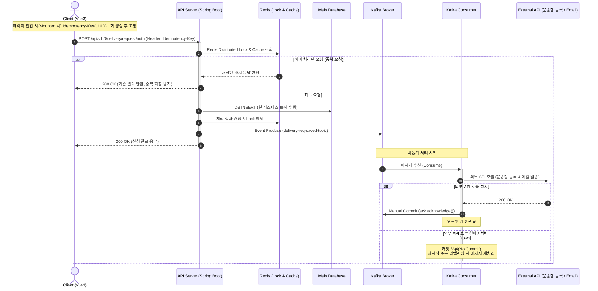
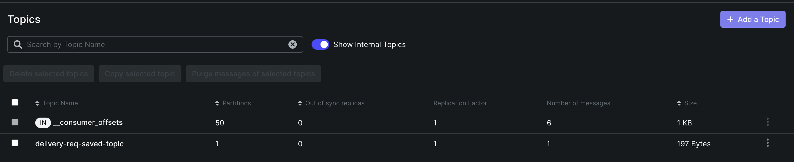
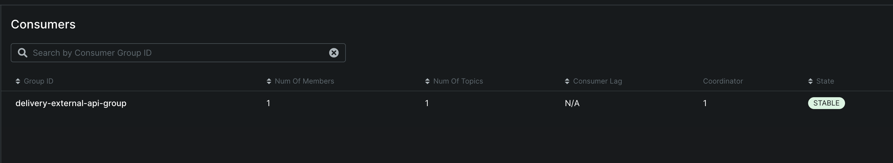

## 전체 흐름



핵심은 두 가지입니다. 클라이언트 쪽 요청은 멱등성 키로 중복을 걸러내고, 서버 쪽은 느린
외부 연동(운송장 등록, 메일 발송)을 Kafka 뒤로 보내서 API 응답 경로에서 완전히 떼어냅니다.

## 프론트엔드: 멱등성 키 고정과 중복 클릭 방지

버튼 클릭 핸들러 안에서 UUID를 매번 생성하면, 클라이언트가 재시도할 때마다 새 UUID가
발급되어 서버의 멱등성 방어 로직이 그대로 우회됩니다. 그래서 생성 시점을 컴포넌트
마운트(페이지 진입) 시점으로 옮겨 `idempotencyKey`를 1회만 생성해 고정하고,
`isLoading` 플래그로 응답이 오기 전까지 중복 클릭을 물리적으로 막았습니다.

```javascript
// Vue 3 Component
import { ref } from 'vue'
import { v4 as uuidv4 } from 'uuid'

export default {
  setup() {
    const idempotencyKey = ref(uuidv4()) // 페이지 진입 시 1회 생성 후 고정
    const isLoading = ref(false)

    return { idempotencyKey, isLoading }
  },
  methods: {
    async handleConfirm(stepInfo, step3Info) {
      if (this.isLoading) return // 중복 클릭 차단
      this.isLoading = true

      try {
        const tempInfo = {
          stepInfo: JSON.parse(JSON.stringify(stepInfo)),
          step3Info: JSON.parse(JSON.stringify(step3Info)),
          idempotencyKey: this.idempotencyKey
        }

        this.$changePage('deliveryAgency', 'Complete')
      } catch (error) {
        console.error('신청 처리 중 오류:', error)
      } finally {
        this.isLoading = false
      }
    }
  }
}
```

```javascript
// api.js
const saveDeliveryReqInfoApi = (payload) => {
  const { idempotencyKey, ...requestData } = payload

  return http.post({
    url: '/api/v1.0/delivery/request/auth',
    data: requestData,
    headers: {
      'Idempotency-Key': idempotencyKey
    }
  })
}
```

## 백엔드: 수동 커밋 기반 비동기 처리

### application.yml

자동 커밋을 켜두면 컨슈머가 메시지를 받은 직후(비즈니스 로직 성공 여부와 무관하게)
오프셋이 올라가 버려서, 처리 도중 서버가 죽으면 그 메시지는 그대로 유실됩니다. 그래서
`enable-auto-commit`을 끄고 `ack-mode: MANUAL`로 수동 커밋을 씁니다.

```yaml
spring:
  kafka:
    bootstrap-servers: 127.0.0.1:9092
    producer:
      key-serializer: org.apache.kafka.common.serialization.StringSerializer
      value-serializer: org.springframework.kafka.support.serializer.JsonSerializer
    consumer:
      group-id: delivery-external-api-group
      enable-auto-commit: false
      auto-offset-reset: earliest
      key-deserializer: org.apache.kafka.common.serialization.StringDeserializer
      value-deserializer: org.springframework.kafka.support.serializer.JsonDeserializer
      properties:
        spring.json.trusted.packages: "*"
    listener:
      ack-mode: MANUAL
```

### Producer — Redis 락 검증 후 이벤트 발행

Redis 락 검증과 DB 저장(본 비즈니스 로직)이 성공적으로 끝난 직후에만 카프카로 이벤트를
발행합니다. 저장이 실패하면 걸어둔 멱등성 락도 같이 풀어서, 클라이언트가 재시도했을 때
막히지 않고 다시 정상 처리되도록 합니다.

```java
@Service
@Slf4j
@RequiredArgsConstructor
public class ReqService {

    private final KafkaTemplate<String, Object> kafkaTemplate;
    private final RedisTemplate<String, String> redisTemplate;

    @Transactional
    public ReqSaveResponse saveDlvRequest(ReqSaveRequest req, String idempotencyKey) throws Exception {
        String redisKey = "idempotency:" + idempotencyKey;

        // 1. Redis 멱등성 검증 (생략)

        try {
            // 2. DB 저장 처리
            ReqSaveResponse res = new ReqSaveResponse();
            res.setReqNo(req.getReqNo());

            // 3. 성공 응답 캐싱 (24시간)

            // 4. Kafka 메시지 발행
            DeliveryReqMessage message = new DeliveryReqMessage(req.getReqNo(), req.getCustPoBoxNo());
            kafkaTemplate.send("delivery-req-saved-topic", req.getReqNo(), message);

            return res;
        } catch (Exception e) {
            redisTemplate.delete(redisKey);
            throw e;
        }
    }
}
```

### Consumer — 외부 API 호출 성공 시에만 커밋

외부 통신(운송장 등록, 이메일 발송) 도중 서버가 내려가도 메시지가 유실되지 않도록,
비즈니스 로직이 전부 끝난 뒤에만 `ack.acknowledge()`를 호출합니다.

```java
@Slf4j
@Component
@RequiredArgsConstructor
public class DeliveryKafkaConsumer {

    private final DeliveryTrackingService deliveryTrackingService;
    private final ReqService reqService;

    @KafkaListener(topics = "delivery-req-saved-topic", groupId = "delivery-external-api-group")
    public void consumeDeliverySavedEvent(DeliveryReqMessage message, Acknowledgment ack) {
        log.info("카프카 비동기 메시지 수신 - reqNo: {}", message.getReqNo());

        try {
            // 1. 운송장 등록 API 호출
            deliveryTrackingService.registerTracking(message.getReqNo(), null);

            // 2. 이메일 알림 전송 API 호출
            reqService.registerEmailNotification(message.getReqNo(), message.getCustPoBoxNo());

            // 3. 모든 외부 연동이 성공했을 때만 오프셋 커밋
            ack.acknowledge();
            log.info("외부 API 연동 성공 및 커밋 완료 - reqNo: {}", message.getReqNo());

        } catch (Exception e) {
            // acknowledge()를 호출하지 않으므로, 재시작이나 리밸런싱 시 이 메시지가 다시 처리됨
            log.error("외부 API 통신 실패 (카프카 커밋 보류) - reqNo: {}", message.getReqNo(), e);
        }
    }
}
```

## 결과 확인 (Kafka UI)

프로듀서가 발행한 토픽과 컨슈머 그룹이 정상적으로 붙어 있는지 Kafka UI로 확인했습니다.



`delivery-req-saved-topic`이 생성되어 있고, 컨슈머 그룹도 STABLE 상태로 붙어 있습니다.



## 정리

- 멱등성 키(UUID)를 요청 시점이 아니라 페이지 진입 시점에 고정해서, 클라이언트 재시도로
  인한 중복 요청을 원천 차단했습니다.
- 느린 외부 API 연동을 DB 트랜잭션 밖(Kafka 비동기)으로 분리해서 API 응답 속도와 DB
  커넥션 풀을 외부 API 지연으로부터 보호했습니다.
- 수동 커밋(Manual Commit)을 적용해서, 연동 도중 서버가 죽어도 재시작 시 메시지가
  다시 처리되도록 했습니다.
