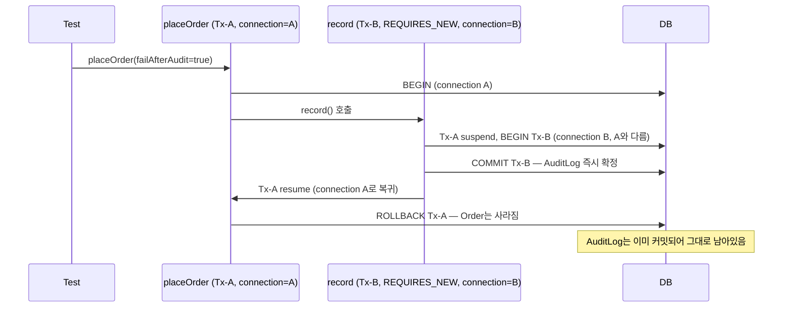

[스프링 트랜잭션 개념 정리 글](/posts/spring-transaction-propagation-isolation/)에서 전파(Propagation)
7가지를 정리하면서, 아직 직접 재현해서 확인한 내용은 없다고 밝힌 바 있습니다. 이번에는 Spring Boot와
MySQL로 실습 프로젝트를 구성해 직접 재현했으며, 예상과 다른 결과 두 가지를 확인했습니다.

실습 코드 전체는 [transaction-propagation-lab](https://github.com/yoonxjoong/transaction-propagation-lab)에서
확인할 수 있습니다.

## 검증 방법

"REQUIRED는 참여하고 REQUIRES_NEW는 새로 시작한다"는 설명은 로그만으로는 쉽게 납득되지만, 이것이 실제로
물리적인 DB 커넥션 수준에서 일어나는 일인지는 별도 확인이 필요합니다. 이를 위해 서비스 메서드마다
`connection_id()`를 기록해, 부모와 자식이 같은 커넥션을 사용하는지를 값으로 비교했습니다.

```java
@Component
public class ConnectionIdProbe {
    @PersistenceContext
    private EntityManager entityManager;

    public Long currentConnectionId() {
        Object result = entityManager.createNativeQuery("select connection_id()").getSingleResult();
        return ((Number) result).longValue();
    }
}
```

## REQUIRED — 부모/자식이 물리적으로 같은 커넥션

```java
@Service
public class RequiredOrderService {

    @Transactional // REQUIRED (기본값)
    public void placeOrder(TxTrace trace, boolean failInInventory) {
        trace.record("outer-before", probe.currentConnectionId());
        orderRepository.save(new Order("required-demo"));
        inventoryService.decreaseStock(trace, failInInventory);
        trace.record("outer-after", probe.currentConnectionId());
    }
}

@Service
public class InventoryService {

    @Transactional // REQUIRED (기본값)
    public void decreaseStock(TxTrace trace, boolean fail) {
        trace.record("inner-required", probe.currentConnectionId());
        if (fail) {
            throw new IllegalStateException("재고 부족");
        }
    }
}
```

`decreaseStock`에서 예외가 발생하면 `placeOrder`의 `Order` insert까지 전부 롤백됩니다.
`outer-before`, `inner-required`, `outer-after` 세 시점의 커넥션 ID는 모두 동일했습니다 — REQUIRED가
같은 물리 커넥션과 트랜잭션을 공유한다는 설명이 실제 동작과 일치함을 확인했습니다.

## REQUIRES_NEW — 부모가 롤백돼도 자식은 이미 커밋된 채로 남음

```java
@Service
public class RequiresNewOrderService {

    @Transactional // REQUIRED
    public void placeOrder(TxTrace trace, boolean failAfterAudit) {
        trace.record("outer-before", probe.currentConnectionId());
        orderRepository.save(new Order("requires-new-demo"));
        auditLogService.record(trace, "placeOrder attempted"); // REQUIRES_NEW
        trace.record("outer-after", probe.currentConnectionId());
        if (failAfterAudit) {
            throw new IllegalStateException("주문 처리 중 실패");
        }
    }
}

@Service
public class AuditLogService {

    @Transactional(propagation = Propagation.REQUIRES_NEW)
    public void record(TxTrace trace, String message) {
        trace.record("inner-requires-new", probe.currentConnectionId());
        auditLogRepository.save(new AuditLog(message));
    }
}
```



`placeOrder(failAfterAudit=true)`를 호출하면 `Order`는 롤백되지만 `AuditLog`는 그대로 남습니다.
`outer-before`와 `inner-requires-new`의 커넥션 ID는 서로 달랐고(별도 물리 커넥션), 자식 호출이 끝난
뒤 `outer-after`는 다시 `outer-before`와 같은 커넥션 ID로 돌아왔습니다. 기존 트랜잭션을 suspend하고
새로 시작한다는 설명이 실제 커넥션 수준에서도 그대로 일어난다는 것을 확인했습니다.

## NESTED — 설정만으로는 활성화할 수 없다

개념 정리 글에서는 JDBC savepoint를 지원해야 동작하며 JPA 환경에서는 제약이 있다고 정리했습니다.
직접 검증하기 전에는 이를 설정으로 해결 가능한 제약으로 예상했지만, 실제로는 설정이 아니라
Hibernate 연동 구조 자체의 제약이었습니다.

### 1. 시도한 방법 — nestedTransactionAllowed를 true로 설정

`JpaTransactionManager`는 기본적으로 NESTED를 막아두고 있습니다. 이 플래그를 켜면 될 것으로
예상했습니다.

```java
@Bean
public PlatformTransactionManager nestedCapableTransactionManager(EntityManagerFactory emf) {
    JpaTransactionManager tm = new JpaTransactionManager(emf);
    tm.setNestedTransactionAllowed(true); // 기본값 false를 true로
    return tm;
}
```

### 2. 결과 — 그래도 예외 발생

이 매니저로 `@Transactional(propagation = Propagation.NESTED)`를 실행해도 다음 예외가 그대로
발생합니다.

```
NestedTransactionNotSupportedException: JpaDialect does not support savepoints
- check your JPA provider's capabilities
```

### 3. 원인 분석 — Hibernate 연동에 savepoint 기능 자체가 없다

spring-orm 6.1.13의 클래스 파일을 직접 분석해 원인을 확인했습니다. 스프링이 savepoint를 생성하려면
다음 두 조건이 모두 필요합니다.

- 조건 1: `nestedTransactionAllowed` 플래그가 true일 것
- 조건 2: 트랜잭션을 시작할 때 JPA 쪽이 "savepoint를 만들 수 있는 객체"를 스프링에 넘겨줄 것

조건 1은 방금 설정으로 충족했습니다. 문제는 조건 2입니다. `JpaTransactionManager`는 트랜잭션을 시작할
때 `JpaDialect.beginTransaction()`이 반환하는 객체가 스프링의 `SavepointManager` 인터페이스를
구현하고 있는지를 확인합니다. 그런데 Hibernate와 스프링을 연결하는
`HibernateJpaDialect.beginTransaction()`은 `HibernateJpaDialect$SessionTransactionData`라는 객체를
반환하고, 이 클래스는 `SavepointManager`를 구현하지 않습니다.

즉 조건 1을 아무리 켜도 조건 2가 채워지지 않으면 savepoint는 만들어지지 않습니다. Hibernate
연동에는 savepoint를 만들어주는 경로 자체가 없기 때문에, 이건 설정값 하나를 더 찾아서 바꾼다고
해결되는 문제가 아니었습니다. 실제로 해결하려면 Hibernate 세션에서 JDBC 커넥션을 직접 꺼내
`SavepointManager`를 구현하는 커스텀 `JpaDialect`를 만들어야 합니다.

### 4. 해결 — JPA 대신 순수 JDBC로 전환

NESTED가 실제로 동작하는 경로를 확인하기 위해, 이 부분만 JPA 대신 순수 JDBC
(`DataSourceTransactionManager` + `JdbcTemplate`)로 전환했습니다. JDBC 커넥션은 스프링이 요구하는
`SavepointManager` 조건을 이미 충족하고 있어서, 같은 방식이 그대로 동작합니다.

```java
@Bean
public PlatformTransactionManager nestedCapableTransactionManager(DataSource dataSource) {
    return new DataSourceTransactionManager(dataSource);
}
```

```java
@Transactional(transactionManager = "nestedCapableTransactionManager", propagation = Propagation.REQUIRED)
public void runWithCapableManager(boolean failFinalCommit) {
    jdbcTemplate.update("insert into orders(product_name) values (?)", "nested-outer-capable");

    try {
        nestedItemService.saveItemWithCapableManager("nested-bad-item", true);
    } catch (RuntimeException ignored) {
        // savepoint까지만 롤백되고 배치는 계속 진행
    }

    nestedItemService.saveItemWithCapableManager("nested-good-item", false);

    if (failFinalCommit) {
        throw new IllegalStateException("배치 마무리 단계에서 실패 - 부모 전체 롤백");
    }
}
```

```java
@Transactional(transactionManager = "nestedCapableTransactionManager", propagation = Propagation.NESTED)
public void saveItemWithCapableManager(String name, boolean fail) {
    jdbcTemplate.update("insert into orders(product_name) values (?)", name);
    if (fail) {
        throw new IllegalStateException("아이템 저장 실패: " + name);
    }
}
```

### 5. 샘플 코드 동작 방식

`runWithCapableManager`는 바깥쪽(부모) 트랜잭션이고, REQUIRED로 실행됩니다.

1. `nested-outer-capable` 행을 하나 insert합니다.
2. `saveItemWithCapableManager("nested-bad-item", true)`를 호출합니다. 이 메서드는 NESTED로 실행되며,
   `fail=true`이므로 insert 후 예외를 던집니다. NESTED이기 때문에 이 예외가 나면 이 메서드 안에서
   실행한 insert 하나만 롤백되고, 바깥 트랜잭션은 영향을 받지 않습니다.
3. 그 예외를 catch해서 흐름을 이어갑니다.
4. `saveItemWithCapableManager("nested-good-item", false)`를 호출합니다. `fail=false`이므로 정상적으로
   insert되고 끝납니다.
5. `failFinalCommit`이 true면 여기서 다시 예외를 던집니다. 이번엔 NESTED가 아니라 바깥 트랜잭션 자체를
   실패시키는 예외입니다.

`saveItemWithCapableManager`는 NESTED로 실행되는 자식입니다. insert 한 줄과 조건부 예외로 구성됩니다.
`fail=true`면 이 메서드가 시작되기 직전에 만들어둔 savepoint까지만 롤백되고, 바깥에는 영향을 주지
않습니다.

### 6. 검증 결과

두 가지 입력값으로 이 코드를 실행해 확인했습니다.

- `runWithCapableManager(false)` 호출 → `nested-outer-capable`과 `nested-good-item`은 DB에 남고,
  `nested-bad-item`만 없습니다. 자기 자신의 savepoint까지만 롤백됐기 때문입니다.
- `runWithCapableManager(true)` 호출 → 아무것도 남지 않습니다. `nested-good-item`은 분명 성공적으로
  insert됐었지만, 5번 단계의 예외가 바깥 물리 트랜잭션 전체를 롤백시켜 함께 사라집니다.

두 번째 결과가 핵심입니다. REQUIRES_NEW로 처리한 `AuditLog`는 부모가 이후 롤백되어도 살아남았지만,
NESTED로 처리한 `nested-good-item`은 부모가 최종적으로 롤백되는 순간 함께 사라집니다. **NESTED는
물리적으로 부모와 동일한 트랜잭션 안에서 savepoint만 생성하는 반면, REQUIRES_NEW는 별도의 물리
트랜잭션이라는 차이가 최종 결과에 그대로 드러납니다.**

참고로 MySQL에서 이 실험을 재현할 때는 InnoDB 스토리지 엔진(기본값)인지만 확인하면 됩니다 —
savepoint는 InnoDB에서만 지원되고, MyISAM은 트랜잭션 자체를 지원하지 않습니다.

## self-invocation — 예외 없이 조용히 트랜잭션 보호만 사라짐

같은 클래스 안에서 `this.method()`로 호출하면 프록시를 거치지 않아 `@Transactional`이 무시된다는 것은
잘 알려진 내용입니다. 이번 검증에서는 이를 값으로 증명하고, 한 걸음 더 나아가 그 상태에서 실제로 저장을
시도하면 어떤 일이 벌어지는지 확인했습니다.

```java
@Service
public class SelfInvocationDemoService {

    @Transactional(propagation = Propagation.REQUIRES_NEW)
    public boolean isActualTransactionActive() {
        return TransactionSynchronizationManager.isActualTransactionActive();
    }

    public boolean callTransactionalMethodViaSelfInvocation() {
        return this.isActualTransactionActive(); // 프록시를 거치지 않음
    }

    public void saveAuditViaSelfInvocation() {
        this.saveAuditRequiresNew();
    }

    @Transactional(propagation = Propagation.REQUIRES_NEW)
    public void saveAuditRequiresNew() {
        auditLogRepository.save(new AuditLog("self-invocation"));
    }
}
```

- 테스트에서 `selfInvocationDemoService.isActualTransactionActive()`를 직접(프록시를 거쳐) 호출하면
  `true`.
- 같은 빈 안에서 `this.isActualTransactionActive()`로 호출하면 `false` — `@Transactional(REQUIRES_NEW)`가
  명시돼 있어도 트랜잭션이 전혀 시작되지 않습니다.
- 그 상태로 `saveAuditViaSelfInvocation()`을 호출하면 `TransactionRequiredException`과 같은 예외가
  발생할 것으로 예상했으나, 실제로는 **예외 없이 저장이 완료됩니다.** Hibernate는 활성 트랜잭션이
  없으면 사실상 autocommit과 같은 방식으로 세션을 즉시 반영하기 때문입니다.

self-invocation이 위험한 이유는 여기에 있습니다. 트랜잭션 누락이 즉시 에러로 드러난다면 배포 전에
걸러지겠지만, 실제로는 평소에는 정상적으로 동작하는 것처럼 보이다가 롤백이 필요한 예외 상황에서만
문제가 드러납니다.

## 롤백 규칙 — checked exception은 기본값으로 롤백 안 됨

이 부분은 개념 정리 글의 설명과 일치했습니다. `@Transactional` 기본 설정에서는 checked
exception(`IOException`)을 던져도 `Order`가 그대로 커밋되며, `rollbackFor = Exception.class`를
명시해야 롤백됩니다. unchecked exception은 기본 설정으로도 롤백됩니다.

## 정리

| 항목 | 예상 | 실제 확인 결과 |
| --- | --- | --- |
| REQUIRED | 부모/자식이 같은 트랜잭션 공유 | 커넥션 ID 동일 — 확인됨 |
| REQUIRES_NEW | 별도 물리 트랜잭션, 부모 롤백과 무관 | 커넥션 ID 다름, 부모 롤백돼도 자식 생존 — 확인됨 |
| NESTED (JPA) | 설정만 손보면 될 것 | HibernateJpaDialect 구조상 원천적으로 불가능 |
| NESTED (JDBC) | savepoint까지만 롤백 | 확인됨 + 부모 최종 롤백 시 NESTED 자식도 함께 사라짐 |
| self-invocation | @Transactional 무시됨 | 확인됨 — 예외 없이 저장까지 완료됨 |
| checked exception | 기본 롤백 안 됨 | 확인됨 |

## 한계 및 남는 궁금증

- NESTED 전용 커스텀 `JpaDialect`(Hibernate 세션에서 JDBC 커넥션을 직접 꺼내 `SavepointManager`를
  구현)는 만들지 않았습니다. 실무에서 NESTED를 JPA와 결합해야 할 필요성이 크지 않다고 판단해 이번
  범위에서 제외했습니다.
- self-invocation 상태에서 저장이 이루어질 때 Hibernate 세션이 정확히 어떤 방식으로 동작하는지(순수
  autocommit인지, flush마다 트랜잭션을 암묵적으로 열고 닫는지)는 추가로 확인하지 않았습니다.

## 참고 자료

- [transaction-propagation-lab (GitHub)](https://github.com/yoonxjoong/transaction-propagation-lab)
- [스프링 트랜잭션 개념 정리 글](/posts/spring-transaction-propagation-isolation/)
- [Spring Framework Reference — Transaction Propagation](https://docs.spring.io/spring-framework/reference/data-access/transaction/declarative/tx-propagation.html)
