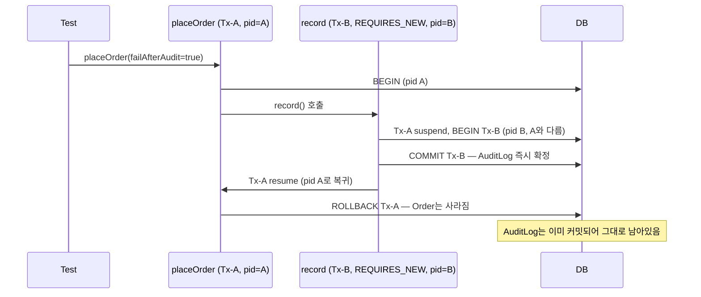

[스프링 트랜잭션 개념 정리 글](/posts/spring-transaction-propagation-isolation/)에서 전파(Propagation)
7가지를 정리하면서 "아직 직접 재현해서 확인한 건 하나도 없다"고 남겨뒀습니다. 이번에 실제로 Spring Boot +
PostgreSQL 프로젝트를 만들어서 돌려봤고, 예상과 다른 결과가 두 개 나와서 그 과정을 기록합니다.

실습 코드 전체는 [transaction-propagation-lab](https://github.com/yoonxjoong/transaction-propagation-lab)에
있습니다.

## 어떻게 증명했나

로그로 "REQUIRED는 참여하고 REQUIRES_NEW는 새로 시작한다"라고 말하는 건 쉽지만, 그게 실제로 물리적인
DB 커넥션 레벨에서 일어나는 일인지 확인하고 싶었습니다. 그래서 서비스 메서드마다 `pg_backend_pid()`를
찍어서, 부모/자식이 같은 커넥션을 쓰는지 다른 커넥션을 쓰는지를 값으로 비교했습니다.

```java
@Component
public class ConnectionIdProbe {
    @PersistenceContext
    private EntityManager entityManager;

    public Integer currentBackendPid() {
        Object result = entityManager.createNativeQuery("select pg_backend_pid()").getSingleResult();
        return ((Number) result).intValue();
    }
}
```

## REQUIRED — 부모/자식이 물리적으로 같은 커넥션

```java
@Service
public class RequiredOrderService {

    @Transactional // REQUIRED (기본값)
    public void placeOrder(TxTrace trace, boolean failInInventory) {
        trace.record("outer-before", probe.currentBackendPid());
        orderRepository.save(new Order("required-demo"));
        inventoryService.decreaseStock(trace, failInInventory);
        trace.record("outer-after", probe.currentBackendPid());
    }
}

@Service
public class InventoryService {

    @Transactional // REQUIRED (기본값)
    public void decreaseStock(TxTrace trace, boolean fail) {
        trace.record("inner-required", probe.currentBackendPid());
        if (fail) {
            throw new IllegalStateException("재고 부족");
        }
    }
}
```

`decreaseStock`에서 예외를 던지면 `placeOrder`의 `Order` insert까지 통째로 롤백됩니다. 그리고
`outer-before`, `inner-required`, `outer-after` 세 시점의 pid가 전부 동일했습니다 — REQUIRED는
문서상의 설명이 아니라 실제로 같은 물리 커넥션/트랜잭션을 그대로 공유한다는 걸 확인했습니다.

## REQUIRES_NEW — 부모가 롤백돼도 자식은 이미 커밋된 채로 남음

```java
@Service
public class RequiresNewOrderService {

    @Transactional // REQUIRED
    public void placeOrder(TxTrace trace, boolean failAfterAudit) {
        trace.record("outer-before", probe.currentBackendPid());
        orderRepository.save(new Order("requires-new-demo"));
        auditLogService.record(trace, "placeOrder attempted"); // REQUIRES_NEW
        trace.record("outer-after", probe.currentBackendPid());
        if (failAfterAudit) {
            throw new IllegalStateException("주문 처리 중 실패");
        }
    }
}

@Service
public class AuditLogService {

    @Transactional(propagation = Propagation.REQUIRES_NEW)
    public void record(TxTrace trace, String message) {
        trace.record("inner-requires-new", probe.currentBackendPid());
        auditLogRepository.save(new AuditLog(message));
    }
}
```



`placeOrder(failAfterAudit=true)`를 호출하면 `Order`는 롤백되지만 `AuditLog`는 그대로 남습니다.
`outer-before`와 `inner-requires-new`의 pid는 서로 달랐고(별도 물리 커넥션), 자식이 끝난 뒤 `outer-after`는
다시 `outer-before`와 같은 pid로 돌아왔습니다. "기존 트랜잭션을 suspend하고 새로 시작한다"는 설명이
실제 커넥션 레벨에서 일어나는 일이라는 걸 확인한 셈입니다.

## NESTED — 예상과 다른 결과: 설정으로 켤 수 있는 옵션이 아니었다

개념 정리 글에서는 "JDBC savepoint를 지원해야 동작하며, JPA 환경에서는 제약이 있다"고 적어뒀습니다.
직접 돌려보기 전까지는 이걸 "설정을 좀 더 손보면 되는 제약" 정도로 생각했는데, 실제로는 훨씬 근본적인
제약이었습니다.

처음 시도는 이거였습니다:

```java
@Bean
public PlatformTransactionManager nestedCapableTransactionManager(EntityManagerFactory emf) {
    JpaTransactionManager tm = new JpaTransactionManager(emf);
    tm.setNestedTransactionAllowed(true); // 기본값 false를 true로
    return tm;
}
```

이렇게 하면 될 줄 알았는데, `@Transactional(propagation = Propagation.NESTED)`를 이 매니저로 실행하면
여전히 이 예외가 던져집니다.

```
NestedTransactionNotSupportedException: JpaDialect does not support savepoints
- check your JPA provider's capabilities
```

원인을 spring-orm 6.1.13 클래스 파일까지 까봐서 확인했습니다. `JpaTransactionManager`가 savepoint를
만들려면, 트랜잭션 시작 시점에 `JpaDialect.beginTransaction()`이 돌려주는 객체가 스프링의
`SavepointManager` 인터페이스를 구현하고 있어야 합니다. 그런데 `HibernateJpaDialect.beginTransaction()`은
`HibernateJpaDialect$SessionTransactionData`라는 객체를 돌려주는데, 이 클래스는 `SavepointManager`를
구현하지 않습니다. 즉 **`nestedTransactionAllowed` 플래그는 필요조건일 뿐 충분조건이 아니고, Hibernate
연동에는 애초에 savepoint 매니저를 만들어주는 경로 자체가 없습니다.** 설정 한 줄로 될 일이 아니라,
JPA에서 NESTED를 정말로 쓰려면 Hibernate 세션에서 진짜 JDBC 커넥션을 꺼내 `SavepointManager`를
직접 구현하는 커스텀 `JpaDialect`가 필요합니다.

그래서 NESTED가 실제로 동작하는 경로를 확인하려고 JPA를 빼고 순수 JDBC(`DataSourceTransactionManager`
+ `JdbcTemplate`)로 바꿨습니다.

```java
@Bean
public PlatformTransactionManager nestedCapableTransactionManager(DataSource dataSource) {
    return new DataSourceTransactionManager(dataSource);
}
```

```java
@Transactional(transactionManager = "nestedCapableTransactionManager", propagation = Propagation.REQUIRED)
public void runWithCapableManager(boolean failFinalCommit) {
    jdbcTemplate.update("insert into orders(product_name) values (?)", "nested-outer-capable");

    try {
        nestedItemService.saveItemWithCapableManager("nested-bad-item", true);
    } catch (RuntimeException ignored) {
        // savepoint까지만 롤백되고 배치는 계속 진행
    }

    nestedItemService.saveItemWithCapableManager("nested-good-item", false);

    if (failFinalCommit) {
        throw new IllegalStateException("배치 마무리 단계에서 실패 - 부모 전체 롤백");
    }
}
```

```java
@Transactional(transactionManager = "nestedCapableTransactionManager", propagation = Propagation.NESTED)
public void saveItemWithCapableManager(String name, boolean fail) {
    jdbcTemplate.update("insert into orders(product_name) values (?)", name);
    if (fail) {
        throw new IllegalStateException("아이템 저장 실패: " + name);
    }
}
```

이걸로 확인한 두 가지:

1. `nested-bad-item`은 savepoint까지만 롤백되고, `nested-good-item`과 배치 전체(`runWithCapableManager`)는
   정상 커밋됩니다.
2. 같은 배치에서 `failFinalCommit=true`로 마무리 단계를 한 번 더 실패시키면, 이미 savepoint를 통과해서
   "성공"했던 `nested-good-item`도 함께 사라집니다.

두 번째가 핵심입니다. REQUIRES_NEW로 처리한 `AuditLog`는 부모가 나중에 롤백돼도 살아남았지만, NESTED로
처리한 `nested-good-item`은 부모가 최종적으로 롤백되는 순간 함께 사라집니다. **NESTED는 물리적으로
부모와 같은 트랜잭션(같은 커넥션) 안에서 savepoint만 만드는 것이고, REQUIRES_NEW는 아예 별도의 물리
트랜잭션이라는 차이가 최종 결과에 그대로 드러납니다.**

## self-invocation — 예외 없이 조용히 트랜잭션 보호만 사라짐

같은 클래스 안에서 `this.method()`로 호출하면 프록시를 거치지 않아 `@Transactional`이 무시된다는 건
알려진 내용입니다. 이번엔 그걸 값으로 증명하고, 한 걸음 더 나아가 "그 상태로 실제 저장을 하면 무슨 일이
일어나는가"까지 확인했습니다.

```java
@Service
public class SelfInvocationDemoService {

    @Transactional(propagation = Propagation.REQUIRES_NEW)
    public boolean isActualTransactionActive() {
        return TransactionSynchronizationManager.isActualTransactionActive();
    }

    public boolean callTransactionalMethodViaSelfInvocation() {
        return this.isActualTransactionActive(); // 프록시를 거치지 않음
    }

    public void saveAuditViaSelfInvocation() {
        this.saveAuditRequiresNew();
    }

    @Transactional(propagation = Propagation.REQUIRES_NEW)
    public void saveAuditRequiresNew() {
        auditLogRepository.save(new AuditLog("self-invocation"));
    }
}
```

- 테스트에서 `selfInvocationDemoService.isActualTransactionActive()`를 직접(프록시를 거쳐) 호출하면
  `true`.
- 같은 빈 안에서 `this.isActualTransactionActive()`로 호출하면 `false` — `@Transactional(REQUIRES_NEW)`가
  명시돼 있어도 트랜잭션이 전혀 시작되지 않습니다.
- 그 상태로 `saveAuditViaSelfInvocation()`을 호출하면 — `TransactionRequiredException` 같은 에러가 날
  거라 예상했는데, **예외 없이 그냥 저장됩니다.** Hibernate가 활성 트랜잭션이 없으면 사실상 autocommit
  성격의 세션으로 즉시 반영해버리기 때문입니다.

이게 self-invocation이 위험한 진짜 이유라고 생각합니다. 트랜잭션이 사라진 게 에러로 바로 드러나면
배포 전에 걸러지겠지만, 실제로는 평소엔 아무 문제 없이 잘 동작하는 것처럼 보이다가, 나중에 롤백이
필요한 상황(예외 발생)에서만 "어? 왜 롤백이 안 되지"로 뒤늦게 드러납니다.

## 롤백 규칙 — checked exception은 기본값으로 롤백 안 됨

이 부분은 개념 정리 글의 설명 그대로였습니다. `@Transactional` 기본 설정에서 `IOException`(checked)을
던지면 `Order`가 그대로 커밋되고, `rollbackFor = Exception.class`를 명시해야 롤백됩니다. unchecked
exception은 기본값으로도 롤백됩니다.

## 정리

| 항목 | 예상 | 실제 확인 결과 |
| --- | --- | --- |
| REQUIRED | 부모/자식이 같은 트랜잭션 공유 | pid 동일 — 확인됨 |
| REQUIRES_NEW | 별도 물리 트랜잭션, 부모 롤백과 무관 | pid 다름, 부모 롤백돼도 자식 생존 — 확인됨 |
| NESTED (JPA) | 설정만 손보면 될 것 | HibernateJpaDialect 구조상 원천적으로 불가능 |
| NESTED (JDBC) | savepoint까지만 롤백 | 확인됨 + 부모 최종 롤백 시 NESTED 자식도 함께 사라짐 |
| self-invocation | @Transactional 무시됨 | 확인됨, 게다가 에러도 없이 조용히 저장까지 됨 |
| checked exception | 기본 롤백 안 됨 | 확인됨 |

## 한계 및 남는 궁금증

- NESTED용 커스텀 `JpaDialect`(Hibernate 세션에서 실제 JDBC 커넥션을 꺼내 `SavepointManager`를 직접
  구현)는 만들지 않았습니다. 실무에서 NESTED를 굳이 JPA와 맞추려는 수요 자체가 크지 않아 보여서
  이번 범위 밖으로 뒀습니다.
- self-invocation으로 트랜잭션 없이 저장될 때 Hibernate 세션이 정확히 어떤 모드로 동작하는지(진짜
  autocommit인지, flush마다 암묵적 트랜잭션을 여닫는 것인지)는 더 파고들지 않았습니다.

## 참고 자료

- [transaction-propagation-lab (GitHub)](https://github.com/yoonxjoong/transaction-propagation-lab)
- [스프링 트랜잭션 개념 정리 글](/posts/spring-transaction-propagation-isolation/)
- [Spring Framework Reference — Transaction Propagation](https://docs.spring.io/spring-framework/reference/data-access/transaction/declarative/tx-propagation.html)
